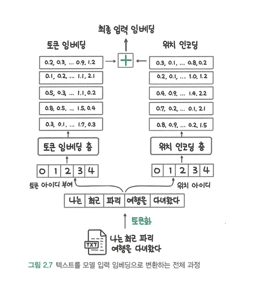
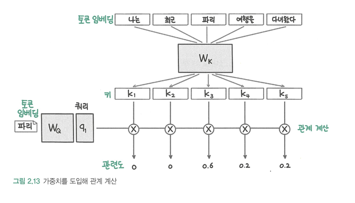
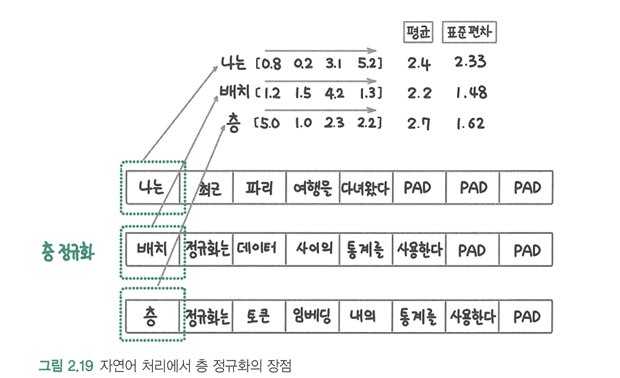

# LLM을 활용한 실전 AI 애플리케이션 개발
# 1. LLM 지도
## 딥러닝과 언어 모델링
- 딥러닝: 인간의 두뇌에 영감을 받아 만들어진 신경망으로, 데이터의 패턴을 학습하는 머신러닝의 한 분야
- 언어모델: 다음에 올 단어를 예측하는 모델  
- 딥러닝과 머신러닝의 가장 큰 차이는, 데이터의 특징을 누가 뽑는가이다. 기존 머신러닝에서는 데이터의 특징을 연구자가 찾고 모델에 입력으로 넣었으면, 딥러닝에서는 모델이 스스로 데이터의 특징을 찾고 분류하는 모든 과정을 학습한다.
- 
- 임베딩: 데이터의 의미와 특징을 포착해 숫자로 표현한 것
- 임베딩 작업을 통해 거리를 계산할 수 있으므로 검색 및 추천, 클러스터링 및 분류, 이상치 탐지에 활용 가능
- 전이 학습
  +  하나의 문제를 해결하는 과정에서 얻은 지식과 정보를 다른 문제를 풀 때 사용하는 방식
  + 전이 학습은 사전 학습과 미세 조정으로 진행
    + 사전학습은 대량의 데이터로 모델을 학습하는 과정
    +  미세 조정은 특정 문제를 해결하기 위해 데이터를 추가로 학습하는 과정
- 
## 언어 모델이 챗GPT가 되기까지
-  RNN(순환 신경망): 트랜스포머가 개발되기 전 사용했던 방식
    + 하나의 잠재 상태에 지금까지의 입력 텍스트의 맥락을 압축하는 방식
    +  빠르다는 장점이 있지만 입력이 길어지는 경우 먼저 이력된 단어의 의미가 점차 희석되며, 입력이 길어지는 경우 성능이 떨어진다는 단점 존재
- 
-  이러한 RNN의 단점을 극복하기 위해, 맥락을 모두 참조하는 어텐션 연산 개발
    + RNN과 달리 맥락을 모두 참조하기 때문에, 예측에 걸리는 시간 증가
    + 무겁고 비효율적인 연산
- 
- 
## LLM 어플리케이션의 시대가 열리다
- LLM은 기존 자연어 처리 접근 방식과 달리 언어 이해 모델과 생성 모델이 하나의 LLM으로 수행이 가능하기 때문에 더 다양한 작업에 AI를 활용할 수 있다.
- 
-  sLLM: 모델의 크기가 작으면서 특정 도메인 데이터나 작업에서 높은 성능을 보이는 모델
    + 라마-3, 젬마-2, Phi-3 등이 존재
- LLM의 학습과 추론에 필요한 연산량을 줄이기 위해서 양자화(quantization)과 LoRA(Low Rank Adaption) 방식으로 연산량을 효율적으로 줄임
-  환각 현상: LLM이 잘못된 정보나 실제로 존재하지 않는 정보를 만들어내는 현상
    + 이를 해결하기 위해 프롬프트에 LLM이 답변할 때 필요한 정보를 미리 추가하는 기술인 RAG 기술 이용 
## LLM의 미래: 인식과 행동의 확장
-  멀티 모달: LLM이 더 다양한 형식(이미지, 비디오, 오디오 등)으로 입력을 받을 수 있고 다양한 형태의 출력이 가능하도록 발전시킨 모델
-  에이전트 : 특정한 작업을 수행하기 위해 LLM을 활용하여 작동하는 프로그램이나 시스템으로 자율성, 상호작용성, 학습 능력 보유
# 2. LLM의 중추, 트랜스포머 아키텍처 살펴보기
## 트랜스포머 아키텍처란
- RNN: 기존의 자연어 처리 문제에서 사용하던 방식
  +  텍스트를 순차적으로 처리하기 때문에 학습 속도가 느림
  +  입력이 길어지면 먼저 입력된 토큰의 정보가 희석
  +  그레이디언트 소실이나 그레이디언트 증폭 발생
- 
- 트랜스포머
  +  셀프 어텐션 사용
  +  작동 방식
      1. 입력을 임베딩으로 변환
      2. 위치 인코딩을 문장의 위치 정보 더하기
      3. 인코더에서 층 정규화, 멀티 헤드 어텐션, 피드 포워드 층을 거치며 디코더로 전달
      4. 디코더에서 층 정규화, 멀티 헤드 어텐션, 피드 포워드 층을 거치며 한국어 번역 결과 생성 
- 
## 텍스트를 임베딩으로 변환하기
-  토큰화: 텍스트를 적절한 단위로 잘라 숫자형 아이디를 부여하는 과정
    +  사전: 어떤 토큰이 어떤 숫자 아이디에 연결됐는지 기록해둔 것
    +  서브워드 토큰화: 데이터에 등장하는 빈도에 따라 토큰화 단위를 결정하는 방식
-  임베딩: 데이터의 의미를 담아 숫자 집합으로 변환하는 것
    + 파이토치의 nn.Embedding 클래스를 이용
-  위치 인코딩
    + 기존 RNN 방식과 트랜스포머의 큰 차이점은 입력을 순차적으로 처리하는지 여부
    +  모든 입력을 동시에 처리하기 때문에 순서 정보를 위치 인코딩으로 파악
    + 절대적 위치 인코딩: 입력 데이터의 각 토큰에 고유한 위치 정보를 부여해 모델이 순서를 인식할 수 있도록 하는 방법
    + 상대적 위치 인코딩: 입력 토큰 간의 상대적인 거리 정보로 더 유연하게 학습하는 방법
- 
## 어텐션 이해하기
- 딥러닝 모델이 작동하려면 단어 사이의 관계를 계산해 관련이 있는지 찾고, 관련이 있는 단어의 맥락을 포함시켜 단어를 재해석해야 함
- 쿼리: 우리가 입력하는 검색어
-  키: 문서가 가진 특징
-  값: 쿼리와 키를 기반으로 실제로 반환되는 정보
- 임베딩을 활용해 관련도를 직접 계산 시
    + 같은 단어끼리 임베딩이 동일하므로 관련도가 크게 계산되면서 주변 맥락 충분히 반영 못하는 경우 발생
    + 문법에 의해 토큰이 이어지는 경우처럼 간접적인 관련성 반영 X
- 트랜스포머에서는 토큰 임베딩을 변환하는 가중치를 도입해 문제 해결
    + Wq (쿼리 가중치): 입력 임베딩을 쿼리 벡터로 변환하는 행렬
    + Wk (키 가중치): 입력 임베딩을 키 벡터로 변환하는 행렬
    + Wv (값 가중치): 입력 임베딩을 값 벡터로 변환하는 행렬
    + 트랜스포머는 입력된 임베딩을 쿼리, 키, 값 벡터로 변환한 후, 쿼리와 키 벡터의 내적을 통해 각 단어들 간의 연관성을 계산
      * 쿼리와 키의 내적이 클수록 두 단어가 서로 강하게 관련된 것으로 해석
    + 어텐션 값이 구해지면, 각 단어의 값(Value) 벡터에 어텐션 값(가중치)을 곱해서 가중합을 구하고, 가중합을 통해 쿼리에 해당하는 단어가 다른 모든 단어와 얼마나 관련이 있는지를 파악
- 
- 멀티 헤드 어텐션
    + 하나의 어텐션만 수행하는 것이 아닌, 여러 어텐션 연산을 동시에 적용해 성능을 높이는 방식
    + 토큰 사이의 관계를 한 가지 측면에서 이해하는 것이 아닌, 여러 측면에서 동시에 고려하는 방식
- 
## 정규화와 피드 포워드 층
-  배치 정규화: 배치 입력 데이터 사이에 정규화
    + 자연어에서는 입력으로 들어가는 문장 길이가 다양하기 때문에 정규화 효과 보장 어려움
-  층 정규화: 각 입력 샘플 내의 모든 특성의 평균과 분산을 계산하고 정규화
- 
    + 사후 정규화: 어텐션과 피드 포워드 층 이후에 정규화
    + 사전 정규화: 어텐션과 피드 포워드 층 이전에 정규화
-  피드 포워드 층: 데이터의 특징을 학습하는 완전 연결 층으로, 입력 텍스트 전체를 이해하는 부분
## 인코더
  - 인코더는 멀티 헤드 어텐션, 층 정규화, 피드 포워드 층이 반복되는 형태
  - 잔차 연결: 입력을 다시 더해주는 형태로, 안정적인 학습 가능
  - 
## 디코더
-  생성을 담당하는 부분
-  인코더와 유사하지만 멀티 헤드 에텐션 대신 마스크 멀티 헤드 어텐션을 이용
-  크로스 어텐션: 인코더의 결과를 디코더가 활용하는 부분
- 

## BERT, GPT, T5 등 트랜스포머를 활용한 아키텍처
 - 트랜스포머를 활용한 모델은 크게 세 가지
    + 인코더만 활용한 자연여 이해 ex) BERT
    + 디코더만 활용해 자연어 생성 ex) GPT
    + 인코더와 디코더를 모두 활용해 생성과 이해 작업 모두 뛰어난 성능 ex) BART, T5
## 주요 사전 학습 메커니즘
- 인과적 언어 모델링: 문장의 시작부터 끝까지 순차적으로 단어를 예측하는 학습 방식
    + 많은 데이터에 대해 다음 단어를 예측하는 방법을 학습
-  마스크 언어 모델링: 문장 일부를 마스크로 가리고, 가려진 단어를 예측하는 학습 방식

# 3. 트랜스포머 모델을 다루기 위한 허깅페이스 트랜스포머 라이브러리
## 허깅페이스 트랜스포머란
- 허깅페이스 트랜스포머: 다양한 트랜스포머 모델을 통일된 인터페이스로 사용할 수 있도록 지원하는 오픈소스 라이브러리
    + 트랜스포머 모델과 토크나이저를 사용하는 transformers 라이브러리
    + 데이터셋을 사용하는 datasets 라이브러리
- ### BERT와 GPT-2 모델을 활용할 때 허깅페이스 트랜스포머 코드
```python
from transformers import AutoTokenizer, AutoModel

text = "What is Huggingface Transformers?"
# BERT 모델 활용
bert_model = AutoModel.from_pretrained("bert-base-uncased")
bert_tokenizer = AutoTokenizer.from_pretrained('bert-base-uncased')
encoded_input = bert_tokenizer(text, return_tensors='pt')
bert_output = bert_model(**encoded_input)
# GPT-2 모델 활용
gpt_model = AutoModel.from_pretrained('gpt2')
gpt_tokenizer = AutoTokenizer.from_pretrained('gpt2')
encoded_input = gpt_tokenizer(text, return_tensors='pt')
gpt_output = gpt_model(**encoded_input)
```

## 허깅페이스 허브 탐색하기
- 모델 허브
    + 어떤 작업에 사용하는지, 어떤 언어로 학습된 모델인지 등 다양한 기준으로 모델 분류
    + 자연어처리, 컴퓨터 비전, 오디오 처리, 멀티 모달 등 다양한 작업 분야의 모델 제공
    + 모델 내부 사진
    + 
- 데이터셋 허브
    + 모델 허브와 달리 분류 기준에 데이터셋 크기, 데이터 유형 존재
- 스페이스
    + 모델 데모를 간편하게 공개할 수 있는 기능
## 허깅페이스 라이브러리 사용법 익히기
- 모델은 바디와 헤드로 구분
    + 바디: 사전 학습된 모델의 기본 구조
    + 헤드: 특정 작업에 맞게 설계된 출력층
- 
- 토크나이저 : 텍스트를 토큰 단위로 나누고 각 토큰을 대응하는 토큰 아이디로 변환
    + AutoTokenizer를 이용해 사용
- ### 토크나이저 불러오기
```python
from transformers import AutoTokenizer
model_id = 'klue/roberta-base'
tokenizer = AutoTokenizer.from_pretrained(model_id)
```


- ### 토크나이저 사용하기
    + input_ids: 토큰화했을 때 각 토큰이 토크나이저 사전의 몇 번째 항목인지 나타내는 변수
    + attention_mask: 1이면 패딩(토큰 아이디의 길이를 맞추기 위해 추가하는 특수 토큰)이 아닌 실제 단어
    + decode: CLS 토큰으로 문장을 시작하고 SEP 토큰으로 문장을 종료, 2개의 문장을 한번에 토큰화하면 SEP로 두 문장 구분
```python
tokenized = tokenizer("토크나이저는 텍스트를 토큰 단위로 나눈다")
print(tokenized)
# {'input_ids': [0, 9157, 7461, 2190, 2259, 8509, 2138, 1793, 2855, 5385, 2200, 20950, 2],
#  'token_type_ids': [0, 0, 0, 0, 0, 0, 0, 0, 0, 0, 0, 0, 0],
#  'attention_mask': [1, 1, 1, 1, 1, 1, 1, 1, 1, 1, 1, 1, 1]}

print(tokenizer.convert_ids_to_tokens(tokenized['input_ids']))
# ['[CLS]', '토크', '##나이', '##저', '##는', '텍스트', '##를', '토', '##큰', '단위', '##로', '나눈다', '[SEP]']

print(tokenizer.decode(tokenized['input_ids']))
# [CLS] 토크나이저는 텍스트를 토큰 단위로 나눈다 [SEP]

print(tokenizer.decode(tokenized['input_ids'], skip_special_tokens=True))
# 토크나이저는 텍스트를 토큰 단위로 나눈다
```
- datasets 라이브러리 사용해서 데이터셋 사용 가능
```python
from datasets import load_dataset
klue_mrc_dataset = load_dataset('klue', 'mrc')
# klue_mrc_dataset_only_train = load_dataset('klue', 'mrc', split='train')
```
- 로컬의 데이터셋 사용은 Dataset 클래스의 from_pandas 메서드 사용
```python
from datasets import load_dataset
# 로컬의 데이터 파일을 활용
dataset = load_dataset("csv", data_files="my_file.csv")

# 파이썬 딕셔너리 활용
from datasets import Dataset
my_dict = {"a": [1, 2, 3]}
dataset = Dataset.from_dict(my_dict)

# 판다스 데이터프레임 활용
from datasets import Dataset
import pandas as pd
df = pd.DataFrame({"a": [1, 2, 3]})
dataset = Dataset.from_pandas(df)
```
## 모델 학습시키기
- 트레이너 API: 간편하게 모델의 학습을 수행할 수있도록 학습 과정을 추상화한 API
- ### Trainer를 사용한 학습
```python
import torch
import numpy as np
from transformers import (
    Trainer,
    TrainingArguments,
    AutoModelForSequenceClassification,
    AutoTokenizer
)

def tokenize_function(examples):
    return tokenizer(examples["title"], padding="max_length", truncation=True)

model_id = "klue/roberta-base"
model = AutoModelForSequenceClassification.from_pretrained(model_id, num_labels=len(train_dataset.features['label'].names))
tokenizer = AutoTokenizer.from_pretrained(model_id)

train_dataset = train_dataset.map(tokenize_function, batched=True)
valid_dataset = valid_dataset.map(tokenize_function, batched=True)
test_dataset = test_dataset.map(tokenize_function, batched=True)

training_args = TrainingArguments(
    output_dir="./results",
    num_train_epochs=1,
    per_device_train_batch_size=8,
    per_device_eval_batch_size=8,
    evaluation_strategy="epoch",
    learning_rate=5e-5,
    push_to_hub=False
)

def compute_metrics(eval_pred):
    logits, labels = eval_pred
    predictions = np.argmax(logits, axis=-1)
    return {"accuracy": (predictions == labels).mean()}

trainer = Trainer(
    model=model,
    args=training_args,
    train_dataset=train_dataset,
    eval_dataset=valid_dataset,
    tokenizer=tokenizer,
    compute_metrics=compute_metrics,
)

trainer.train()

trainer.evaluate(test_dataset) # 정확도 0.84
```
- ### Trainer를 사용하지 않는 학습
```python
import torch
from tqdm.auto import tqdm
from torch.utils.data import DataLoader
from transformers import AdamW

def tokenize_function(examples): # 제목(title) 컬럼에 대한 토큰화
    return tokenizer(examples["title"], padding="max_length", truncation=True)

# 모델과 토크나이저 불러오기
device = torch.device("cuda" if torch.cuda.is_available() else "cpu")
model_id = "klue/roberta-base"
model = AutoModelForSequenceClassification.from_pretrained(model_id, num_labels=len(train_dataset.features['label'].names))
tokenizer = AutoTokenizer.from_pretrained(model_id)
model.to(device)

def make_dataloader(dataset, batch_size, shuffle=True):
    dataset = dataset.map(tokenize_function, batched=True).with_format("torch") # 데이터셋에 토큰화 수행
    dataset = dataset.rename_column("label", "labels") # 컬럼 이름 변경
    dataset = dataset.remove_columns(column_names=['title']) # 불필요한 컬럼 제거
    return DataLoader(dataset, batch_size=batch_size, shuffle=shuffle)

# 데이터로더 만들기
train_dataloader = make_dataloader(train_dataset, batch_size=8, shuffle=True)
valid_dataloader = make_dataloader(valid_dataset, batch_size=8, shuffle=False)
test_dataloader = make_dataloader(test_dataset, batch_size=8, shuffle=False)

def train_epoch(model, data_loader, optimizer):
    model.train()
    total_loss = 0
    for batch in tqdm(data_loader):
        optimizer.zero_grad()
        input_ids = batch['input_ids'].to(device) # 모델에 입력할 토큰 아이디
        attention_mask = batch['attention_mask'].to(device) # 모델에 입력할 어텐션 마스크
        labels = batch['labels'].to(device) # 모델에 입력할 레이블
        outputs = model(input_ids, attention_mask=attention_mask, labels=labels) # 모델 계산
        loss = outputs.loss # 손실
        loss.backward() # 역전파
        optimizer.step() # 모델 업데이트
        total_loss += loss.item()
    avg_loss = total_loss / len(data_loader)
    return avg_loss

def evaluate(model, data_loader):
    model.eval()
    total_loss = 0
    predictions = []
    true_labels = []
    with torch.no_grad():
        for batch in tqdm(data_loader):
            input_ids = batch['input_ids'].to(device)
            attention_mask = batch['attention_mask'].to(device)
            labels = batch['labels'].to(device)
            outputs = model(input_ids, attention_mask=attention_mask, labels=labels)
            logits = outputs.logits
            loss = outputs.loss
            total_loss += loss.item()
            preds = torch.argmax(logits, dim=-1)
            predictions.extend(preds.cpu().numpy())
            true_labels.extend(labels.cpu().numpy())
    avg_loss = total_loss / len(data_loader)
    accuracy = np.mean(np.array(predictions) == np.array(true_labels))
    return avg_loss, accuracy

num_epochs = 1
optimizer = AdamW(model.parameters(), lr=5e-5)

# 학습 루프
for epoch in range(num_epochs):
    print(f"Epoch {epoch+1}/{num_epochs}")
    train_loss = train_epoch(model, train_dataloader, optimizer)
    print(f"Training loss: {train_loss}")
    valid_loss, valid_accuracy = evaluate(model, valid_dataloader)
    print(f"Validation loss: {valid_loss}")
    print(f"Validation accuracy: {valid_accuracy}")

# Testing
_, test_accuracy = evaluate(model, test_dataloader)
print(f"Test accuracy: {test_accuracy}") # 정확도 0.82
```
## 모델 추론하기
- 모델 추론 또한 파이프라인을 사용하는 방법과 직접 추론하는 방법 존재
- ### pipeline을 사용한 학습
```python
from transformers import pipeline

model_id = "본인의 아이디 입력/roberta-base-klue-ynat-classification"

model_pipeline = pipeline("text-classification", model=model_id)

model_pipeline(dataset["title"][:5])
```
- ### 커스텀 pipeline 구현
```python
import torch
from torch.nn.functional import softmax
from transformers import AutoModelForSequenceClassification, AutoTokenizer

class CustomPipeline:
    def __init__(self, model_id):
        self.model = AutoModelForSequenceClassification.from_pretrained(model_id)
        self.tokenizer = AutoTokenizer.from_pretrained(model_id)
        self.model.eval()

    def __call__(self, texts):
        tokenized = self.tokenizer(texts, return_tensors="pt", padding=True, truncation=True)

        with torch.no_grad():
            outputs = self.model(**tokenized)
            logits = outputs.logits

        probabilities = softmax(logits, dim=-1)
        scores, labels = torch.max(probabilities, dim=-1)
        labels_str = [self.model.config.id2label[label_idx] for label_idx in labels.tolist()]

        return [{"label": label, "score": score.item()} for label, score in zip(labels_str, scores)]

custom_pipeline = CustomPipeline(model_id)
custom_pipeline(dataset['title'][:5])
```
# 4. 말 잘 듣는 모델 만들기
## 코딩 테스트 통과하기: 사전 학습과 지도 미세 조정
- LLM은 인터넷상에 있는 다양한 텍스트 데이터를 수집한 대용량의 텍스트로 사전 학습
- 사전 학습 데이터에는 코드, 블로그, 기사, 광고 등 다양한 글 존재
- 지도 미세 조정:  요청의 형식을 적절히 해석하고, 응당의 형태를 적절히 작성하며, 요청과 응답이 잘 연결되도록 학습하는 것
    + 지도(supervised): 학습 데이터에 정답이 포함 되어 있음
    + 정렬: 사람의 요청과 LLM의 응답이 정렬되도록 한다는 의미
- 지시 데이터셋: 지도 미세 조정에 사용하는 데이터셋으로, 사용자의 지시에 맞춰 응답하는 데이터셋
- 좋은 지시 데이터셋이 갖춰야 할 조건:
    + 지시 데이터셋은 작은 규모로 구축하더라도 모델이 지시사항의 형식을 인식하고 답변하도록
    + 피상적인 정렬 가설: 모델의 지식이나 능력은 사전 학습 단계에서 대부분 학습되고, 정렬 데이터를 통해서는 답변의 형식을 어떻게 나열할지만 추가로 배우기 때문에 적은 정렬 데이터로도 사용자가 원하는 형태의 답변을 형성할 수 있다는 가설
    + 지시사항이 다양한 형태로 되어 있고 응답 데이터의 품질이 높을 수록 답변 품질이 높아짐
    + 교재의 예제 데이터와 같은 고품질의 데이터를 학습 데이터에 추가하면 성능이 크게 향상
## 채점 모델로 코드 가독성 높이기
  - 선호 데이터셋: 두 데이터 중 사람이 더 선호하는 데이터
  - 생성된 답변의 점수를 평가하는 리워드 모델을 이용해 더 좋은 답변을 이용
  - 
  - RLHF(Reinforcement Learning from Human Feedback): 사람의 피드백을 이용한 강화 학습
  - 강화 학습에서는 에이전트가 환경에서 행동을 하고, 행동에 따라 환경의 상태가 바뀌면서 행동에 대한 보상이 생김. 에이전트는 보상을 많이 받으려고 행동을 수정하면서 학습
  - 에피소드: 에이전트가 보상을 더 많이 받기 위해 연속적으로 수행하는 행동
  - 
  - 
  - 보상 해킹: 평가 모델의 높은 점수를 받는 과정에서 다른 능력이 감소하거나 평가 점수만 높게 받을 수 있는 우회로를 찾는 현상
  - 보상 해킹을 피하기 위해 PPO(Proximal Preference Optimization), 근접 정책 최적화라는 방법 이용
  - PPO: 지도 미세 조정 모델을 기준으로 학습하는 모델이 너무 멀지 않게 가까운 범위에서 리워드 모델의 높은 점수를 찾는 방식
  -  
  - RLHF의 어려움
    1. 성능이 높고 일관성 있는 리워드 모델 필요
    2. 많은 리소스 필요
    3. 하이퍼파라미터에 민감 및 학습이 불안정
## 강화 학습이 꼭 필요할까?
  - 기각 샘플링: 지도 미세 조정을 마친 LLM을 통해 여러 응답을 생성하고, 그 중 리워드 모델이 가장 높은 점수를 준 응답을 모아 다시 지도 미세 조정을 수행하는 방식
    + 강화 학습을 사용하지 않기 때문에 학습이 안정적이고 직관적
  - DPO(Direct Preference Optimization): 직접 선호 최적화 방법으로, 선호 데이터를 활용하여 언어 모델의 출력을 사용자의 선호도에 맞게 최적화하는 학습 방법
  -  
# 5. GPU 효율적인 학습
## GPU에 올라가는 데이터 살펴보기
## 단일 GPU 효율적으로 활용하기
## 분산 학습과 ZeRO
## 효율적인 학습 방법(PEFT): LoRA
## 효율적인 학습 방법(PEFT): QLoRA
# 6. sLLM 학습하기
## Text2SQL 데이터셋
## 성능 평가 파이프라인 준비하기
## 실습: 미세 조정 수행하기
