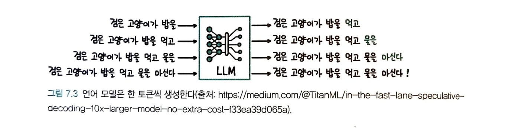

# LLM을 활용한 실전 AI 애플리케이션 개발
# 7. 모델 가볍게 만들기
## 언어 모델 추론 이해하기
- 언어 모델은 입력한 텍스트 다음에 올 토큰의 확률을 계산하고 그 중 확률이 가장 높은 토큰을 입력 테스트에 추가하면서 토큰 생성
- 
- 밑의 그림과 같이 동일한 연산을 반복적으로 수행하기 때문에 비효율적
- 
- 이를 해결하기 위해 계산했던 결과를 메모리에 저장하는 방법인 KV 캐시 사용
- 
- 효율적인 서빙을 위해서는 높은 처리량과 낮은 지연 시간
- 메모리 바운드: 최적의 배치 크기보다 배치 크기가 작을 시 고대역폭 메모리에 있는 모델 파라미터를  SRAM으로 이동시키느라 연산이 멈추면서 생기는 비효율
- 연산 바운드: 배치 크기가 최적의 배치 크기보다 커지면 연산이 오래 걸리는 현상
- 
- 최대 배치 크기를 최적의 배치 크기와 가까워지게 만들어야 하기 때문에 배치 크기를 키워야 함
- 배치 크기를 키우는 방안
    + 모델의 용량 줄이기
    + KV 캐시 줄이기
- KV 캐시 메모리를 줄이기 위해서는 멀티 헤드 어텐션이 아닌 다른 연산 수행
    + 멀티 쿼리 어텐션: 여러 헤드의 쿼리 벡터가 하나의 키와 값 벡터를 사용하는 방법
    + 그룹 쿼리 어텐션: 멀티 헤드 어텐션보다는 키와 값의 수를 줄이지만 멀티 쿼리 어텐션보다는 많은 키와 값을 사용하는 방식으로 멀티 헤드 어텐션과 멀티 쿼리 어텐션을 절충한 방법
-                                 
## 양자화로 모델 용량 줄이기
  - 비츠앤바이츠: 양자화 방식을 쉽게 사용할 수 있는 라이브러리
    + 영점 양자화: 데이터의 최댓값과 최솟값을 변환하려는 데이터 형식의 범위로 변환하는 방식
    + 절대 최대값 양자화: 절대 최댓값을 기준으로 대칭적으로 새로운 데이터 타입으로 변환하는 방식
    + 입력 중 이상치가 포함된 열은 별도로 분리해 16비트 그대로 계산
  - GPTQ: 양자화를 위한 작은 데이터셋을 준비하고 그 데이터셋을 활용해 모델 연산을 수행하면서 양자화 이전과 유사한 결과가 나오도록 모델을 업데이트하는 방식 이용
  - AWQ: 중요한 파라미터의 값은 유지하면서 덜 중요한 파라미터들에만 양자화를 적용해 모델의 성능을 유지하면서 효율을 높이는 방식 이용
## 지식 증류 활용하기
  - 지식 증류: 더 크고 성능이 좋은 선생 모델의 생성 결과를 활용해 더 작고 성능이 낮은 학생 모델을 만드는 방법
    +단순히 선생 모델이 생성한 결과를 학생 모델이 모방하는 것이 아닌 학생 모델의 학습에 더 도움이 되는 데이터셋을 구축하거나 사람의 리소스가 필요한 작업에 선생 모델을 활용 가능
# 8.  sLLM 서빙하기
## 효율벅인 배치 전략
  - 일반 배치: 정적 배치라고도 부르며, 한 번에 N개의 입력을 받아 모두 추론이 끝날 때까지 기다리는 방식
  - 동적 배치: 비슷한 시간대에 들어오는 요청을 하나의 배치로 묶어 배치 크기를 키우는 전략
  - 연속 배치: 한 번에 들어온 배치 데이터의 추론이 모두 끝날 때까지 기다리지 않고 하나의 토큰 생성이 끝날 때마다 생성이 종료된 문장은 제거하고 새로운 문장을 추가하는 방식
## 효율적인 트랜스포머 연산
  - 플래시어텐션: 메모리와 계산 효율성을 개선한 최적화된 어텐션 메커니즘
    + 트랜스포머 아키텍처는 학습 과정에서는 연산량이 시퀀스 길이의 제곱에 비례하고 추론 과정에서는 시퀀스 길이에 비례하게 증가
    + 연산이 오래 걸리는 이유는 GPU에서 메모리를 읽고 쓰는데 오랜 시간이 걸리기 때문
    + 데이터 이동 속도가 느린 고대역폭 메모리에 큰 어텐션 행렬을 쓰고 읽으면서 걸리는 시간을 줄이기 위해 블록 단위로 어텐션 연산을 수행하고 전체 어텐션 행렬을 쓰거나 읽지 않는 방식으로 어텐션 연산의 속도 높임
    + 작은 블록 단위로 연산 수행해서 SRAM에 데이터를 읽고 쓰면서 연산 빠르게 수행
    + 역전파 계산 과정에서 필요한 N * N 행렬 값은 역전파 과정에서 다시 순전파를 계산하는 방식으로 해결
    + 계산량은 증가하지만,  실행 시간은 짧아짐
  - 플래시어텐션2: 행렬 곱셉이 아닌 연산을 줄이고, 시퀀스 길이 방향의 병렬화를 추가해 플래시어텐션과 비교해 2배 정도 속도 개선
  - 사인파 위치 인코딩: 사인과 코사인을 이용해 위치 인코딩을 더하는 방식
  - 절대적 위치 인코딩은 학습 데이터보다 긴 입력이 들어오면 품질이 떨어진다는 단점
  - 상대적 위치 인코딩: 토큰의 절대적인 위치에 따라 임베딩을 더하는 것이 아닌 토큰과 토큰 사이의 상대적인 위치 정보를 추가하는 방식
  - ROPE(Rotary Positional Encoding): 각 토큰의 상대적 위치를 각도 기반의 주기 함수로 인코딩하여 순서 정보를 효율적으로 반영하는 방식
  - AliBI(Attention with Linear Biases): 토큰 간의 거리 정보를 선형 편향을 통해 반영하여, 더 먼 토큰에 가중치를 덜 주는 방식
## 효율적인 추론 전략
  - 커널 퓨전: 여러 개의 연산을 하나로 묶어서 오버헤드를 줄이는 기법
  - 페이지어텐션: 가상 메모리 개념을 이용해 메모리를 페이지 단위로 나누고, 필요한 데이터만 불러와 어텐션 연산을 수행함으로써 메모리 사용을 효율적으로 관리하는 방식
    + 블록 테이블: 논리적 메모리와 물리적 메모리를 연결하는 테이블
    + 페이지어텐션 기법을 이용하면 낭비되는 메모리양 감소
    + 병렬 샘플링에서 입력 프롬프트에 대한 메모리를 공유하면서 메모리 절약
    + 참조 카운트: 물리적 블록을 공유하고 있는 논리적 블록 수
-   
- 추측 디코딩: 쉬운 단어는 작고 효율적인 모델이 예측하고 어려운 단어는 더 크고 성능이 좋은 모델이 예측하는 방식
    + 드래프트 모델: 타깃 모델에 비해 빠르지만 생성 정확도는 떨어지는 모델
    + 타깃 모델: 드래프트 모델에 비해 느리지만 생성 정확도는 높은 모델
    + 2개의 모델을 이용해서 시스템 복잡도가 올라가지만 토큰 생성 시간은 줄어듬
## 실습: LLM 서빙 프레임워크
  - 오프라인 서빙: 정해진 입력 데이터에 대해 배치 추론 수행
  - 온라인 서빙: 사용자의 요청이 올 때 모델 추론을 수행
  - vLLM은 연속 배치와 페이지어텐션 기술을 사용해 허깅페이스의 파이프라인 추론 대비 높은 속도로 추론이 가능
# 9. LLM 어플리케이션 개발하기
## 검색 증강 생성(RAG)
  - RAG(검색 증강 생성): LLM에게 단순히 질문이나 요청만 전달하고 생성하는 것이 아닌 답변에 필요한 정보와 맥락을 제공하고 답변하도록 하는 방법
    + 검색할 데이터를 벡터 데이터베이스에 저장
    + 사용자 인터페이스를 통해 들어온사용자의 요청에 관련된 정보를 벡터 데이터베이스에서 검색한 후 사용자의 요청과 결합해 프롬프트 완성
  - 라마인덱스(LlamaIndex): 대형 언어 모델(LLM)을 활용해 문서나 데이터베이스에서 정보를 효율적으로 검색하고 조직하는 인덱싱 라이브러리
## LLM 캐시
  - LLM 캐시: 이전에 생성 결과를  기록하여 동일한 요청이 들어오면 이전의 생성 결과를 이용하는 방법
    + 일치 캐시: 요청이 완전히 일치하는 경우
    + 유사 검색 캐시: 임베딩 벡터를 통해 유사한 요청이 있었는지 확인하고, 유사한 벡터가 있더만 저장된 텍스트를 반환 
## 데이터 검증 
 - 데이터 검증: 벡터 검색 결과나 LLM 생성 겨로가에 포함되지 않아야 하는 데이터를 필터링하는 과정
    1. 규칙 기반: 문자열 매칭이나 정규 표현식을 활룡해 데이터를 확인하는 방식
    2. 분류 또는 회귀 모델: 입력 데이터가 적절한지 여부를 예측하기 위해 기계 학습 모델을 사용하는 방식
    3. 임베딩 유사도 기반: 데이터의 의미적 유사성을 비교하여 데이터가 올바른지 검증하는 방식
    4. LLM 활용: LLM을 활용해 텍스트에 부적절한 내용이 섞여 있는지 확인하는 방식
## 데이터 로깅
  - 데이터 로깅: 사용자의 입력과 LLM이 생성한 출력을 기록
    + 입력이 동일해도 출력이 달라질 수 있기 때문에 어떤 입력에서 어떤 출력을 반환했는지 기록 필요
    + 서비스 운영, 어플리케이션 개선, 고도화
# 10. 임베딩 모델로 데이터 의미 압축하기
## 텍스트 임베딩 이해하기
  - 임베딩: 데이터의 의미를 압축한 숫자 배열
  - 텍스트 임베딩: 여러 문장의 텍스트를 임베딩 벡터로 변환하는 방식
  - 원핫 인코딩: 단어를 벡터로 변환할 때, 해당 단어에만 1을 넣고 나머지는 모두 0으로 표현하는 방식
    + 데이터 사이에 의도하지 않은 관계가 담기는걸 방지
    + 단어 사이의 관계 표현 X
  - 백오브워즈(Bag of Words): 문서를 단어들의 순서 없이 각 단어의 출현 빈도만을 고려해 벡터로 표현하는 기법
  - TF-IDF: 문서 내에서 단어의 빈도(TF)와 그 단어가 전체 문서에서 얼마나 희귀한지(IDF)를 고려해 단어의 중요도를 측정하는 방법
  - 밀집 임베딩: 고차원 공간에서 단어 또는 문장을 의미적으로 유사한 값으로 나타내는 벡터 표현
    + 벡터가 대부분의 값이 0이 아니며, 더 작은 차원에서 의미를 압축해 표현
  - 워드투벡: 단어가 문맥에서 함께 등장하는 패턴을 학습해 단어의 의미를 압축하는 임베딩 방법
## 문장 임베딩 방식
  - 바이 인코더: 각각의 문장을 독립적으로 BERT와 같은 모델에 입력하여 문장 임베딩 벡터를 생성한 후, 이 벡터들 간의 유사도를 코사인 유사도와 같은 방법으로 계산하는 방식
  - 교차 인코더: 두 문장을 함께 BERT와 같은 모델에 입력하여, 모델이 두 문장 사이의 관계나 유사도를 직접 0에서 1 사이의 값으로 출력하는 방식
  - 교차 인코더는 모든 문장 조합에 대해 유사도를 계산해야 가장 유사한 문장을 검색할 수 있기 때문에 확장성 부족
  - 바이 인코더는 임베딩을 재사용하면서 계산량을 줄임
  - 오픈소스와 상업용 임베딩 모델
    + 상업용 임베딩 모델: 뛰어난 성능, 미세조정 기능 X,  ex) OpenAI의 text-embedding-ada-002
    + 오픈소스 모델: 자신의 데이터에 맞춰 미세 조정 수행 가능, ex) Sentence-Transformers 라이브러리
## 실습: 의미 검색 구현하기
  - 의미 검색: 밀집 임베딩을 이용해 문장이나 문서의 의미를 고려한 검색
- ### 실습에 사용할 모델과 데이터셋
```python
from datasets import load_dataset
from sentence_transformers import SentenceTransformer

klue_mrc_dataset = load_dataset('klue', 'mrc', split='train')
sentence_model = SentenceTransformer('snunlp/KR-SBERT-V40K-klueNLI-augSTS')
```
- ### 실습 데이터에서 1000개만 선택하고 문장 임베딩으로 변환
```python
klue_mrc_dataset = klue_mrc_dataset.train_test_split(train_size=1000, shuffle=False)['train']
embeddings = sentence_model.encode(klue_mrc_dataset['context'])
embeddings.shape
# 출력 결과
# (1000, 768)
```
- ### KNN 검색 인덱스를 생성하고 문장 임베딩 저장
```python
import faiss
# 인덱스 만들기
index = faiss.IndexFlatL2(embeddings.shape[1])
# 인덱스에 임베딩 저장하기
index.add(embeddings)
```
- ### 라마인덱스에서 Sentence-Transformers 임베딩 모델 활용
```python
from llama_index.core import VectorStoreIndex, ServiceContext
from llama_index.core import Document
from llama_index.embeddings.huggingface import HuggingFaceEmbedding

embed_model = HuggingFaceEmbedding(model_name="snunlp/KR-SBERT-V40K-klueNLI-augSTS")
service_context = ServiceContext.from_defaults(embed_model=embed_model, llm=None)
# 로컬 모델 활용하기
# service_context = ServiceContext.from_defaults(embed_model="local")

text_list = klue_mrc_dataset[:100]['context']
documents = [Document(text=t) for t in text_list]

index_llama = VectorStoreIndex.from_documents(
    documents,
    service_context=service_context,
)
```
## 검색 방식을 조합해 성능 높이기
  - 키워드 검색: 동일한 키워드가 많이 포함될수록 유사도를 높게 평가하는 검색 방식
    + BM25: TF-IDF와 유사한 통계 기반 스코어링 방법으로, TF-IDF에 문서의 길이에 대한 가중치를 추가한 알고리즘
  -
  - 하이브리드 검색: 의미 검색과 키워드 검색의 단점을 보완하기 위해 두 검색 방식을 조합하는 방식
    + 점수마다 분포가 다르기 때문에 두 점수를 그대로 더하면 둘 중 하나의 영향을 더 크게 반영
    + 이를 해결하기 위해 상호 순위 조합 이용
    + 상호 순위 조합: 각 점수에서의 순위를 활용해 점수를 산출하는 방식
  -
## 실습: 하이브리드 검색 구현하기
- ### BM25 구현
```python
import math
import numpy as np
from typing import List
from transformers import PreTrainedTokenizer
from collections import defaultdict

class BM25:
  def __init__(self, corpus:List[List[str]], tokenizer:PreTrainedTokenizer):
    self.tokenizer = tokenizer
    self.corpus = corpus
    self.tokenized_corpus = self.tokenizer(corpus, add_special_tokens=False)['input_ids']
    self.n_docs = len(self.tokenized_corpus)
    self.avg_doc_lens = sum(len(lst) for lst in self.tokenized_corpus) / len(self.tokenized_corpus)
    self.idf = self._calculate_idf()
    self.term_freqs = self._calculate_term_freqs()

  def _calculate_idf(self):
    idf = defaultdict(float)
    for doc in self.tokenized_corpus:
      for token_id in set(doc):
        idf[token_id] += 1
    for token_id, doc_frequency in idf.items():
      idf[token_id] = math.log(((self.n_docs - doc_frequency + 0.5) / (doc_frequency + 0.5)) + 1)
    return idf

  def _calculate_term_freqs(self):
    term_freqs = [defaultdict(int) for _ in range(self.n_docs)]
    for i, doc in enumerate(self.tokenized_corpus):
      for token_id in doc:
        term_freqs[i][token_id] += 1
    return term_freqs

  def get_scores(self, query:str, k1:float = 1.2, b:float=0.75):
    query = self.tokenizer([query], add_special_tokens=False)['input_ids'][0]
    scores = np.zeros(self.n_docs)
    for q in query:
      idf = self.idf[q]
      for i, term_freq in enumerate(self.term_freqs):
        q_frequency = term_freq[q]
        doc_len = len(self.tokenized_corpus[i])
        score_q = idf * (q_frequency * (k1 + 1)) / ((q_frequency) + k1 * (1 - b + b * (doc_len / self.avg_doc_lens)))
        scores[i] += score_q
    return scores

  def get_top_k(self, query:str, k:int):
    scores = self.get_scores(query)
    top_k_indices = np.argsort(scores)[-k:][::-1]
    top_k_scores = scores[top_k_indices]
    return top_k_scores, top_k_indices
```
- ### BM25 점수 계산
```python
from transformers import AutoTokenizer
tokenizer = AutoTokenizer.from_pretrained('klue/roberta-base')

bm25 = BM25(['안녕하세요', '반갑습니다', '안녕 서울'], tokenizer)
bm25.get_scores('안녕')
# array([0.44713859, 0.        , 0.52354835])
```
- ### 상호 순위 조합 함수 구현
```python
from collections import defaultdict

def reciprocal_rank_fusion(rankings:List[List[int]], k=5):
    rrf = defaultdict(float)
    for ranking in rankings:
        for i, doc_id in enumerate(ranking, 1):
            rrf[doc_id] += 1.0 / (k + i)
    return sorted(rrf.items(), key=lambda x: x[1], reverse=True)
```
- ### 하이브리드 검색 구현
```python
def dense_vector_search(query:str, k:int):
  query_embedding = sentence_model.encode([query])
  distances, indices = index.search(query_embedding, k)
  return distances[0], indices[0]

def hybrid_search(query, k=20):
  _, dense_search_ranking = dense_vector_search(query, 100)
  _, bm25_search_ranking = bm25.get_top_k(query, 100)

  results = reciprocal_rank_fusion([dense_search_ranking, bm25_search_ranking], k=k)
  return results
```
# 11. 자신의 데이터에 맞춘 임베딩 모델 만들기: RAG 개선하기
## 검색 성능을 높이기 위한 두 가지 방법
  - 바이 인코더를 추가 학습해 검색 성능 향상
  - 교차 인코더를 추가해 성능 향상
## 언어 모델을 임베딩 모델로 만들기
  - 대조 학습: 유사한 데이터는 더 가까워지도록 만들고 유사하지 않은 데이터는 멀어지도록 하는 학습 방식
## 임베딩 모델 미세 조정하기
  - MNR 손실 함수: 문장 쌍 유사도를 비교할 때 부정적인(negative) 쌍의 순위를 학습하여 잘못된 문장 쌍의 유사도를 낮추는 방식으로 사용하는 손실 함수
- ### MNR 손실 함수 불러오기 및 MRC 데이터셋으로 미세 조정
```python
from sentence_transformers import losses

loss = losses.MultipleNegativesRankingLoss(sentence_model)
epochs = 1
save_path = './klue_mrc_mnr'

sentence_model.fit(
    train_objectives=[(loader, loss)],
    epochs=epochs,
    warmup_steps=100,
    output_path=save_path,
    show_progress_bar=True
)
```
## 검색 품질을 높이는 순위 재정렬
 - ### 교차 인코더
```python
from sentence_transformers.cross_encoder import CrossEncoder
cross_model = CrossEncoder('klue/roberta-small', num_labels=1)
from sentence_transformers.cross_encoder.evaluation import CECorrelationEvaluator
ce_evaluator = CECorrelationEvaluator.from_input_examples(examples)
ce_evaluator(cross_model)
# 0.003316821814673943
train_samples = []
for idx, row in df_train_ir.iterrows():
    train_samples.append(InputExample(
        texts=[row['question'], row['context']], label=1
    ))
    train_samples.append(InputExample(
        texts=[row['question'], row['irrelevant_context']], label=0
    ))
train_batch_size = 16
num_epochs = 1
model_save_path = 'output/training_mrc'

train_dataloader = DataLoader(train_samples, shuffle=True, batch_size=train_batch_size)

cross_model.fit(
    train_dataloader=train_dataloader,
    epochs=num_epochs,
    warmup_steps=100,
    output_path=model_save_path
)
ce_evaluator(cross_model)
# 0.8650250798639563
```
## 바이 인코더와 교차 인코더로 개선된 RAG 구현하기
  - RAG를 개선하기 위해서 3가지 경우의 수인 기본 임베딩 모델로 검색, 미세 조정한 임베딩 모델로 검색, 미세 조정한 모델과 교차 인코더를 결합하여 검색, 이렇게 3가지 방법을 비교
- ### 성능 지표(히트율)와 평가에 걸린 시간을 반환하는 함수
```python
import time
def evaluate_hit_rate(datasets, embedding_model, index, k=10):
  start_time = time.time()
  predictions = []
  for question in datasets['question']:
    predictions.append(find_embedding_top_k(question, embedding_model, index, k)[0])
  total_prediction_count = len(predictions)
  hit_count = 0
  questions = datasets['question']
  contexts = datasets['context']
  for idx, prediction in enumerate(predictions):
    for pred in prediction:
      if contexts[pred] == contexts[idx]:
        hit_count += 1
        break
  end_time = time.time()
  return hit_count / total_prediction_count, end_time - start_time
```
- ### 기본 임베딩 모델
```python
from sentence_transformers import SentenceTransformer
base_embedding_model = SentenceTransformer('shangrilar/klue-roberta-base-klue-sts')
base_index = make_embedding_index(base_embedding_model, klue_mrc_test['context'])
evaluate_hit_rate(klue_mrc_test, base_embedding_model, base_index, 10)
# (0.88, 13.216430425643921)
```
- ### 미세 조정한 임베딩 모델
```python
finetuned_embedding_model = SentenceTransformer('shangrilar/klue-roberta-base-klue-sts-mrc')
finetuned_index = make_embedding_index(finetuned_embedding_model, klue_mrc_test['context'])
evaluate_hit_rate(klue_mrc_test, finetuned_embedding_model, finetuned_index, 10)
# (0.946, 14.309881687164307)
```
- ### 순위 재정렬을 포함한 평가 함수
```python
import time
import numpy as np
from tqdm.auto import tqdm

def evaluate_hit_rate_with_rerank(datasets, embedding_model, cross_model, index, bi_k=30, cross_k=10):
  start_time = time.time()
  predictions = []
  for question_idx, question in enumerate(tqdm(datasets['question'])):
    indices = find_embedding_top_k(question, embedding_model, index, bi_k)[0]
    predictions.append(rerank_top_k(cross_model, question_idx, indices, k=cross_k))
  total_prediction_count = len(predictions)
  hit_count = 0
  questions = datasets['question']
  contexts = datasets['context']
  for idx, prediction in enumerate(predictions):
    for pred in prediction:
      if contexts[pred] == contexts[idx]:
        hit_count += 1
        break
  end_time = time.time()
  return hit_count / total_prediction_count, end_time - start_time, predictions
```
- ### 임베딩 모델과 교차 인코더를 조합한 성능(순위 재정렬 포함)
```python
hit_rate, cosumed_time, predictions = evaluate_hit_rate_with_rerank(klue_mrc_test, finetuned_embedding_model, cross_model, finetuned_index, bi_k=30, cross_k=10)
hit_rate, cosumed_time
# (0.973, 1103.055629491806)
```
- 