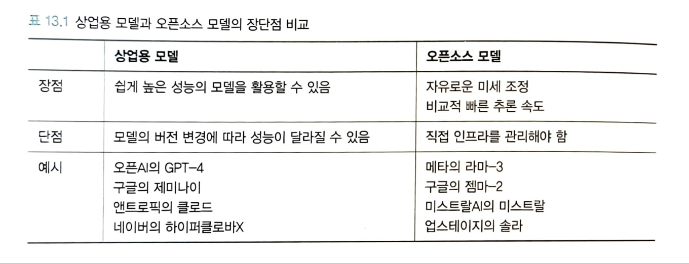

# 12. 벡터 데이터베이스로 확장하기:RAG 구현하기
## 벡터 데이터베이스란
  - 벡터 데이터베이스: 벡터 임베딩을 키로 사용하는 데이터베이스
      1. 저장: 저장할 데이터를 임베딩 모델을 거쳐 벡터로 변환하고 벡터 데이터 베이스에 저장
      2. 검색: 검색할 데이터를 임베딩 모델을 거쳐 벡터로 변환하고 벡터 데이터베이스에서 검색
      3. 결과 반환: 벡터 데이터베이스에서 검색 쿼리의 임베딩과 거라가 가까운 벡터를 찾아 반환
  - 표현 학습: 데이터에서 특징을 자동으로 학습하여 모델이 유용한 데이터 표현을 스스로 만들 수 있도록 하는 방법
  - 벡터 라이브러리: 벡터의 저장, 검색 가능
  - 벡터 데이터 베이스: 저장, 검색 외에도 메타 데이터 저장 및 필터링, 데이터 백업 및 관리, 모니터링, 관련 AI 도구 등 에코시스템과의 통합, 데이터 보안과 엑세스 관리 가능
## 벡터 데이터베이스 작동 원리
  - KNN 검색: 검색하려는 벡터와 가장 가까운 K개의 이웃 벡터를 찾는 검색 방식
    + 모든 데이터를 조사하기 때문에 정확
    + 연산량이 많아서 느리고 확장성이 떨어짐
  - 재현율: 실제로 가장 가까운 K개의 정답 데이터 중 검색 결과로 반환된 비율
  - ANN(Approximate Nearest Neighbor) 검색: 대규모 임베딩 공간에서 입력 쿼리와 가장 유사한 항목을 빠르게 찾기 위한 효율적인 검색 기법
    + IVF: 검색 공간을 제한하기 위해 데이터셋 벡터들을 클러스터로 그룹화하는 근사 최근접 이웃 검색 알고리즘
    + HNSW: 효율적인 ANN 검색을 위한 그래프 기반 인덱싱 구조
## 실습: HNSW 인덱스의 핵심 파라미터 이해하기
  - m: 추가하는 임베딩 벡터에 연결하는 간선의 수로, m이 클수록 더 촘촘하게 연결되기 때문에 재현율이 좋아지지만, 메모리 사용량이 커짐
- ### 파라미터 m의 변경에 따른 성능 확인
```python
import numpy as np

k=1
d = xq.shape[1]
nq = 1000
xq = xq[:nq]

for m in [8, 16, 32, 64]:
    index = faiss.IndexHNSWFlat(d, m)
    time.sleep(3)
    start_memory = get_memory_usage_mb()
    start_index = time.time()
    index.add(xb)
    end_memory = get_memory_usage_mb()
    end_index = time.time()
    print(f"M: {m} - 색인 시간: {end_index - start_index} s, 메모리 사용량: {end_memory - start_memory} MB")

    t0 = time.time()
    D, I = index.search(xq, k)
    t1 = time.time()

    recall_at_1 = np.equal(I, gt[:nq, :1]).sum() / float(nq)
    print(f"{(t1 - t0) * 1000.0 / nq:.3f} ms per query, R@1 {recall_at_1:.3f}")
```
  - ef_construction: M개의 가장 가까운 벡터를 선택할 후보군의 크기
    + 색인 단계에서 후보군의 크기
    + 크면 더 많은 후보를 탐색하기 때문에 가장 가까운 벡터를 선택할 가능성 높아지나 색인 시간 또한 증가
- ### ef_construction을 변화시킬 때 성능 확인
```python
k=1
d = xq.shape[1]
nq = 1000
xq = xq[:nq]

for ef_construction in [40, 80, 160, 320]:
    index = faiss.IndexHNSWFlat(d, 32)
    index.hnsw.efConstruction = ef_construction
    time.sleep(3)
    start_memory = get_memory_usage_mb()
    start_index = time.time()
    index.add(xb)
    end_memory = get_memory_usage_mb()
    end_index = time.time()
    print(f"efConstruction: {ef_construction} - 색인 시간: {end_index - start_index} s, 메모리 사용량: {end_memory - start_memory} MB")

    t0 = time.time()
    D, I = index.search(xq, k)
    t1 = time.time()

    recall_at_1 = np.equal(I, gt[:nq, :1]).sum() / float(nq)
    print(f"{(t1 - t0) * 1000.0 / nq:.3f} ms per query, R@1 {recall_at_1:.3f}")
```
  - ef_search: 검색 단계에서의 후보군의 크기로, 커지면 재현율이 높아지나 검색 시간 증가
- ### ef_search 변경에 따른 성능 확인
```python
for ef_search in [16, 32, 64, 128]:
    index.hnsw.efSearch = ef_search
    t0 = time.time()
    D, I = index.search(xq, k)
    t1 = time.time()

    recall_at_1 = np.equal(I, gt[:nq, :1]).sum() / float(nq)
    print(f"{(t1 - t0) * 1000.0 / nq:.3f} ms per query, R@1 {recall_at_1:.3f}")
```
## 실습: 파인콘으로 벡터 검색 구현하기
- ### 파인콘 계정 연결 및 인덱스 생성
```python
for ef_search in [16, 32, 64, 128]:
    index.hnsw.efSearch = ef_search
    t0 = time.time()
    D, I = index.search(xq, k)
    t1 = time.time()

    recall_at_1 = np.equal(I, gt[:nq, :1]).sum() / float(nq)
    print(f"{(t1 - t0) * 1000.0 / nq:.3f} ms per query, R@1 {recall_at_1:.3f}")
```
- ### 임베딩 생성
```python
from datasets import load_dataset
from sentence_transformers import SentenceTransformer
# 임베딩 모델 불러오기
sentence_model = SentenceTransformer('snunlp/KR-SBERT-V40K-klueNLI-augSTS')
# 데이터셋 불러오기
klue_dp_train = load_dataset('klue', 'dp', split='train[:100]')

embeddings = sentence_model.encode(klue_dp_train['sentence'])
```
- ### 파인콘 입력을 위한 데이터 형태 변경
```python
# 파이썬 기본 데이터 타입으로 변경
embeddings = embeddings.tolist()
# {"id": 문서 ID(str), "values": 벡터 임베딩(List[float]), "metadata": 메타 데이터(dict) ) 형태로 데이터 준비
insert_data = []
for idx, (embedding, text) in enumerate(zip(embeddings, klue_dp_train['sentence'])):
  insert_data.append({"id": str(idx), "values": embedding, "metadata": {'text': text}})
```
- ### 임베딩 데이터를 인덱스에 저장 및 검색
```python
upsert_response = index.upsert(vectors = insert_data, namespace='llm-book-sub')
query_response = index.query(
    namespace='llm-book-sub', # 검색할 네임스페이스
    top_k=10, # 몇 개의 결과를 반환할지
    include_values=True, # 벡터 임베딩 반환 여부
    include_metadata=True, # 메타 데이터 반환 여부
    vector=embeddings[0] # 검색할 벡터 임베딩
)
query_response
```
- ### 파인콘에서 문서 수정 및 삭제
```python
new_text = '변경할 새로운 텍스트'
new_embedding = sentence_model.encode(new_text).tolist()
# 업데이트
update_response = index.update(
    id= '기존_문서_id',
    values=new_embedding,
    set_metadata={'text': new_text},
    namespace='llm-book-sub'
)

# 삭제
delete_response = index.delete(ids=['기존_문서_id'], namespace='llm-book-sub')
```
## 실습: 파인콘을 이용해 멀티 모달 검색 구현하기
  - CLIP: 이미지와 텍스트를 동일한 벡터 공간에 임베딩으로 변환할 수 있는 모델
- ### GPT-4o 요청 함수
```python
import requests
import base64
from io import BytesIO

def make_base64(image):
  buffered = BytesIO()
  image.save(buffered, format="JPEG")
  img_str = base64.b64encode(buffered.getvalue()).decode('utf-8')
  return img_str

def generate_description_from_image_gpt4(prompt, image64):
  headers = {
      "Content-Type": "application/json",
      "Authorization": f"Bearer {client.api_key}"
  }
  payload = {
      "model": "gpt-4o",
      "messages": [
        {
          "role": "user",
          "content": [
            {
              "type": "text",
              "text": prompt
            },
            {
              "type": "image_url",
              "image_url": {
                "url": f"data:image/jpeg;base64,{image64}"
              }
            }
          ]
        }
      ],
      "max_tokens": 300
  }
  response_oai = requests.post("https://api.openai.com/v1/chat/completions", headers=headers, json=payload)
  result = response_oai.json()['choices'][0]['message']['content']
  return result
```
- ### 클라이언트 준비 및 인덱스 생성
```python
import os
from openai import OpenAI
from pinecone import Pinecone, ServerlessSpec

pinecone_api_key = pinecone_api_key # '자신의 파인콘 API 키 입력'
openai_api_key = '자신의 OpenAI API 키 입력'

pc = Pinecone(api_key=pinecone_api_key)
os.environ["OPENAI_API_KEY"] = openai_api_key
client = OpenAI()
print(pc.list_indexes())

index_name = "llm-multimodal"
try:
  pc.create_index(
    name=index_name,
    dimension=512,
    metric="cosine",
    spec=ServerlessSpec(
      "aws", "us-east-1"
    )
  )
  print(pc.list_indexes())
except:
  print("Index already exists")
index = pc.Index(index_name)
```
- ### 프롬프트 텍스트를 임베딩 벡터로 변환 후 파인콘 인덱스에 저장
```python
import torch
from tqdm.auto import trange
from torch.utils.data import DataLoader
from transformers import AutoTokenizer, CLIPTextModelWithProjection

device = "cuda" if torch.cuda.is_available() else "cpu"

text_model = CLIPTextModelWithProjection.from_pretrained("openai/clip-vit-base-patch32")
tokenizer = AutoTokenizer.from_pretrained("openai/clip-vit-base-patch32")

tokens = tokenizer(dataset['prompt'], padding=True, return_tensors="pt", truncation=True)
batch_size = 16
text_embs = []
for start_idx in trange(0, len(dataset), batch_size):
    with torch.no_grad():
        outputs = text_model(input_ids = tokens['input_ids'][start_idx:start_idx+batch_size],
                        attention_mask = tokens['attention_mask'][start_idx:start_idx+batch_size])
        text_emb_tmp = outputs.text_embeds
    text_embs.append(text_emb_tmp)
text_embs = torch.cat(text_embs, dim=0)
text_embs.shape # (1000, 512)
input_data = []
for id_int, emb, prompt in zip(range(0, len(dataset)), text_embs.tolist(), dataset['prompt']):
  input_data.append(
      {
          "id": str(id_int),
          "values": emb,
          "metadata": {
              "prompt": prompt
          }
      }
  )

index.upsert(
  vectors=input_data
)
```
- ### 이미지 임베딩의 유사 프롬프트 검색 및 확인
```python
from transformers import AutoProcessor, CLIPVisionModelWithProjection

vision_model = CLIPVisionModelWithProjection.from_pretrained("openai/clip-vit-base-patch32")
processor = AutoProcessor.from_pretrained("openai/clip-vit-base-patch32")

inputs = processor(images=original_image, return_tensors="pt")

outputs = vision_model(**inputs)
image_embeds = outputs.image_embeds

search_results = index.query(
  vector=image_embeds[0].tolist(),
  top_k=3,
  include_values=False,
  include_metadata=True
)
searched_idx = int(search_results['matches'][0]['id'])
search_results

# {'matches': [{'id': '918',
#               'metadata': {'prompt': 'cute fluffy bunny cat lion hybrid mixed '
#                                      'creature character concept, with long '
#                                      'flowing mane blowing in the wind, long '
#                                      'peacock feather tail, wearing headdress '
#                                      'of tribal peacock feathers and flowers, '
#                                      'detailed painting, renaissance, 4 k '},
#               'score': 0.372838408,
#               'values': []},
#              {'id': '867',
#               'metadata': {'prompt': 'cute fluffy baby cat rabbit lion hybrid '
#                                      'mixed creature character concept, with '
#                                      'long flowing mane blowing in the wind, '
#                                      'long peacock feather tail, wearing '
#                                      'headdress of tribal peacock feathers and '
#                                      'flowers, detailed painting, renaissance, '
#                                      '4 k '},
#               'score': 0.371655703,
#               'values': []},
# ...
```
- ### 프롬프트로 이미지 생성 함수 정의 및 이미지 생성
```python
from PIL import Image

def generate_image_dalle3(prompt):
  response_oai = client.images.generate(
    model="dall-e-3",
    prompt=str(prompt),
    size="1024x1024",
    quality="standard",
    n=1,
  )
  result = response_oai.data[0].url
  return result

def get_generated_image(image_url):
  generated_image = requests.get(image_url).content
  image_filename = 'gen_img.png'
  with open(image_filename, "wb") as image_file:
      image_file.write(generated_image)
  return Image.open(image_filename)
# GPT-4o가 만든 프롬프트로 이미지 생성
gpt_described_image_url = generate_image_dalle3(described_result)
gpt4o_prompt_image = get_generated_image(gpt_described_image_url)
gpt4o_prompt_image
# 원본 프롬프트로 이미지 생성
original_prompt_image_url = generate_image_dalle3(original_prompt)
original_prompt_image = get_generated_image(original_prompt_image_url)
original_prompt_image
# 이미지 임베딩으로 검색한 유사 프롬프트로 이미지 생성
searched_prompt_image_url = generate_image_dalle3(dataset[searched_idx]['prompt'])
searched_prompt_image = get_generated_image(searched_prompt_image_url)
searched_prompt_image
```
# 13. LLM 운영하기
## MLOps
  - MLOps: 소프트웨어 개발과 운영의 협업과 자동화에 데이터와 머신러닝 모델 요소 확장
  - 재현성: ML 워크플로를 그대로 반복했을 떄 동일한 모델을 얻을 수 있는지 여부
  - 모델 저장소: 머신러닝 모델을 버전 관리하고, 배포 및 활용할 수 있도록 저장하는 시스템
## LLMOps는 무엇이 다를까?
  - LLMOps는 MLOps보다 훨씬 크고 다양한 일을 할 수 있는 모델을 다룸
-
## LLM 평가하기
  - BLEU: 기계 번역 결과와 사람이 번역한 결과의 유사도 측정하여 번역 성능 평가
  - ROGUE: 모델이 생성한 요약문과 사람이 작성한 참조 요약문 사이의 n그램 중복도를 재현율 관점에서 측정
# 14. 멀티 모달 LLM
## 멀티 모달 LLM이란
  - 멀티 모달 LLM: 이미지, 비디오, 오디오, 3D 등 다양한 형식의 데이터를 이해하고 생성할 수 있는 LLM
  - 모달리티 인코더: 텍스트, 이미지, 오디오 등 다양한 형태의 데이터를 LLM이 처리할 수 있는 통일된 벡터 표현으로 변환하는 역할을 하는 인코더
  - 입력 프로젝터: 모달리티 인코더를 통해 변환된 데이터의 차원을 모델이 처리하기 적합한 크기로 맞춰주는 역할
  - 출력 프로젝터: 모델의 마지막 단계에서 생성된 고차원 벡터를 사람이 이해할 수 있는 형식으로 변환하는 역할
  - 모달리티 생성기: 모델이 특정 모달리티(텍스트, 이미지, 오디오 등)로 출력을 생성하는 데 사용되는 모듈
## 이미지와 텍스트를 연결하는 모델: CLIP
  - CLIP(Contrastive Language- Image Pre training): 이미지와 데이터의 관계를 계산할 수 있도록 텍스트 모델과 이미지 모델을 함께 학습시킨 모델
  - 제로샷 추론: 사전 학습 데이터 이외에 특정 작업을 위한 데이터로 미세 조정 하지 않은 상태에서 추론을 수행하는 것
  - 이미지 검색: 이미지와 텍스트를 입력했을 때 유사한 이미지를 찾는 기능
## 텍스트로 이미지를 생성하는 모델: DALL-E
  - DALL-E 모델:
    1.  CLIP의 텍스트 인코더를 사용해 입력한 텍스트를 텍스트 임베딩으로 변환
    2. 프라이어 모델을 이용해 CLIP 이미지 임베딩 제작
    3. 디코더를 사용해 이미지 생성
## LLaVA
  - LLaVA: 이미지를 인식하는 CLIP 모델과 LLM을 결합해 모델이 이미지를인식하고 이미지에 대한 택스트 생성 가능
# 15. LLM 에이전트
## 에이전트란
## 에이전트 시스템의 형태
## 에이전트 평가하기
## 실습: 에이전트 구현
# 16. 새로운 아키텍처
## 기존 아키텍처의 장단점
## SSM
## 선택 메커니즘
## 맘바
## 코드로 보는 맘바

