# LLM을 활용한 실전 AI 애플리케이션 개발

# 3부 | LLM을 활용한 실전 애플리케이션 개발
# 12. 벡터 데이터베이스로 확장하기: RAG 구현하기
## 12.1 벡터 데이터베이스란
### 12.1.1 딥러닝과 벡터 데이터베이스
> 딥러닝 기술이 폭넓게 활용됨녀서 데이터의 특징을 추출한 임베딩을 활용하는 경우가 많아졌고, 임베딩을 저장하고 관리하는 기능에 특화된 벡터 데이터베이스의 필요성이 커졌다.

- **벡터 데이터베이스**: 벡터 임베딩을 키로 사용하는 데이터베이스
### 12.1.2 벡터 데이터베이스 지형 파악하기
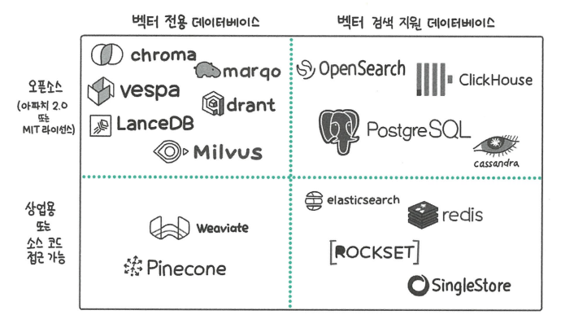
- 벡터 전용 데이터베이스: 고급 벡터 검색이 필요하고 워크로드가 큰 경우
- 벡터 검색 지원 데이터베이스: 벡터 이외의 데이터 형태를 처리하는 경우

## 12.2 벡터 데이터베이스 작동 원리
### 12.2.1 KNN 검색과 그 한계
- **KNN 검색**: 검색하려는 벡터와 가장 가까운 K개의 이웃 벡터를 찾는 검색 방식
    - 모든 데이터를 조사하므로 정확하다.
    - 연산량이 데이터 수에 비례하게 늘어나 속도가 느려지고 확장성이 떨어진다.
### 12.2.2 ANN 검색이란
- ANN 검색: 근사 최근접 이웃 검색이라는 뜻으로, 임베딩 벡터를 빠르게 탐색할 수 있는 구조로 저장해서 검색 시 탐색할 범위를 좁힌다.
1. IVF
    - 검색 공간을 제안하기 위해 데이터셋 벡터들을 클러스터로 그룹화한다.
2. HNSW
    - 효율적인 ANN 검색을 위한 그래프 기반 인덱싱 구조로, 상위 계층에는 연결이 적고 하위 계층에는 연결이 밀집된 다층 그래프를 구축한다.
### 12.2.3 탐색 가능한 작은 세계(NSW)
> HNSW는 그래프 기반으로, 노드와 간선으로 구성된다.
- 탐색 가능한 작은 세계: 적당히 랜덤하게 연결된 그래프 상태
    > 규칙적인 연결으로 정확한 탐색이 가능하면서도 랜덤한 성질으로 빠른 탐색이 가능해진다.
    > 랜덤으로 저장하다 보니 검색 벡터와 가장 가까운 점이 아닌 곳에서 탐색을 멈추는 지역 최솟값 문제가 발생한다.
### 12.2.4 계층 구조
- HNSW는 계층구조를 NSW에 접목해 여러 계층에 그래프를 배치하는 방식으로 벡터를 저장한다.
- 계층구조는 레벨 0에는 모든 데이터가 있도록, 레벨이 높아질수록 데이터를 듬성듬성 배치하는 방식으로 구성된다.
- 높은 레벨에 벡터를 저장할 때는 확률을 이용한다.

## 12.3 실습: HNSW 인덱스의 핵심 파라미터 이해하기
### 12.3.1 파라미터 m 이해하기
- 추가하는 임베딩 벡터에 연결하는 간선의 수
> 해당 파라미터가 커짐에 따라 어떻게 변화할지 알아보자
- 검색의 품질(재현율) 상승
- 메모리 사용량 증가
- 색인 시간 증가
- 검색 시간 증가
### 12.3.2 파라미터 ef_construction 이해하기
- 가장 가까운 벡터를 선택할 후보군의 크기
> 해당 파라미터가 커짐에 따라 어떻게 변화할지 알아보자
- 검색의 품질(재현율) 상승
- 색인 시간 증가
### 12.3.3 파라미터 ef_search 이해하기
- 검색 단계에서 후보군의 크기
> 해당 파라미터가 커짐에 따라 어떻게 변화할지 알아보자
- 검색의 품질(재현율) 상승
- 검색 시간 증가

## 12.4 실습: 파인콘으로 벡터 검색 구현하기
> 파인콘: 대표적인 벡터 데이터베이스
### 12.4.1 파인콘 클라이언트 사용법
> 파인콘 계정 연결/인덱스 생성 -> 임베딩 생성 -> 파인콘 입력을 위한 데이터 형태 변경 -> 임베딩 데이터를 인덱스에 저장 -> **인덱스 검색 가능**
- 파인콘 클라이언트 라이브러리로 벡터 데이터베이스의 CRUD(생성, 조회, 수정, 삭제)를 수행할 수 있다.
### 12.4.2 라마인덱스에서 벡터 데이터베이스 변경하기
> 라마 인덱스로 RAG 구현 시, 다양한 벡터 데이터베이스와 쉽게 통합할 수 있는 기능을 제공한다.

## 12.5 실습: 파인콘을 활용해 멀티 모달 검색 구현하기
> 이미지와 텍스트를 동일한 벡터 공간에 임베딩으로 변환할 수 있는 CLIP 모델을 사용한다.
### 12.5.1 데이터셋
> 프롬프트와 스테이블 디퓨젼 이미지 쌍으로 구성된 데이터셋을 사용한다.
### 12.5.2 실습 흐름
> 원본 이미지와 세가지 프롬프트로 생성한 이미지를 비교한다.
- GPT 설명 프롬프트
- 원본 프롬프트
- 유사 프롬프트

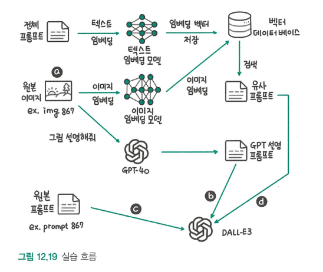

### 12.5.3 GPT-4o로 이미지 설명 생성하기
> GPT-4o에 원본 이미지를 입력하고 이미지에 대해 설명하도록 지시해 프롬프트를 생성한다.
### 12.5.4 프롬프트 저장
> 클라이언트 준비 -> 인덱스 생성 -> 프롬프트 텍스트를 임베딩 벡터로 변환 -> 텍스트 임베딩 벡터를 파인콘 인덱스에 저장
### 12.5.5 이미지 임베딩 검색
> 원본 이미지를 이미지 임베딩으로 변환하고 해당 임베딩 벡터로 파인콘에서 유사한 프롬프트를 검색한다.
### 12.5.6 DALLE-3로 이미지 생성
> GPT-4o의 설명을 프롬프트로 생성한 이미지가 원본과 가장 유사하고, 원본 프롬프트와 유사 프롬프트로 생성한 이미지가 비슷하다는 결과를 얻는다.

# 13. LLM 운영하기
## 13.1 MLOps
- MLOps: 데브옵스의 개념을 머신러닝과 데이터 과학 분야로 확장한 방법론, 데이터 수집/전처리/모델 학습/평가/배포/모니터링 등 머신러닝 프로젝트의 전 과정을 자동화하고 효율화하는 것을 목표로 한다.

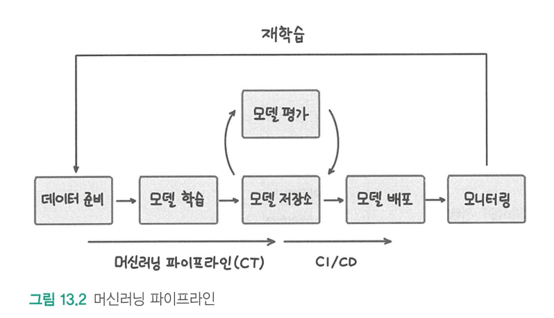

### 13.1.1 데이터 관리
> 데이터 준비 과정에서 데이터 선택/전처리 방식/특성 공학에 따라 학습 데이터셋이 달라진다. 이러한 데이터셋을 관리하고 기록하기 위해 DVC와 같은 도구를 사용한다.
### 13.1.2 실험 관리
> 모델 종류와 하이퍼파라미터 등을 기록하는 실험 관리 도구로는 MLflow, W&B가 있다.
### 13.1.3 모델 저장소
> 다양한 모델을 관리하는 모델 저장소로는 MLflow 모델 저장소, AWS 세이지메이커 모델 저장소 등이 있다.
### 13.1.4 모델 모니터링
> 머신러닝 모델이 배포 이후 지속적으로 잘 작동하는지 모니터링하는 도구로는 프로메테우스, 그라파나 등이 있다.

## 13.2 LLMOps는 무엇이 다를까?
### 13.2.1 상업용 모델과 오픈소스 모델 선택하기
> LLMOps는 MLOps보다 크고 다양한 일을 할 수 있는 모델을 다룬다.

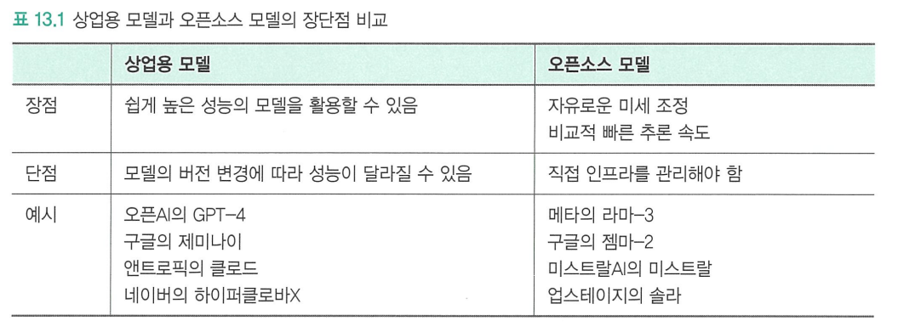

- 모델이 크면 비용이 많이 발생하므로 양자화와 지식 증류로 모델을 경량화한다. (7장)
- 또한, 연속 배치와 플래시 어텐션, 페이지 어텐션을 통해 추론을 효율적으로 할 수 있다. (8장)
### 13.2.2 모델 최적화 방법의 변화
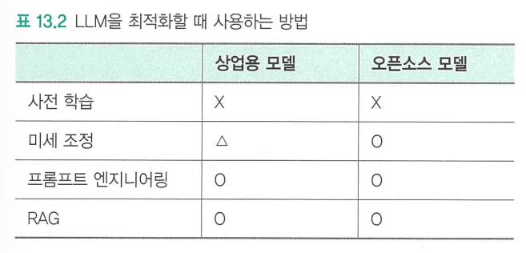
- 사전 학습을 하지 않고 전이 학습을 한다.
- 미세 조정은 LoRA나 QLoRA 방식을 사용한다. (5장)
- 프롬프트를 추적하기 위해 W&B, MLflow 같은 도구를 사용한다.
### 13.2.3 LLM 평가의 어려움
> 다양한 작업이 가능하므로 특정 작업의 성능 평가로만 평가하기는 어렵다.

## 13.3 LLM 평가하기
### 13.3.1 정량적 지표
1. BLEU: 기계 번역과 사람이 번역한 결과의 유사도를 측정하여 번역 성능을 평가
2. ROUGE: 모델이 생성한 요약문과 사람이 작성한 참조 요약문 사이의 n그램 중복도를 측정한다.
3. 펄플렉시티: 모델이 새로운 단어를 생성할 때의 불확실성을 수치화한다.
### 13.3.2 벤치마크 데이터셋을 활용한 평가
- 벤치마크 데이터셋: 다양한 모델의 성능을 비교하기 위해 공통으로 사용하는 데이터셋
1. ARC: 사지선다형 과학 문제
2. 다음으로 연결된 문장을 4개의 보기 중 고르는 문제
3. MMLU: 다양한 과제에 대한 모델의 성능을 평가
4. TruthfulQA: 신뢰할 수 있는 모델인지 확인하기 위한 질문
### 13.3.3 사람이 직접 평가하는 방식
> 정량적인 지표로 평가하기 어려운 사항을 평가한다.
### 13.3.4 LLM을 통한 평가
> 사람이 직접 평가하는 방식의 단점을 보완한다.
### 13.3.5 RAG 평가
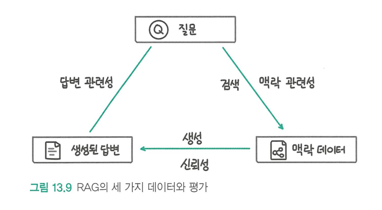
- 신뢰성: 생성된 응답이 검색된 맥락 데이터에 얼마나 사실적을 부합하는가
- 답변 관련성: 생성된 답변이 요청과 얼마나 관련성이 있는가
- 맥락 관련성: 맥락 데이터가 요청과 얼마나 관련 있는지

# 4부 | 멀티 모달, 에이전트 그리고 LLM의 미래
# 14. 멀티 모달 LLM
## 14.1 멀티 모달 LLM이란
- 멀티 모달 LLM: 텍스트뿐만 아니라 이미지, 비디오 등 다양한 형색의 데이터를 이해하고 생성할 수 있는 LLM
### 14.1.1 멀티 모달 LLM의 구성요소
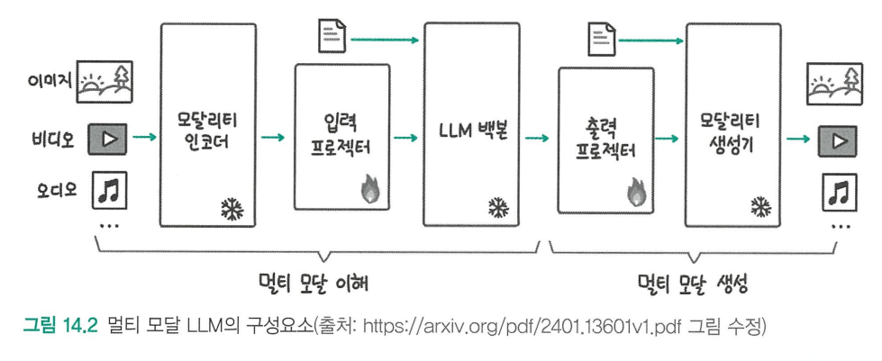
- 이미지 형식의 데이터를 모달리티 인코더와 입력 프로젝터를 통해 텍스트로 변환해 LLM에 입력한다.
    > 모달리티 인코더는 입력 데이터를 특징 벡터로 변환하고, 입력 프로젝터가 벡터를 텍스트로 변환한다.
    > 모달리티 인코더는 비전 트랜스포머가 가장 많이 활용된다.
    > 이미지를 패치 단위로 자른 후 일렬로 나열해 처리한다.
    > 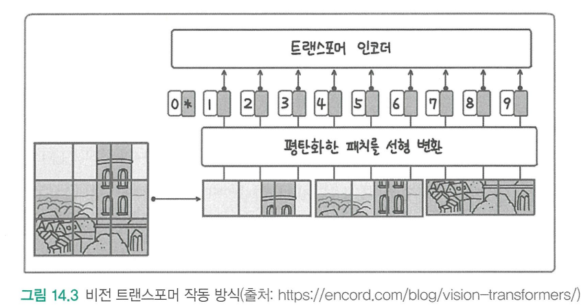
    > CLIP도 이미지를 처리하는 모달리티 인코더로, 많이 사용된다.
- 출력 프로텍터를 통해 이미지 형태의 데이터 출력이 필요한지 판단하고 모달리티 생성기를 통해 특정 데이터 형식의 출력을 생성한다.
### 14.1.2 멀티 모달 LLM 학습 과정
- 사전 학습: 이미지-텍스트 쌍과 같은 대규모 멀티 모달 데이터 세트로 학습된다.
- 지시 학습: 멀티 모달 LLM을 소규모 멀티 모달 지시 데이터셋으로 미세 조정한다.
## 14.2 이미지와 텍스트를 연결하는 모델: CLIP
### 14.2.1 CLIP 모델이란
- CLIP: 텍스트 데이터와 이미지 데이터의 관계를 계산할 수 있도록 텍스트와 이미지 모델을 함께 학습시킨 모델
### 14.2.1 CLIP 모델의 학습 방법
- 대조 학습: 유사한 데이터 쌍은 더 가까워지도록, 그렇지 않은 데이터 쌍은 더 멀어지도록 학습시킨다.
    > 이미지와 텍스트를 각각 임베딩으로 만든 후, 서로 매칭되는 쌍의 유사도는 커지고 그렇지 않은 쌍의 유사도는 작아지도록 학습시킨다.
    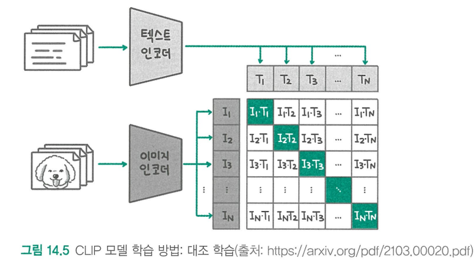
### 14.2.3 CLIP 모델의 활용과 뛰어난 성능
- 제로샷 추론: 사전 학습 데이터 이외에 특정 작업을 위한 데이터로 미세 조정하지 않은 상태에서 추론을 수행하는 것
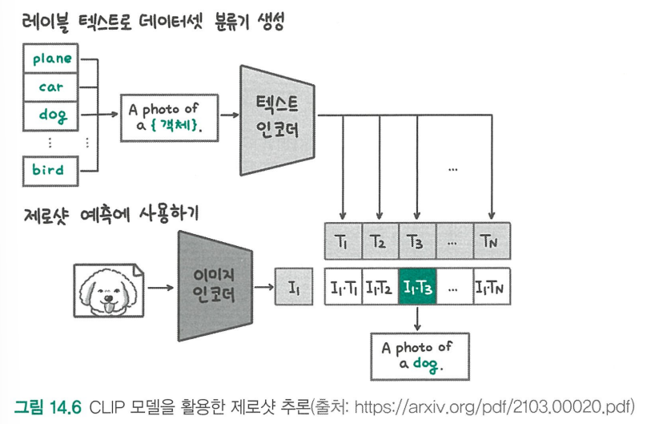
> 지도 학습을 수행한 다른 모델보다 성능이 더 높다.
- 이미지 검색: 이미지와 텍스트의 유사도를 기반으로 텍스트 입력 시 유사한 이미지를 찾는 기능
### 14.2.4 CLIP 모델 직접 활용하기
> 허깅페이스 트랜스포머 라이브러리를 활용해 CLIP 모델으로 이미지를 추론할 수 있다.

## 14.3 텍스트로 이미지를 생성하는 모델: DALL-E
### 14.3.1 디퓨전 모델 원리
> 확산 현상에서 영감을 받아 만들어진 모델로, 이미지에서 어떤 부분이 노이즈인지 예측하는 방식으로 학습한다.
> 완전한 노이즈 상태의 이미지에서 노이즈를 예측하고, 예측된 노이즈를 제거하면서 점차 의미 있는 이미지를 생성한다.
- 인코더 디코더: 입력 데이터의 차원을 낮추는 인코딩, 차원을 높이는 디코딩을 통해 데이터의 의미를 압축하는 모델 구조
- U-Net: 인코딩 단계의 고차원 정보를 디코딩 단계에도 활용해 이미지의 위치 정보가 손실되는 것을 막는다.
> 원하는 결과물의 형태를 텍스트 임베딩으로 변환해 디퓨전 모델에 함께 입력을 넣으면 완전한 노이즈 상태에서 원하는 이미지를 생성할 수 있다.
### 14.3.2 DALL-E 모델
> CLIP 모델을 활용해 텍스트 임베딩을 만들고 텍스트 임베딩을 활용해 두 단계를 거쳐 이미지를 생성한다.
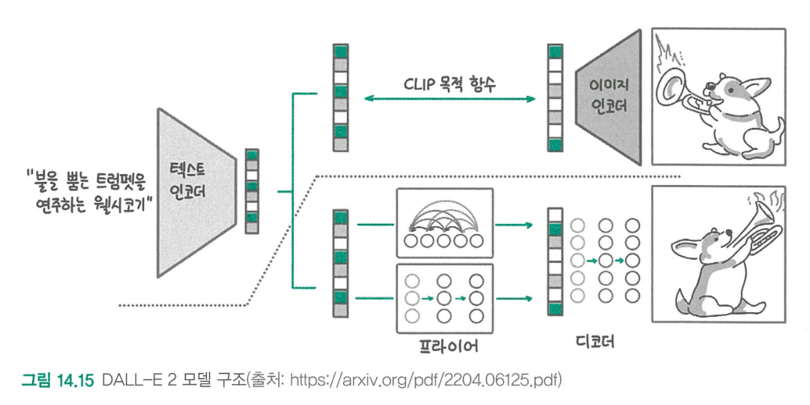
- CLIP의 텍스트 인코더를 사용해 입력 텍스트를 임베딩한다.
- 프라이어 모델을 이미지 임베딩을 만들고 디코더로 이미지를 생성한다.
    > 프라이어: 텍스트 임베딩을 입력받아 이미지 임베딩을 예측하는 디퓨전 모델

## 14.4 LLaVA
> 이미지를 인식하는 CLIP모델과 LLM을 결합해 모델이 이미지를 인식하고, 이미지에 대한 텍스트를 생성할 수 있다.
### 14.4.1 LLaVA의 학습 데이터
> ChatGPT와 GPT-4를 활용해 이미지에 대한 설명과 위치정보로 이미지를 인식하도록 만들어 데이터셋을 생성한다.
### 14.4.2 LLaVA 모델 구조
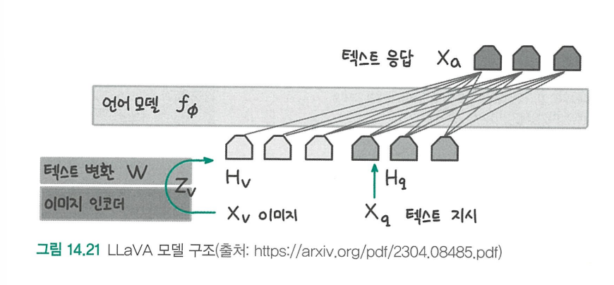
> 입력 이미지를 이미지 임베딩으로 만들고 LLM에 입력할 임베딩 토큰으로 만든다. 텍스트 지시사항은 토큰 임베딩으로 변환해 함께 입력으로 넣고 결과를 생성한다.
### 14.4.3 LLaVA 1.5
> 이미지 인코더를 바꾸고, 이미지 임베딩을 토큰 임베딩으로 변환하는 구조를 2층으로 변경해 성능을 향상시켰다.
### 14.4.4 LLaVA NeXT
> LLaVA 1.5를 더 발전시킨 모델로, 오픈소스 모델 중 최고 성능을 달성했다.

# 15. LLM 에이전트
## 15.1 에이전트란
> 주변 환경을 감각을 통해 인식하고 의사결정을 내려 행동하는 인공적인 개체
### 15.1.1 에이전트의 구성요소
1. 감각: 외부 환경과 사용자의 요청을 인식한다.
2. 두뇌: 지식이나 기억을 통해 계획을 세우고 추론을 통해 의사결정을 내린다.
3. 행동: 문제를 해결하기 위해 적절한 도구를 선택하고 행동한다.
### 15.1.2 에이전트의 두뇌
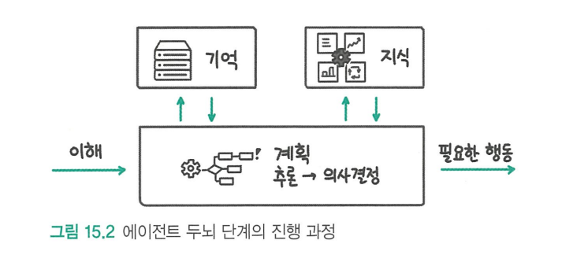
> 현재 상황과 사용자의 요청을 인식하고 목표 달성을 위해 어떤 행동을 취할지 결정한다.
### 15.1.3 에이전트의 감각
> 텍스트와 이미지 뿐만 아니라 음성, 비디오 등 다양한 유형의 입력 데이터를 활용한 모델이 발전하는 중이다.
### 15.1.4 에이전트의 행동
> LLM은 텍스트만 생성할 수 있으므로, LLM이 사용할 수 있는 다양한 도구를 제공해야 한다.
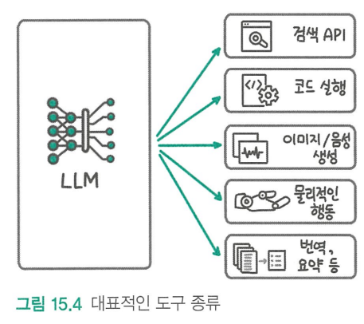

## 15.2 에이전트 시스템의 형태
### 15.2.1 단일 에이전트
> AutoGPT를 예시로 살펴보자.
- 입력받은 프롬프트를 통해 모든 결정을 내린다.
- 에이전트의 이름과 역할을 부여한 후 목표를 정한다.
- 에이전트는 목표를 달성하기 위한 작업을 결정하고 실행하는데, 이 때 제약사항이 있다면 전달한다.
- 사용할 수 있는 도구를 제공한다.
### 15.2.2 사용자와 에이전트의 상호작용
> 예시로는 ChatGPT가 있다.
- 사용자는 에이전트에게 원하는 기능을 요청하고, 이후 에이전트의 응답에 피드백을 주는 과정을 반복한다.
### 15.2.3 멀티 에이전트
> 앞서 살펴본 방식에서 사용자를 또 다른 에이전트가 대체하는 방식이다.

## 15.3 에이전트 평가하기
- 주관적인 방식 (사람이 평가)
    1. 에이전트의 작업 결과를 사람이 직접 평가
    2. 사람의 결과와 비교해 에이전트와 사람이 생성한 것을 구분할 수 있는지 확인 (= 튜링 테스트)
- 객관적인 방식 (데이터로 평가)
    > 에이전트 평가 기준 4가지
    1. 유용성: 작업 성공률
    2. 사회성: 언어적인 상호작용
    3. 가치관: 신뢰/편향 등
    4. 진화 능력: 변화하는 환경 적응
    > 유용성 평가에 활용되는 데이터 셋 8가지
    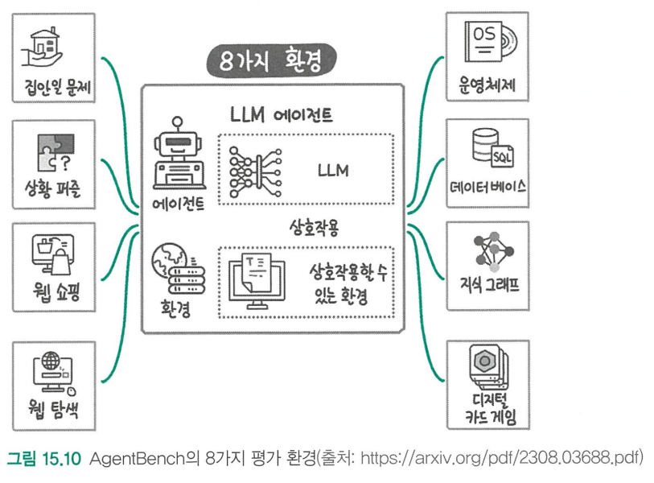

## 15.4 실습: 에이전트 구현
> 에이전트 프레임워크 AutoGen을 사용한다.
### 15.4.1 AutoGen 기본 사용법
- OpenAI API 키 설정 -> 에이전트 설정 불러오기 -> 에이전트 정의 -> 작업 실행
- UserProxyAgent: 사용자의 역할을 대신한다.
- AssistantAgent: 사용자의 요청을 처리한다.
### 15.4.2 RAG 에이전트
> AutoGen에서는 RAG를 구현할 때 텍스트 임베딩 모델과 벡터 데이터베이스를 설정할 수 있다.
- 그룹챗: 3개 이상의 에이전트가 협업하는 것
### 15.4.3 멀티 모달 에이전트
> GPT-4o와 DALL-E 3 모델로 멀티 모달 에이전트를 만들어보자.
- 필요한 라이브러리를 불러오고 각 모델의 기본 설정을 진행한다.
- DALLEAgent 정의 -> GPT-4o 에이전트 생성 -> 그룹챗 기능으로 두 에이전트가 대화를 나누도록 한다.
- 입력 그림에 대해 설명하고, 그 내용을 새 그림을 생성하는 데 활용한다.

# 16. 새로운 아키텍처