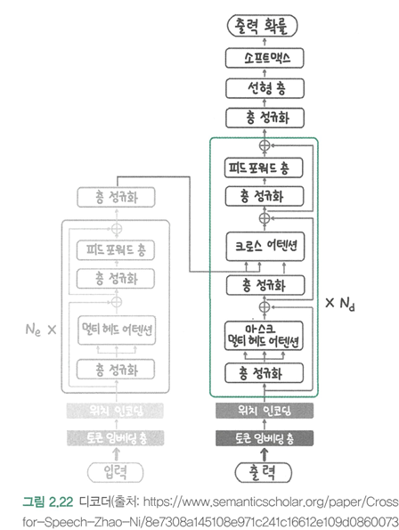
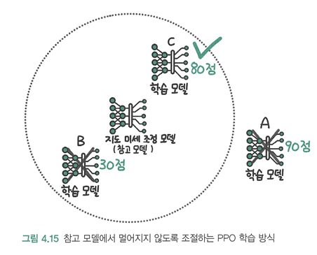
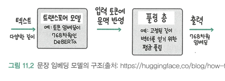

# LLM을 활용한 실전 AI 애플리케이션 개발
## 01 LLM 지도
2022년말 Chat GPT가 등장했고 사용자와 대화가 된다고 느껴질 정도로 놀라운 성능을 보였다. 

하지만 그런 놀라운 성능에도 불구하고 GPT는 굉장히 단순한 과정으로 동작하는데 1장에서는 LLM의 기반이 되는 딥러닝과 언어 모델링에 대해 알아본다.

### 1.1 딥러닝과 언어 모델링
LLM은 **딥러닝** 기반의 **언어 모델**이다.

* 딥러닝 : 데이터의 패턴을 학습한느 머신러닝의 한 분야, 표 형태의 정형 데이터 뿐만 아니라 텍스트와 이미지 같은 비정형 데이터에서도 뛰어난 패턴 인식 성능을 보임.
* 언어 모델 : 다음에 올 단어를 예측하는 모델

이러한 LLM이 지금처럼 자리 잡기까지 중요했던 세 가지 사건이 있다. 
1. 2013년 구글에서 **워드투벡** 발표.
2. 2017년 구글에서 **트랜스포머 아키텍쳐** 공개
3. 2018년 OpenAI의 **GPT-1 모델** 공개 

이 세 가지 주요 사건들이 어떠한 영향들을 미쳐왔는지 알아보자.

---
### 1.1.1 데이터의 특징을 스스로 추출하는 딥러닝

딥러닝의 단순하면서도 범용적으로 문제를 해결하는 3단계 접근 방식
+ 문제의 유형(예: 자연어 처리, 이미지 처리)에 따라 일반적으로 사용되는 모델을 준비
+ 풀고자 하는 문제에 대한 학습 데이터를 준비
+ 학습 데이터를 반복적으로 모델에 입력

딥러닝은 기존 머신러닝과 다르게 연구자 또는 개발자가 데이터의 특징을 뽑지않고 모델이 **스스로** 데이터의 특징을 찾고 분류하는 모든 과정을 학습한다.

---

### 1.1.2 임베딩: 딥러닝 모델이 데이터를 표현하는 방식

딥러닝 모델은 데이터의 의미를 숫자의 집합으로 표현한다. 

이때 데이터의 의미와 특징을 포착해 그 의미를 담고 여러 개의 숫자 집합으로 표현하는 것을 **임베딩(Embedding)** 이라고 부른다.    
데이터를 임베딩으로 표현하면 데이터 사이의 거리를 계산하고 거리를 바탕으로 관련 있는 데이터와 관련이 없는 데이터를 구분할 수 있다.   
#### 이때 2013년 구글에서 워드투벡(word2vec)이라는 모델을 통해 단어를 임베딩(여러개의 숫자 집합)으로 변환하는 방법을 소개했다.   
단어를 임베딩으로 변환한 것을 단어 임베딩(word embedding)이라고 한다.   
(단어를 임베딩으로 변환하다 = 데이터(단어)들을 의미와 특징을 담아 여러개의 숫자 집합으로 표현하다)   

* 다음은 요즘 유행하는 MBTI를 임베딩 모델에 비교해 표로 나타낸 것이다.   

---

### 1.1.3 언어 모델링: 딥러닝 모델의 언어 학습법

* 언어 모델링 : 모델이 입력받은 텍스트의 다음 단어를 예측해 텍스트를 생성하는 방식.   대량의 데이터에서 언어의 특성을 학습하는 사전 학습(pre-training)과제로도 많이 사용된다.

기존의 머신러닝 모델 학습은 지도 학습(supervised-learning) 방식으로 각각의 데이터 셋으로 별도의 모델을 학습 시켰다.    
이에 발전해 지금의 딥러닝 분야에서는 총 **두 단계** 로 나눠 학습을 진행한다. 그리고 이 과정을 전이 학습(transfer-learning)이라고 부른다.

* 사전 학습(pre-training) : 대량의 데이터로 모델을 학습 시킴. 이때 대량의 데이터는 꼭 문제를 해결하기 위한 데이터와 관련이 있는 것은 아니다.
* 미세 조정(fine-tunning) : 특정한 문제를 해결하기 위한 데이터로 추가 학습하는 것. (사전 학습모델을 미세 조정해 풀고자 하는 과제를 다운스트림(downtream) 과제라고 부른다.)

이때 재밌는 것은 학습시키려는 데이터와 다른 대량의 데이터들로 사전 학습을 시킨 것이 결국 점이나 선같은 특징을 파악하는데 도움을 주기 때문에 일반적으로 성능이 더 좋아졌다.

--- 

## 1.2 (딥러닝)언어 모델이 CHAT GPT가 되기 까지

--- 

### 1.2.1 RNN에서 트랜스포머 아키텍처(구조)로

RNN(순환 신경망, Recurrent Neural Network): 트랜스포머 아키텍처를 사용하기 전 텍스트를 생성하기 위해 사용되었던 아키텍처
 

- 입력하는 텍스트를 **순차적** 으로 처리해서 다음 단어를 예측 -> 먼저 입력한 단어의 의미가 점차 희석되며, 입력이 길어지는 경우 성능 저하
- 모델이 '하나의 잠재 상태(hidden state)'에 지금까지의 입력 텍스트의 맥락을 압축 -> 메모리를 적게 사용, 다음 단어를 빠르게 생성
  
트랜스 포머 아키텍처: RNN의 **순차적인** 방식을 버리고, 맥락을 모두 참조하는 **어텐션(atttention)** 연산을 사용 -> RNN의 문제를 대부분 해결

- 맥락을 압축하지 않고 그대로 활용하기 때문에 성능을 높일 수 있지만, 입력 텍스트가 길어지면 맥락 데이터를 모두 저장하고 있어야 하기 때문에 메모리 사용량이 증가
- 매번 단어를 예측할 때마다 맥락 데이터를 모두 확인해야 하기 때문에 입력이 길어지면 예측에 걸리는 시간도 증가
- **but 성능이 좋고 병렬 처리를 통해 학습 속도를 높일 수 있어 현재는 대부분 LLM이 트랜스포머 아키텍처를 기반으로 한다.**
  
### 1.2.2 GPT 시리즈로 보는 모델 크기와 성능의 관계 

언어 모델이 학습하는 과정 = 언어 모델이 학습 데이터를 압축하는 과정   
이때 압축은 공통되고 중요한 패턴을 남기는 손실 압축이다.    
중요한 점은 모델이 계속해서 커진다고 성능이 높아지지 않고 학습 데이터의 크기가 최대 모델 크기의 상한이라고 볼 수 있다.

---

### 1.2.3 Chat GPT의 등장

GPT-3를 CHAT CPT로 바꾼것은 OpenAI가 논문의 연구 결과 발표와 함께 공개한 **지도 미세 조정(supervised-fine-tunning)** 과 **RLHF(Reinforcement Learning from Human Feedback)** 라는 기술 덕분이었다.   
이 기술들을 통해 챗GPT는 그저 사용자가 한 말 다음에 이어질 말을 생성하는 것이 아니라 사용자의 요청을 해결할 수 있는 텍스트를 생성하게 되었다.   

* 지도 미세 조정: 정렬(LLM이 생성하는 답변을 사용자의 요청 의도에 맞추는 것)을 위한 가장 핵심적인 학습 과정으로서, 언어 모델링으로 사전 학습한 언어 모델을 지시 데이터셋으로 추가 학습하는 것.
이때 지시 데이터셋은 사용자가 요청 또는 지시한 사항과 그에 대한 적절한 응답을 정리한 데이터 셋.
* RLHF: OpenAI에서는 두 가지 답변 중 사용자가 더 선호하는 답변을 선택한 데이터셋을 구축, 이를 선호 데이터셋이라고 한다. 이 선호 데이터셋으로 LLM의 답변을 평가하는 리워드 모델을 만들고 LLM이 점점 더 높은 점수를 받을 수 있도록 추가 학습하는 것.

--- 

## 1.3 LLM 애플리케이션의 시대가 열린다

---

### 1.3.1 지식 사용법을 획기적으로 바꾼 LLM 

기존의 자연어 처리 접근 방식에서는 언어 이해 모델과 언어 생성 모델을 각각 개발해 연결했다. 때문에 시스템 복잡도가 높았고 관리가 어려웠다.    
하지만 LLM의 경우 언어 이해와 생성 능력이 모두 뛰어나 **다재다능** 하다. 

LLM은 우리가 기존에 지식을 습득하고 활용하던 모든 측면에 영향을 줄 수 있기 때문에 이전의 AI 모델보다 사회에 미치는 영향이 크다.

---

### 1.3.2 sLLM: 더 작고 효율적인 모델 만들기 

* LLM을 활용하는 두 가지 방법
1. OpenAI의 GPT-4나 구글의 제미나이처럼 **상업용 API**를 사용하는 방법 -> 모델이 크고 범용 텍스트 생성 능력이 뛰어남
2. 오픈소스 LLM을 활용해 **직접 LLM API**를 생성해 사용하는 방법 -> 작업을 위한 데이터를 자유롭게 추가 학습 가능 

* 오픈소스 LLM을 활용해 추가 학습을 하는 경우 모델 크기가 작으면서도 특정 도메인 데이터나 작업에서 높은 성능을 보이는 모델을 만들 수 있는데, 이를 **sLLM**이라고 한다.

--- 

### 1.3.3 더 효율적인 학습과 추론을 위한 기술

LLM의 기반이 되는 트랜스포머 아키텍처 연산은 LLM의 학습과 추론에 필요한 연산량이 크게 증가했다. 이 많은 연산량을 빠르게 처리하기 위해 많은 연산을 병렬로 처리하는데 특화된 처리 장치인 GPU를 사용한다.    
하지만 요즘 비용도 비용이지만 챗GPT 수요가 급증하며 돈을 주고도 GPU을 구하지 못하는 품귀 현상도 나타나고 있다.   
때문에 적은 GPU자원으로도 LLM을 활용할 수 있또록 돕는 연구가 진행중이며 대표적으로 모델 파라미터를 더 적은 비트로 표현하는 양자화와 모델전체를 학습하는 것이 아니라 모델의 일부만 학습하는 LoRA방식이 있다.

--- 

### 1.3.4 LLM의 환각 현상을 대처하는 검색 증각 생성(RAG) 기술

* 환각 현상 : LLM의 한 가지 큰 문제, LLM이 잘못된 정보나 실제로 존재하지 않는 정보를 만들어 내는 현상.
> 이유는 정확히 알기 어렵지만 사실 LLM이 특정 정보가 사실인지 판단할 능력이 없다. 또한 학습 데이터를 압축하는 과정에서 비교적 드물게 등장하는 정보는 소실되는데, 그런 정보의 소실이 부정확한 정보를 생성하는 원인이 될 수도 있다.

* RAG(검색 증강 생성, Retrival Augmented Generation) : 환각 현상을 줄이기 위한 기술, 프롬프트에 LLM이 답변할 때 필요한 정보를 미리 추가함으로써 잘못된 정보를 생성하는 문제를 줄인다.

--- 

## 1.4 LLM의 미래 : 인식과 행동의 확장 

   

앞으로의 LLM이 어떤 방향으로 발전할까에 대한 세 가지 큰 흐름이다. 

먼저, LLM이 더 다양한 형식의 데이터를 입력으로 받을 수 있고 출력으로도 여러 형태의 데이터를 생성할 수 있도록 발전시킨 멀티 모달 LLM이 있다. 또 LLM이 텍스트 생성 능력을 사용해 계획을 세우거나 의사결정을 내리고 필요한 행동까지 수행하는 에이전트 연구도 활발히 진행되고 있다. LLM이 사용하는 트랜스포머 아키텍처를 새로운 아키텍처로 변경해 더 긴 입력을 효율적으로 처리하려는 연구도 주목받고 있다. 

> 멀티 모달 모델이란 다양한 형태의 입력을 받을 수 있는 LLM을 말한다.

--- 

## 02 LLM의 중추, 트랜스포머 아키텍처 살펴보기

**이번 장에서의 목표는 트랜스포머 아키텍처를 코드 레벨에서 직접 구현해 보면서 세부적인 동작을 이해해 보는 것이다.**

---

## 2.1 트랜스포머 아키텍처란

기존 RNN은 1장에서 배웠다싶이 텍스트를 순차적으로 하나씩 입력하는 형태였다.    
   

위 그림에서 x는 텍스트 토큰(token)이고 이는 거의 모든 자연어 처리 연산의 기본 단위이자, 보통 단어보다 짧은 텍스트 단위다. (단어와 같다고 생각하자)   
h는 입력 토큰을 RNN 모델에 입력했을 때의 출력인데, 그림에서 확인할 수 있듯이 이전 토큰의 출력을 다시 모델에 입력으로 사용하기 때문에 입력을 병렬적으로 처리하지 못하는 구조다.    
이런 구조 때문에 학습 속도가 느리고, 입력이 길어졌을때 먼저 입력한 토큰의 정보가 희석되면서 성능이 떨어진다는 문제가 있는 것이다. 성능을 높이기 위해 층을 깊이 쌓으면 그레디언트 소실(gradient vanishing)이나 그레디언트 증폭(gradient exploding)이 발생해 학습이 불안정했다.

반면 트랜스포머는 이런 RNN의 문제를 해결하고자 셀프 어텐션(self-attention)이라는 개념을 도입한다.    
> 셀프 어텐션(self-attention) : 입력된 문장 내의 각 단어가 서로 어떤 관련이 있는지 계산해서 각 단어의 표현을 조정하는 역할. 이로인해 트랜스포머는 다음과 같은 장점을 보임

다음으로 가장 중요한 전체 트랜스포머 아키텍처를 살펴보자.   

트랜스포머 아키텍처는 크게 인코더와 디코더로 나뉜다. 인코더는 언어를 이해하는 역할, 디코더는 언어를 생성하는 역할을 한다. 공통적으로 입력을 임베딩층을 통해 숫자 집합인 임베딩으로 변환하고 위치 인코딩(positional encoding)층에서 문장의 위치 정보를 더한다.   
인코더에서는 층 정규화(layer normalization), 멀티 헤드 어텐션(multi-head-attention), 피드 포워드(feed forward)층을 거치며 영어 문장을 이해하고 디코더로 전달한다.   
디코더에서는 인코더와 유사하게 층 정규화, 멀티 헤드 어텐션 연산을 수행하면서 크로스 어텐션 연산을 통해 인코더가 전달한 데이터를 출력과 함께 종합해서 피드 포워드 층을 거쳐 한국어 번역 결과를 생성한다.

---

## 2.2 텍스트를 임베딩으로 변환하기

컴퓨터는 텍스트를 그대로 계산에 사용할 수 없어 숫자 형식의 데이터로 변경해야한다.   

먼저 텍스트를 적절한 단위로 잘라 숫자형 ID를 부여하는 토큰화(tokenization)을 수행하고 토큰 임베딩 층, 위치 인코딩 층을 통해 여러 숫자의 집합인 토큰임베딩, 토큰의 위치 정보를 담고 있는 위치 임베딩을 추가해 최종적으로 모델에 입력할 임베딩을 만들게 된다. 

이 세가지 과정에 대해 자세히 알아보자.

---

### 2.2.1 토큰화 

토큰화란 텍스트를 적절한 단위로 나누고 숫자 ID를 부여하는 것을 말한다. 단위의 기준은 작게는 자모, 크게는 단어 단위로 나눌 수 있고 어떤 토큰이 어떤 숫자 ID로 연결 됐는지 기록한 사전을 만들어야 한다. 

> OOV(Out Of Vocabulary) : 사전에 없는 단어

위와 같이 작은 단위, 큰 단위 모두 각각 장단점이 뚜렷해 최근에는 데이터에 등장하는 빈도에 따라 토큰화 단위를 결정하는 **서브워드(subword) 토큰화** 방식을 사용한다. 

서브워드 토큰화 방식에서는 자주 나오는 단어는 단어 단위 그대로 유지하고 가끔 나오는 단어는 더 작은 단위로 나눠 텍스트의 의미를 최대한 유지하면서 사전의 크기는 작고 효율적으로 유지할 수 있다.

---

### 2.2.2 토큰 임베딩으로 변환하기

딥러닝 모델이 텍스트 데이터를 처리하기 위해서는 입력으로 들어오는 토큰과 토큰사이의 관계를 계산할 수 있어야 한다. 그러기 위해서 토큰의 의미를 **최소 2개 이상의 숫자 집합인 벡터**로 나타낼 수 있어야 한다.   
이것을 **토큰 임베딩**이라하는데 PyTorch가 제공하는 nn.Embedding 클래스를 사용하면 트큰 아이디를 토큰 임베딩으로 변환할 수 있다.    

*******<여기 예제 2.2 이미지>*******

위 과정을 거친다고 해서 토큰의 의미가 담겨 벡터로 변환되는 것은 아니다.   
임베딩 층이 단어의 의미를 담기 위해서는 딥러닝 모델이 학습 데이터로 훈련되어야 한다.   
기존 머신러닝과 다르게 딥러닝에서는 모델이 특정 작업을 잘 수행하도록 학습하는 과정에서 데이터의 의미를 잘 담은 임베딩을 만드는 법도 학습한다. 

* 맛보기 예시

---

### 2.2.3 위치 인코딩 

* RNN: 입력을 순차적으로 처리 -> 자연스럽게 입력 데이터의 순서 정보가 고려됨

* 트랜스포머: 순차적을 버리고 모든 입력을 병렬(동시에)처리 -> 그 과정에서 순서 정보가 사라짐 -> 그래도 순서 정보는 중요하기에 추가해줘야 하고 그 역할을 **위치 인코딩**이 담당

> 처음 사인, 코사인을 활용한 수식을 통해 위치에 대한 정보를 입력했으나 이후 위치 인코딩도 **위치에 따른 임베딩 층**을 추가해 학습 데이터를 통해 학습하는 방식을 많이 활용하고 있다. 

> 쨋든 두 가지 방법 모두 모델로 추론을 수행하는 시점에는 입력 토큰의 위치에 따라 고정된 임베딩을 더해주기 때문에 이를 **절대적 위치 인코딩(absolute position encoding)**이라고 부른다. 

> but..이 또한 상대적인 위치 정보는 활용 못하고, 학습 데이터에서 보기 어려웟던 긴 텍스트를 추론하는 경우에 성능이 떨어지는 문제가 있어 최근에는 **상대적 위치 인코딩 방식**도 많이 활용된다. 

#### 그냥 트랜스포머가 입력으로 위치 정보를 함께 더해준다는 사실만 기억하면 됨.

* 텍스트를 모델 입력 임베딩으로 변환하는 전체적인 과정을 보며 총 정리 해보자

1. 우선 "나는 최근 파리 여행을 다녀왔다" 라는 문장을 단어 단위로 **토큰화**를 수행한다.

2. 각 토큰에 **토큰 ID**와 **위치 ID**를 부여한다.(이때 각 ID는 숫자임)

3. 이 숫자로된 ID가 데이터의 의미를 담을 수는 없으니까 각각의 층(토큰 임베딩 층, 위치 인코딩 층)을 통해 의미를 담을 수 있게 **토큰 임베딩**, **위치 임베딩**으로 변환한다.

4. 이제 그 토큰 임베딩과 위치 인코딩을 **더한 것**이 최종 입력 임베딩인 것이다.

---

## 2.3 어텐션 이해하기

어텐션 : 텍스트를 처리하는 관점에서 입력한 텍스트에서 어떤 단어가 서로 관련되는지 **'주의를 기울여'** 파악한다는 의미

이번 절에서는 어떻게 딥러닝 모델이 관련있는 단어를 찾도록 만들어지는 것인지에 대해 알아보자.

---

### 2.3.1 사람이 글을 읽는 방법과 어텐션

보통 사람이 글을 읽을 때 왼쪽에서 오른쪽으로 흐르듯이 글을 읽지만 어려운 글일 경우 단어 또는 문장 간의 연결을 고민하며 찾아본다. 

어텐션은 이렇게 사람이 관계에 대해 고민하는 과정을 딥러닝 모델이 수행하도록 모방하는 연산이다.

그렇다면 어떻게 어텐션 연산을 만들까???

1. 먼저 단어와 단어 사이의 관계를 계산해서 그 값에 따라 관련이 깊은 단어와 그렇지 않은 단어를 구분할 수 있어야함.
2. 관련이 깊은 단어는 더 많이, 관련이 적은 단어는 더 적게 맥락을 반영해야 함.

---

### 2.3.2 쿼리, 키, 값 이해하기

트랜스포머 아키텍처를 개발한 연구진은 어텐션 연산 과정을 처리하기 위해 쿼리(query), 키(key), 값(value)이라는 개념을 도입한다. 

> 쿼리: 우리가 입력하는 검색어. 쿼리를 입력하고 엔터 키를 치면 검색 엔진이 수많은 자료 중에 쿼리와 관련있는 문서를 찾음.
키: 쿼리와 관련이 있는지 계산하기 위해서 문서가 가진 특징. (문서의 제목, 본문, 저자 이름 등...) 
값: 검색 엔진이 쿼리와 관련이 깊은 키를 가진 문서를 찾아 관련도 순으로 정렬해서 문서를 제공할 때 문서

결국 우리가 검색하면서 원하는 것은 **값**이다.

위 그림처럼 결과를 만들어 내기 위한 방법들이 있다.   

1. 단어를 모두 동등하게 반영하는 "평균"방법   
> 이 방법은 단어를 재해석한다는 목표는 달성하지만, 관련이 깊은 단어를 더 많이 반영한다는 목표는 달성하지 못한다. 

2. "가까이 있는 단어가 더 관련이 깊을 것"이라는 가정을 세우고 자기 자신에게 가장 높은 가중치를 주고 멀어질수록 가중치를 낮추는 방식   
> 이 방법은 평균 방식보다는 더 나은 결과를 기대할 수 있지만 원하는 형태의 결과는 얻을 수 없다.

이 두 가지 방식 모두 쿼리와 키의 관련도를 계산하지 않고 모두 동등하게 반영한다거나 거리에 따라 차등을 둔다는 적당한 가정을 세워 맥락을 반영해 원하는 결과를 얻지 못하고 유연성이 떨어진다.

따라서 입력 데이터에 따라 다른 결과를 얻기 위해서는 관련도를 규칙이 아니라 **데이터 자체에서 계산**할 수 있어야 한다.   
그러나 문자열은 그 자체로 계산할 수 없기에 쿼리와 키 토큰을 **토큰 임베딩**으로 변환해 계산을 진행한다.   
벡터와 벡터를 곱해 관계를 계산하면 그 관련도에 따라 주변 맥락을 반영할 수 있고, 문자열이 일치하지 않더라도 유사한 의미의 키로 저장된 정보를 검색할 수 있다.

but 여기서 다시 문제점 2개

1. 같은 단어끼리는 임베딩이 동일하므로 관련도가 크게 계산되면서 주변 맥락을 충분히 반영하지 못하는 경우가 발생   

2. 토큰의 의미가 유사하거나 반대되는 경우처럼 직접적인 관련성을 띨때는 잘 작동하지만 문법에 의거해 토큰이 이어지는 경우처럼 간접적인 관련성을 반영되기 힘듦

그래서! 이와 같은 문제를 피하기 위해 토큰 임베딩을 변환하는 가중치를 도입한다. 

딥러닝에서는 어떤 기능을 잘하게 하고 싶을 때 가중치를 도입하고 **학습 단계**에서 업데이트되게 한다.   
밑의 이미지에서 가중치를 통해 토큰 임베딩을 변환한 쿼리와 키는 각각 q,k이다. 

--- 

### 2.3.4 멀티 헤드 어텐션 

멀티 헤드 어텐션: 여러 어텐션 연산을 동시에 적용해 성능을 높이는 것.

위 이미지에서 볼 수 있뜻이 멀티 헤드 어텐션은 동시에(병렬로) 헤드의 수(h)만큼의 연산을 수행한다. 

--- 

## 2.4 정규화와 피드 포워드 층 

이번 절에서는 **층 정규화**와 **피드 포워드 층**에 대해 알아볼 것이다.

> **정규화**란 딥러닝 모델에서 입력이 일정한 분포를 갖도록 만들어 학습이 안정적이고 빨라질 수 있도록 하는 기법   
과거에는 배치 정규화를 사용한데 반해, 트랜스포머 아키텍처에서는 특정 차원에서 정규화를 수행하는 층 정규화를 사용한다. 

> 어텐션 연산이 입력 단어 사이의 관계를 계산해 토큰 임베딩을 조정하는 역할을 했다면 전체 입력 문장을 이해하는 연산이 필요한데, 트랜스포머에서는 이를 위해 완전 연결 층인 피드 포워드 층을 사용한다. 

---

### 2.4.1 층 정규화 이해하기 (배치 정규와 & 층 정규화)

딥 러닝 모델에 데이터를 입력할 때 정확한 예측을 위해 데이터를 정규화 하여 입력하는 것은 상당히 중요하다. 

> 모든 입력 변수가 비슷한 범위와 분포를 갖도록 조정해야함. (정규화)   
이를 통해 모델이 각 입력 변수의 중요성을 적절히 반영해 더 정확한 예측이 가능

정규화는 여러 데이터의 평균과 표준편차를 구해서 다음과 같은 식으로 계산한다.

> 평균이 0이고 표준편차가 1인 분포 

이때, 딥러닝에서는 평균과 표준편차를 구할 데이터를 어떻게 묶는지에 따라 크게 **배치 정규화**와 **층 정규화**로 구분한다.   
일반적으로 이미지 처리에서는 배치 정규화, 자연어 처리에서는 층 정규화를 사용

>위 이미지에서 볼 수 있듯이 자연어를 배치 정규화로 처리하는데 있어서 서로 다른 문장의 데이터를 묶어 정규화를 수행하는데 각 정규화에 포함되는 데이터 개수가 제각각이다. 따라서 정규화 효과를 보장하기 어렵다. 

> 층 정규화는 각 토큰 임베딩의 **평균**과 **표준편차**를 구해 정규화를 수행해 이런 단점을 보완한다. 때문에 서로 다른 문자의 실제 데이터 수(단어 수)가 다르더라도 각각의 토큰 임베딩별로(단어 하나마다의) 정규화를 수행하기 때문에 정규화 효과에 차이가 없다.

층 정규화는 적용하는 순서에 따라 크게 두 가지 방식이 있다. 

> 사후 정규화: 어텐션과 피드 포워드 층 이후에 층 정규화를 적용   
사전 정규화: 층 정규화를 적용하고 어텐션과 피드 포워드 층을 통과 

결국 사전 정규화를 활용하는게 학습이 **더 안정적**이라는 사실이 확인되어 **주로 사전 정규화가 활용된다.** 

---

### 2.4.2 피드 포워드 층 

피드 포워드 층은 **데이터의 특징을 학습**하는 완전 연결 층을 말한다.

멀티 헤드 어텐션이 단어 사이의 관계를 파악하는 역할이라면   
피드 포워드 층은 입력 텍스트 전체를 이해하는 역할을 담당한다.    
> 피드 포워드 층 = 선형 층 + 드롭아웃 층 + 층 정규화 + 활성 함수

> 피드 포워드 층 코드를 통해 피드 포워드 층에서 진행되는 과정을 살펴보자.   
정확히는 forward 메소드 부분을 보면 된다.    
1. **층 정규화**: 입력 데이터 src에 대해 층 정규화를 수행한다. 이로써 입력 벡터의 분포가 일정하게 유진된다. 
2. **첫 번째 선형 변환**: 정규화된 입력을 첫 번째 선형 층을 통해 변환하여, 중간 차원의 벡터를 생성한다. 
3. **활성화 함수 적용**: 선형 변환된 데이터에 GELU 활성화 함수를 적용하여, 비선형 변환을 수행한다.
4. **첫 번째 드롭아웃**: 비선형 변환된 데이터에 대해 드롭아웃을 적용하여, 일부 뉴런을 무작위로 비활성화 한다.
5. **두 번째 선형 변환**: 드롭아웃 이후의 데이터를 두 번째 선형 층을 통해 변환하여, 원래의 출력 차원으로 되돌린다.
6. **잔차 연결**: 원본 입력 src와 두 번째 선형 변환 후의 출력을 더한다. 이는 학습 과정에서 원본 정보를 보존하면서, 추가적인 변환을 통해 더 나은 표현을 학습할 수 있도록 돕는다.
7. **두 번째 드롭아웃**: 최종적으로 출력 벡터에 드롭아웃을 한 번 더 적용하여, 과적합을 방지한다.  

이렇게 **피드 포워드 층**을 거치면 입력 데이터를 변환해 더 높은 수준의 표현을 학습하게 된다.

--- 

## 2.5 인코더 

인코더는 멀티 헤드 어텐션, 층 정규화, 피드 포워드 층이 반복되는 형태다.   
멀티 헤드 어텐션을 거쳐서 나온 결과(입력 데이터 간의 상호작용 정보가 반영된 새로운 벡터)와 피드 포워드 층을 거쳐서 나온 결과(더 깊은 수준에서 복잡한 패턴을 반영하는 새로운 벡터)를 더하고(잔차 연결하고) 이 블록들을 여러번 쌓아서 만든것이 **트랜스포머 인코더**이다.

### 2.6 디코더 

* 디코더: 생성을 담당하는 부분으로, 트랜스포머 모델도 앞에서 생성한 토큰을 기반으로 다음 토큰을 생성한다. 이렇게 순차적으로 생성해야 하는 특징을 인과적(casual)또는 자기 회귀적(auto-regressive)라고 한다. 

* 인코더와의 첫 번째 차이점
디코더는 인코더와 달리 **마스크 멀티 헤드 어텐션**을 사용한다. 
만약 디코더와 인코더와 마찬가지로 **멀티 헤드 어텐션**을 사용하면 학습 시에 전체 텍스트를 보게 되어 이전에 생성한 단어들만 보고 다음 단어를 예측하며 생성해야하는 기조에 어긋나게 된다. 그리하여 실제 텍스트 생성 시 성능이 떨어질 수 있다.   
마스크드 멀티 헤드 어텐션은 **마스크(Mask)**를 사용해 디코더가 미래 단어를 보지 못하게 제한한다. 

이런 식으로 음의 무한대로 마스크를 만들고 행렬 곱을 진행하면 마스크가 된 곳은 음의 무한대로 가중치가 0이 된다. 

* 인코더와의 두 번째 차이점 
디코더에는 **크로스 어텐션**이 있다. 바로 인코더의 결과를 디코더가 활용할 수 있게 해주는 선이다. 이때 쿼리는 디코더의 잠재 상태를 사용하고 키와 값은 인코더의 결과를 사용한다. 

디코더 또한 인코더와 마찬가지로 디코더 층을 여러번 쌓아 만든다. 

---
 
## 2.7 BERT, GPT, T5등 트랜스포머를 활용한 아키텍처

**트랜스포머 아키텍처 = 인코더 + 디코더** 인것을 지금까지 확인했다. 

+ 인코더: 입력 텍스트를 이해하고, 이를 내부적으로 벡터 표현으로 변환
+ 디코더: 이 벡터 표현을 바탕으로 새로운 텍스트를 생성 

이 트랜스포머 아키텍처를 활용한 모델을 크게 세 가지 그룹으로 나눌 수 있다. 

1. 인코더만 활용해 자연어 이해 작업에 집중한 그룹 (BERT)
2. 디코더만 활용해 자연어 생성 작업에 집중한 그룹 (GPT)
3. 인코더와 디코더를 모두 활용해 더 넓은 범위의 작업을 수행할 수 있도록 한 그룹 (BART,T5)

---

### 2.7.1 인코더를 활용한 BERT 

BERT(Bidirectional Encoder Representations from Transformers) : 

+ 인코더만을 활용 (텍스트를 이해하고 표현하는 데 중점을 둔 모델이라는 것임/ 텍스트 생성이 목적이 아님)
+ 그렇게 인코딩 된 벡터는 다양한 NLP 작업(예: 분류, 예측, 번역 등)에 활용
+ 양방향 문맥을 모두 활용해 텍스트를 이해
+ 입력 토큰의 일부를 마스크 토큰으로 대체하고 그 마스크 토큰ㅇ르 맞추는 **마스크 언어 모델링**과제를 통해 사전 학습
+ 사전 학습한 모델은 이후에 필요한 다운스트림(downtream) 과제에 따라 미세 조정(fine-tunning)해 사용한다.

### 정리 
BERT는 두 가지 주요 작업을 통해 사전 학습을 한다.

1. 마스크 언어 모델링(Masked Language Modeling) :
    + 입력 텍스트에서 일부 단어를 마스크 토큰으로 대체
    + 모델은 이 마스크된 단어가 무엇인지 예측하는 과제를 수행
    + 예를 들어, "The cat sat on the [Mask]." 라는 문장에서 [Mask]가 "mat"인지를 예측하는것.

2. 다음 문장 예측 (Next Sentence Prediction) : 
    + 두 문장이 주어졌을 때, 두 번째 문장이 첫 번째 문장에 이어지는지 아닌지를 예측
    + 예를 들어, "The cat sat on the mat." 다음에 "It was a sunny day."가 이어질지, "The dog barked loudly."가 이어질지를 예측한다.

---

### 2.7.2 디코더를 활용한 GPT 

GPT(Generative Pre-trained Transformer) :
+ 이름에서도 알 수 있듯이 생성 작업을 위해 만든 모델
+ 생성 작업의 경우 입력 토큰이나 이전까지 생성한 토크만을 문맥으로 활용하는 인과적 언어 모델링(Causal Language Modeling, CLM)을 사용
+ 그렇기 때문에 단방향 방식 

---

### 2.7.3 인코더와 디코더를 모두 사용하는 BART, T5 

BART(Bidirectional and Auto-Regressive Transformers) :  
+ 자연어 처리 분야에서 인코더-디코더 트랜스포머 아키텍처를 대표 
+ BERT와 GPT의 장점을 결합한 모델
+ 인코더-디코더 모델을 사전 학습하기 위해 입력 테스트에 노이즈를 추가하고 노이즈가 제거된 결과를 생성하는 과제를 수행 
+ 인코더 부분 양항향 추론 가능 

T5(Text-to-Text Transfer Transformer) : 
+ 텍스트에서 텍스트로의 변환
+ 입력의 시작(prefix)에 과제 종류를 지정해서 하나의 모델에서 지정한 작업 종류에 따라 다양한 동작을 하도록 학습시킴. 

---

## 2.8 주요 사전 학습 메커니즘 

디코더 모델을 학습시키는 인과적 언어 모델링과 인코더 모델을 학습시키는 마스크 언어 모델링을 알아보자 

---

### 2.8.1 인과적 언어 모델링 

문장의 시작부터 끝까지 순차적으로 단어를 예측하는 방식이다. 이전 등장한 단어를 바탕으로 다음에 등장할 단어를 예측한다. 

---

### 2.8.3 마스크 언어 모델링 

입력 단어의 일부를 마스크 처리하고 그 단어를 맞추는 작업으로 모델을 학습 시키는 것. 

---

# 03 트랜스포머 모델을 다루기 위한 허깅페이스 트랜스포머 라이브러리

허깅페이스(Huggingface)팀이 개발한 트랜스포머 라이브러리가 트랜스포머 모델을 활용할 수 있도록 지원함으로써 현재 딥러닝 분야의 핵심 라이브러리가 됐다. 

---

## 3.1 허깅페이스 트랜스포머란

* 허깅페이스 트랜스포머 : 다양한 트랜스포머 모델을 통일된 인터페이스로 사용할 수 있도록 지원하는 오픈소스 라이브러리 

* 주요 라이브러리:
    - transformers 라이브러리 : 트랜스포머 모델과 토크나이저를 활용할 때 사용
    - datasets 라이브러리 : 데이터 셋을 공개하고 쉽게 가져다 쓸수 있도록 지원 

* 대표적으로 BERT와 GPT-2 모델을 거의 동일한 인터페이스로 활용 가능 
    1. 모델 불러오기
    2. 토크나이저 불러오기
    3. 입력 토큰화
    4. 모델에 입력

--- 

## 3.2 허깅페이스 허브 탐색하기 

허깅페이스의 허브는 다양한 사전 학습 모델과 데이터셋을 탐색하고 쉽게 불러와 사용 할 수 있도록 제공하는 온라인 플랫폼이다. 

---

### 3.2.1 모델 허브

모델 허브에는 다양한 기준으로 모델이 분류되어 있고 다야한 작업 분야의 모델을 제공받을 수 있다. 

---

### 3.2.2 데이터셋 허브

데이터셋 허브 화면은 모델 허브와 거의 동일한 형태이다. 

모델 허브와의 차이점은 분류 기준에 데이터셋 크기, 데이터 유형 등이 추가로 있고 선택한 기준에 맞는 데이터셋을 보여준다는 점이다. 

대표적인 한국어 데이터셋 중 하나인 KLUF는 텍스트 분류, 기계 독해, 문장 유산도 판단 등 다양한 작업에서 모델의 성능을 평가하기 위해 개발된 벤치마크 데이터셋이다.

---

### 3.2.3 모델 데모를 공개하고 사용할 수 있는 스페이스 

스페이스는 사용자가 자신의 모델 데모를 간편하게 공개할 수 잇는 기능이다. 

모델을 개발할 때 모델 데모를 보여줘야하는 경우 스페이스를 활용하면 복잡한 웹 페이지 개발 없이 모델 데모를 공유할 수 있다. 

허깅페이스는 다양한 오픈소스 LLM과 그 성능 정보를 게시하는 리더보드를 운영하고 있다.   
리더보드는 모델 데모는 아니지만, 모델의 성능을 비교하는 웹 페이지 형태이기 때문에 스페이스를 활용해 제공하고 있다. 

---

## 3.3 허깅페이스 라이브러리 사용법 익히기

모델을 학습시키거나 추론하기 위해서는 모델, 토크나이저, 데이터셋이 필요하다.

---

### 3.3.1 모델 활용하기

* 허깅페이스에서는 모델을 **바디**와 **헤드**로 구분한다. 
> 같은 바디를 사용하면서 다른 작업에 사용할 수 있도록 만들기 위해서.

>위 이미지에서 (a)는 문장 전체가 긍정인지 부정인지를 분류하는 모델인데, 이때는 바디가 반환하는 여러 잠재 상태중 가장 앞에 있는 [CLS]토큰의 데이터만 받아 예측에 사용한다. 
(b)는 각 토큰이 사람이나 장소에 해당하는지 판단하는 개체명 인식 모델인데, 각 토큰에 대해 판단해야 하기 때문에 모든 토큰의 데이터를 받아 각각 사람인지 장소인지를 예측한다. 그림에서 O로 표기된 것은 사람이나 장소에 해당하지 않는다는 예측 결과를 나타낸 것.

---

### 3.3.2 토크나이저 활용하기 

토크나이저는 텍스트를 토큰 단위로 나구고 각 토큰을 대응하는 토큰 아이디로 변환한다. 

[CLS]: 문장의 시작을 나타내며, 주로 분류 작업에 사용된다.
[SEP]: 문장의 끝을 나타내며, 두 문장을 구분하는 역할도 한다.
##: 서브워드 토큰화에서 단어의 첫 번째 토큰을 제외한 나머지 서브워드 앞에 붙어, 원래 단어의 일부임을 표시한다.
서브워드(Subword): 단어를 작은 조각으로 나누어 처리하는 방법으로, 어휘 크기를 줄이고 새로운 단어를 효과적으로 처리할 수 있다.

* 서브워드를 활용하는 기준
어휘에 포함된 단어는 그대로 사용되고, 서브워드로 나누어지지 않는다.
어휘에 포함되지 않은 단어는 서브워드로 분리된다.

토큰화 결과 중 token_type_ids는 문장을 구분하는 역할을 한다. BERT는 학습할 때 2개의 문정이 서로 이어지는지 맞추는 NSP작업을 활용하는데 이를 위해 만든 것이 토큰 타입 아이디이다.
BERT 모델의 토크나이저를 사용하는 경우 첫 번째 문장의 토큰 타입 아이디는 0, 두 번째 문장의 토큰 타입 아이디는 1이다. 하지만 RoBERTa 계열 모델의 경우 NSP 과정을 학습 과정에서 제거했기 때문에 문장 토큰 구분이 필요 없다. 

attention_mask는 해당 토큰이 패딩 토큰인지 실제 데이터인지에 대한 정보를 담는다. 
패딩은 모델에 입력하는 토큰 아이디의 길이를 맞추기 위해 추가하는 **특수 토큰**이다.
> 토크나이저의 padding 인자에 'longest'를 입력하면 입력한 문장 중 가장  긴 문장에 맞춰 패딩 토큰을 추가한다. 

---

### 3.3.3 데이터 셋 활용하기 

datasets 라이브러리를 사용하면 앞서 허깅페이스 허브에서 살펴봤떤 데이ㅓ셋을 코드로 불러올 수 있다.

파이썬 딕셔너리를 데이터셋으로 변환하고 싶은 경우 Dataset 클래스의 **from_dict** 메서드를, 데이터 처리에서 많이사용하는 판다스 데이터 프레임을 데이터셋으로 변환하고 싶은 경우 Dataset 클래스의 **from_pandas** 메서드를 사용하면 된다.

---

## 3.4 모델 학습시키기

<한국어 기사 제목을 바탕으로 기사의 카테고리를 분류하는 텍스트 분류 모델을 학습하는 실습>

### 3.4.1 데이터 준비
### 3.4.2 트레이너 API를 사용해 학습하기
### 3.4.3 트레이너 API를 사용하지 않고 학습하기
### 3.4.4 학습한 모델 업로드하기

---

## 3.5 모델 추론하기 

추론을 할 때 모델을 활용하기 쉽도록 추상화한 파이프라인을 활용하는 방법이 있고 직접 모델과 토크나이저를 불러와 활용하는 방법이 있다. 

### 3.5.1 파이프라인을 활용한 추론
### 3.5.2 직접 추론하기 

--- 

# 04 말 잘 듣는 모델 만들기 
알아볼 것   
+ 지도 미세 조정
+ RLHF (Reinforcement Learning from Human Feedback)
+ PPO (Proximal Policy Optimization)
+ 기각 샘플링 (rejective sampling)
+ 직접 선호 최적화 (DPO, Direct Preference Optimization)
## 4.1 코딩 테스트 통과하기: 사전 학습과 미세 조정
### 4.1.1 코딩 개념 익히기: LLM의 사전 학습 

+ LLM : 딥러닝 기반의 언어 모델이며, 다음 단어를 예측하는 언어 모델링을 통해 텍스트를 이해하는 방법을 학습한다. 
LLM은 보통 인터넷 상에 있는 다양한 텍스트 데이터를 수집한 대용량의 텍스트로 사전 학습한다. 

+ 언어모델 : 다음에 올 단어의 확률을 예측하는 모델   
언어 모델을 학습시킬 때는 학습 데이터의 일부를 입력으로 넣고 바로 다음에 나오는 정답 토큰을 맞추도록 학습한다. 

### 4.1.2 연습문제 풀어보기: 지도 미세 조정

+ 지도 미세 조정(supervised fine-tuning) : 요청의 형식을 적절히 해석하고, 응답의 형태를 적절히 작성하며, 요청과 응답이 잘 연결되도록 추가로 학습하는 것.
> 여기서 지도(supervised)란 학습 데이터에 정답이 포함되어 있다는 의미이다.

+ 정렬(alignment) : 지도 미세 조정을 통해 LLM이 사용자의 요청에 맞춰 응답하도록 학습하는 것. 
> 사람의 요청과 LLM의 응답이 정렬되도록 한다는 의미이다.

+ 지시 데이터셋 : 지도 미세 조정에 사용하는 데이터셋, 사용자의 지시에 맞춰 응답한 데이터셋이다. 즉, 사용자의 요청을 형식에 맞춰 작성하고, 그에 대해 적절한 형식의 응답을(정답을) 하는 형태이다.

> 딥러닝 모델은 기본적으로 학습 데이터에 있는 행동을 배우기 때문에 학습 데이터에 요청에 응답하는 데이터가 적다면 그 행동은 잘 배우지 못한다. 

> 이런 문제를 보완하기 위해 사용자의 요구사항과 그에 대한 응답(정답)을 구조화한 데이터를 구축하고 언어 모델의 학습에 활용한다. 

출력 = 지시사항 + 응답   
텍스트 = 지시사항 + 응답 + 출력 

지금까지 어떤 데이터가 어떤 형식으로 만들어지는지를 봤다.   
그렇다면 이 데이터셋을 어떻게 학습??
* 인과적 언어 모델링(causal language modeling) 

---

### 4.1.3 좋은 지시 데이터셋이 갖춰야 할 조건 

* 지시 데이터셋에서 지시사항이 다양한 형태로 되어 있고 응답 데이터의 품질이 높을수록 정렬한 모델의 답변 품질이 높아진다. 
> 아직 확실하진 않지만 지도 미세 조정을 통해 LLM을 정렬하고자 할 때 기초 모델(foundation model)을 잘 선택한다면 작은 지시 데이터셋으로도 정렬이 가능하다는 힌트는 얻을 수 있다. ex) 메타의 리마

> 학습 데이터의 품질이 높다면 더 많은 양의 데이터로 학습할 때보다도 더 높은 성능을 달성할 수 있다는 사실을 확인할 수 있다.

* 좋은 지시 데이터셋이 갖춰야 하는 조건
> 

---

## 4.2 채점 모델로 코드 가독성 높이기
### 4.2.1 선호 데이터셋을 사용한 채점 모델 만들기

+ 선호 데이터셋: 두 데이터 중 사람이 더 선호하는 데이터를 선택한 데이터셋. 
> 반대는 비선호 데이터셋, 정해진 것은 아니고 비교하는 대상에 따라 달라질 수 있다. 

여러 코드를 바탕으로 어떤 코드가 더 가독성이 높은지를 선택해 **선호 데이터셋을 구축**
-> 채점 모델이 선호 데이터에 비선호 데이터보다 높은 점수를 주도록 **채점 모델을 학습**시킴.

이런식으로 코드 가독성을 평가하는 채점 모델을 만들 수 있음.

+ 리워드 모델: 생성된 답변의 점수를 평가하는 모델 
> 사용자에게 결과적으로 해가 될 수 있는 정보를 줄이기 위함.

1. 지도 미세 조정을 마친 LLM에 지시사항을 입력해 여러 응답(A,B,C)를 생성
2. 레이블러가 응답을 비교해 더 좋다고 판단하는 순서를 정해 선호 데이터셋을 구축
3. 이 선호 데이터셋을 사용해 리워드 모델이 학습

---

### 4.2.2 강화 학습: 높은 코드 가독성 점수를 향해 

* RLHF(Reinforcement Learning form Human Feedback): 사람의 피드백을 활용한 강화 학습

* LLM에 강화 학습이 접목되는 방법 : 
1. 에이전트가 환경에서 행동을 한다. 
2. 행동에 따라 환경의 상태가 바뀌고 행동에 대한 보상이 생긴다.
3. 에이전트는 이 변화된 상태를 인식하고 보상을 받는다. 
4. 더 많은 보상을 받을 수 있도록 행동을 수정하면서 학습한다.   
-> 에이전트가 연속적으로 수행하는 행동의 모음을 **에피소드**라고 한다.

* 언어 모델은 행동을 취할 때마다(토큰 생성시 마다)보상을 받지 않고 전체 생성 결과에 대해 리워드 모델의 점수를 받는다. 
> 생성한 문장의 점수가 높아지는 방향으로 학습한다. 

그러나 이때 보상을 높게 받는 데에만 집중하는 보상 해킹이 발생할 수 있다. 

---

### 4.2.3 PPO: 보상 해킹 피하기 

* 보상 해킹: 평가 모델의 높은 점수를 받는 과정에서 다른 능력이 감소하거나 평가 점수만 높게 받을 수 있는 우회로를 찾는 현상 

* PPO(근접 정책 최적화,Proximal Preference Optimization) : 지도 미세 조정 모델을 기준으로 학습하는 모델이 너무 멀지 않게 가까운 범위에서 리워드 모델의 높은 점수를 찾도록 한다는 의미.
이때 지도 미세 조정 모델을 기준으로 거리를 측정하기 때문에 참고 모델이라고 한다. 

--- 

### 4.2.4 RLHF: 멋지지만 피할 수 있다면...

RLHF는 멋진 결과물만큼이나 사용하기 어렵기로 악명이 높다. 
때문에 강화 학습이나 리워드 모델을 사용하지 않고도 사람의 선호를 학습할 수 있는 기술이 개발 됨.

---

## 4.3 강화 학습이 꼭 필요할까?
### 4.3.1 기각 샘플링: 단순히 가장 점수가 높은 데이터를 사용한다면?

+ 기각 샘플링(rejection sampling): 여러 생성 결과 중 리워드 모델이 가장 높은 점수를 준 결과를 LLM의 지도 미세 조정에 사용하는 것 

> 지도 미세 조정을 마친 LLM을 통해 여러 응답을 생성하고 그중에서 리워드 모델이 가장 높은 점수를 준 응답을 모아 다시 지도 미세 조정을 수행 

-> 강화 학습을 사용하지 않기 때문에 학습이 비교적 안정적이고 간단하고 직관적임에도 효과가 좋음.

---

### 4.3.2 DPO: 선호 데이터셋을 직접 학습하기

DPO 방식 : 리워드 모델이나 강화 학습을 사용하지 않고 선호 데이터셋을 직접 학습
선호 데이터셋을 직접 학습하는 간단한 방법이다.

---

# 2부 LLM 길들이기

# 05 GPU 효율적인 학습 
## 5.1 GPU에 올라가는 데이터 살펴보기 
### 5.1.1. 딥러닝 모델의 데이터 타입 

+ 딥러닝 모델: 수많은 행렬 곱셈을 위한 파라미터의 집합 

과거에는 딥러닝 모델을 32비트(4바이트) 부동소수점 형식을 사용해 저장   
-> 하나의 GPU에 올리지 못하거나 계산이 너무 오래걸리는 문제 발생   
-> 최근에는 주로 16비트 수를 표현하는 fp16 또는 bf16(brain float 16)을 주로 사용   
-> fp16이 표현할 수 있는 수의 법위가 좁아 딥러닝 연산 과정에서 문제 발생   
-> bf16은 이런 문제를 줄이기 위해 지수에 fp32와 같이 8비트를 사용, 가수에 7비트만 사용

딥러닝 모델의 용량 = 파라미터의 수 X 파라미터당 비트(또는 바이트)

---

### 5.1.2. 양자화로 모델 용량 줄이기

더 적은 비트로 모델을 표현하는 양자화(quantization) 기술이 개발 됨.
그러나 양자화를 수행하면 딥러닝 모델의 성능이 저하되기 때문에 더 적은 비트를 사용하면서도 (용량을 줄이면서도) 원본 데이터의 정보를 최대한 소실 없이 유지하는 것이 핵심 과제이다. 

지금 까지 중 가장 효율적으로 수행하는 방법으로는 k개의 데이터를 묶은 블록 단위로 양자화를 수행하는 방법과 입력 데이터를 크기순으로 등수를 매겨 각각 동일한 개수의 값이 대응되도록 배치하는 퀀타일(quantile)방식이 있다

---

### 5.1.3 GPU 메모리 분해하기

GPU 메모리에는 다음과 같은 데이터가 저장된다.   
* 모델 파라미터
* 그레이디언트
* 옵티마이저 상태
* 순전파 상태

딥러닝 학습 과정 :   
순전파 수행 -> 그때 계산한 손실로부터 역전파 수행(그레이디언트 생성) -> 옵티마이저를 통해 모델 업데이트

배치 크기가 증가해도 모델, 그레이디언트, 옵티마이저 상태를 저장하는 데 필요한 GPU 메모리는 동일한다. 총 메모리가 증가하는 것을 통해 순전파 상태의 계산에 필요한 메모리가 증가한다는 사실을 확인할 수 있다. 

---

## 5.2 단일 GPU 효율적으로 활용하기
### 5.2.1 그레이디언트 누적 

* 그레이디언트 누적 : 딥러닝 모델을 학습 시킬 때 각 배치마다 모델을 업데이트하지 않고 여러 배치의 학습 데이터를 연산한 후 모델을 업데이트해 마치 더 큰 배치 크기를 사용하는 것 같은 효과를 내는 방법 

### 5.2.2 그레이디언트 체크포인팅 

* 그레이디언트 체크포인팅 : 순전파의 계산 결과를 모두 저장하지 않고 일부만 저장해 학습 중 GPU메모리의 사용량을 줄이는 학습 방법 

순전파: 입력 데이터가 신경망을 통해 이동하면서 출력이 계산되는 과정.   
역전파: 예측 오류를 줄이기 위해 신경망의 가중치를 조정하는 과정.   
그레이디언트: 가중치 변화가 손실에 미치는 영향을 나타내는 값으로, 역전파에서 사용됨.

--- 
## 5.3 분산 학습과 ZeRo
### 5.3.1 분산 학습 

* 분산 학습: 2개 이상의 GPU를 사용해 모델을 학습시키는 방법 

+ 데이터 병렬화 : 여러 GPU에 모델을 올리고 학습 데이터를 병렬로 학습시키는 것.
+ 모델 병렬화 : 모델을 여러 개의 GPU에 나눠서 올리는 방식    
-> 파이프라인 병렬화(모델의 층별로 나눠)랑 텐서 병렬화(한 층의 모델도 나눠)로 나뉨.

   
모델을 그림 상하로 나누면 파이프 라인 병렬화이고 좌우로 나누면 텐서 병렬화이다. 

---

### 5.3.2 데이터 병렬화에서 중복저장 줄이기(ZeRO)

* 모델이 크다면 각각의 GPU에 온전히 하나의 모델을 올리는 것이 더욱 비효율적이다. 

* ZeRO: 이런 비효율을 해결하고자, 하나의 모델을 하나의 GPU에 올리지 않고 마치 모델 병렬화처럼 모델을 나눠 여러 GPU에 올리고 각 GPU에서는 자신의 모델 부분의 연산만 수행하고 그 상태를 저장한다. 

---

## 효율적인 학습 방법(PEFT) LoRA 
### 5.4.1 모델 파라미터의 일부만 재구성해 학습하는 LoRA 

* PEFT(Parameter Efficient Fine-Tuning) : 일부 파라미터만 학습 
* LoRA(Low-Rank Adaptation) : PEFT의 일종으로 모델에 일부 파라미터를 추가하고 그 부분만 학습하는 방식 

-> LoRA는 모델 파라미터를 재구성해 더 적은 파라미터를 학습함으로써 GPU 메모리 사용량을 줄인다. 

---

### 5.4.2 LoRA 설정 살펴보기 

LoRA를 적용할 때 결정해야 할 사항은 크게 세 가지.   
1. 파라미터 W에 더할 행렬 A와 B를 만들 때 차원 r을 몇으로 할지 
2. 추가한 파라미터를 기존 파라미터에 얼마나 많이 반영할지(알파)
3. 모델에 있는 많은 파라미터 중에서 어떤 파라미터를 재구성할지    
> 일반적으로 선형 연산의 가중치를 재구성

## 5.5 효율적인 학습 방법(PEFT): QLoRA
### 5.5.1 4비트 양자화와 2차 양자화 

* QLoRA : LoRA에 양자화를 추가해 메모리 효율성을 한 번 더 높인 학습 방법 

기존 데이터의 분포를 알고 있다면 많은 연산이나 메모리 사용 없이도 빠르게 데이터의 순위를 정할 수 있다. 

---

### 5.5.2 페이지 옵티마이저

페이지 옵티마이저 : 그레이디언트 체크포인팅 과정에서 발생할 수 있는 OOM에러를 방지하기 위함, 엔비디아의 통합 메모리를 통해 GPU가 CPU 메모리(RAM)를 공유하는 것.

---

# 06 sLLM 학습하기 
## 6.1 Text2SQL 데이터셋 
### 6.1.1 대표적인 Text2SQL 데이터셋

Text2SQL 데이터셋의 대표적인 두 가지 : WikiSQL, Spider 

SQL을 생성하기 위해서는 크게 두 가지 데이터가 필요.   
1. 어떤 데이터가 있는지 알 수 있는 데이터베이스 정보(테이블과 컬럼)
2. 어떤 데이터를 추출하고 싶은지 나타낸 요청사항(request, question)

---

### 6.1.3 합성 데이터 활용

* db_id : 테이블이 포함된 데이터베이스 아이디
* context : SQL 새성에 사용할 테이블 정보
* question : 데이터 요청사항
* answer : 요청에 대한 SQL 정답 
 
 ---

## 6.2 성능 평가 파이프라인 준비하기 
### 6.2.1 Text2SQL 평가 방식 

* EM(Exact Match) 방식 : 생성한 SQL이 문자열 그대로 동일한지 확인하는 방식
* EX(Execution Accuracy) 방식 : 쿼릴르 수행할 수 있는 데이터베이스를 만들고 프로그래밍 방식으로 SQL 쿼리를 수행해 정답과 일치하는지 확인하는 방식

최근에는 LLM을 활요해 LLM의 생성 결과를 평가하는 방식이 활발히 연구되고 있음 

* GPT를 활용한 성능 평가 파이프라인을 준비하기 위해서는 세 가지가 필요   
1. 평가 데이터셋
2. LLM이 SQL을 생성할 때 사용할 프롬프트 
3. GPT 평가에 사용할 프롬프트와 GPT-4 API 요청을 빠르게 수행할 수 있는 코드

---

## 6.3 실습: 미세조정 수행하기 
### 6.3.1 기초 모델 평가하기

기초 모델도 요청에 따라 SQL을 생성할 수 있는 능력이 있지만 형식에 맞춰 답변하도록 하기 위해서는 추가적인 학습이 필요하다.

# 07 모델 가볍게 만들기   

LLM을 사용할 때 GPU에서 가장 많은 비용이 발생.   

* GPU를 효율적으로 활용하는 방식   
1. 모델의 성능을 약간 희생하더라도 비용을 크게 낮추는 방법(이번 장에서 볼 내용)   
2. 모델의 성능을 유지하면서 연산 과정의 비효율을 줄이는 방법(8장)      

---

## 7.1 언어 모델 추론 이해하기 
## 7.1.1 언어 모델이 언어를 생성하는 방법 

* 언어 모델은 입력한 텍스트 다음에 올 토큰의 확률을 계산하고 그중에서 가장 확률이 높은 토큰을 입력 텍스트에 추가하면서 **한 토큰씩** 생성한다.   
-> 이렇게 입력 텍스트를 기반으로 **바로 다음 토큰만** 예측하는 것을 **자기 회기적(auto-regressive)특성**을 갖는다고 한다.     
-> 프롬프트는 이미 작성된 텍스트이기 때문에 **병렬적**으로 처리 가능

* 언어 모델이 텍스트 생성을 마치는 이유   
1. 다음 토큰으로 생성 종료를 의미하는 특수 토큰(EOS 토큰)을 생성하는 경우   
2. 사용자가 최대 길이로 설정한 길이에 도달하는 경우 

* 추론 과정   
1. 사전 계산 단계(prefill phase): 프롬프트를 처리하는 단계   
2. 디코딩 단계(decoding phase): 이후 한 토큰씩 생성하는 단계   

* 셀프 어텐션 연산: 입력 텍스트에서 어떤 토큰이 서로 관련되는지 계산해서 그 결과에 따라 토큰 임베딩을 새롭게 조정   

---

### 7.1.2 중복 연산을 줄이는 KV캐시 

* KV(Key-Value) 캐시: **셀프 어텐션 연산 과정에서** 동일한 입력 토큰에 대해 **중복** 계산이 발생하는 비효율을 줄이기 위해 먼저 계산했던 **키와 값 결과를 메모리에 저장**해 활용하는 방법   

   
> KV 캐시 메모리 = 2바이트 * 2(키와 값) * (레어어 수) * (토큰 임베딩 차원) * (최대 시퀀스 길이) * (배치 크기)

---

### 7.1.3 GPU 구조와 최적의 배치 크기 

* 서빙의 효율성을 판단하는 큰 기준   
1. 비용   
2. 처리량   
3. 지연시간   

비용이 GPU의 종류와 수에만 영향을 받는다고 가정하면, 효율적인 서빙을 위해서는 같은 GPU로 처리량을 높이고 지연 시간을 낮춰야함. -> 어떻게???   

   

하나의 GPU는 여러 스트리밍 멀티프로세서(SM)구성되고 각각의 SM에는 연산을 수행하는 부분과 계산할 값을 저장하는 SRAM(L1 캐시, 공유 메모리)이 있다. SRAM은 큰 메모리를 갖기 어려워 큰 고대역폭 메모리(HBM)에 큰 데이터를 저장한다. 

 

* 추론을 수행할 때는 배치 크기만큼의 토큰을 한 번에 생성.    
* 입력 배치의 각 문장은 길이가 서로 다름.   

모델 추론 과정에서 실제 행렬 곱셈 연산을 수행하는 데만 시간이 걸리는 것은 아님. 
연산을 수행하기 위해 HBM에 있는 모델 파라미터를 SRAM으로 이동시켜야 함. (즉 메모리를 이동시키는데 시간이 걸림)

* 모델 이동 과정과 연산 수행 과정은 함께 진행되기 때문에 두 가지 시간이 같을 **최적의 배치 크기**가 필요

---

### 7.1.4 KV 캐시 메모리 줄이기 

셀프 어텐션 연산을 수행할 때 멀티 헤드 어텐션을 사용했는데, 이때 많은 수의 키와 값 벡터를 저장하기 때문에 KV 캐시에 더 많은 메모리를 사용하고 KV 캐시에서 더 많은 데이터를 불러와 계산하기 때문에 그만큼 속도가 느려진다. 

이런 단점을 극복하기 위해 **모든 쿼리 벡터가 하나의 키와 값 벡터를 공유하는 멀테 쿼리 어텐션 방식**을 개발했다. 하지만 이조차 성능이 떨어진다는 문제가 있었다. 

2023 구글은 이런 문제를 해결하기 위해 **키와 값의 수를 줄이지만 1개보다는 많은 키와 값을 사용하는 그룹 쿼리 어텐션**을 개발했다. 

---

## 7.2 양자화로 모델 용량 줄이기 

**양자화**: 부동소수점 데이터를 더 적은 메모리를 사용하는 정수 형식으로 변환해 GPU를 효율적으로 사용하는 방법 

### 7.2.1 비츠앤바이츠 

**비츠앤바이츠**: 양자화 방식을 쉽게 사용할 수 있도록 제공하는 양자화 라이브러리 

* 크게 두 가지 방식을 제공   
-> 8비트 연산을 수행하면서도 성능 저하가 거의 없이 성능을 유지하는 **8비트 행렬 연산**과 **4비트 정규 분포 양자화 방식**

* 양자화를 할 때는 낭비되는 수를 줄이기 위해   
1. 데이터의 최댓값과 최솟값을 변환하려는 데이터 형식의 범위로 변환하는 **영점 양자화**   
2. 절대 최댓값을 기준으로 대칭적으로 새로운 데이터 타입으로 변환하는 **절대 최댓값 양자화 방식**을 주로 사용했다.  

   
> 하지만 이 같이 적용할 경우 성능 저하 발생

* 비츠앤바이츠의 8비트 양자화 방식   
   
> 입력 X의 값 중 크기가 큰 이상치가 포함된 열은 별도로 분리해서 16비트 그대로 계산했다. 입력에서 값이 큰 경우 중요한 정보를 담고 있다고 판단해 정보가 소실되지 않도록 양자화하지 않고 그대로 연산한 것.   
다음으로 정상 범위에 있는 열을 양자화할 때 벡터 단위(입력의 행, 모델의 열)로 절대 최댓값을 찾고 그 값을 기주으로 양자화를 수행했다.

---

### 7.2.2 GPTQ 

* GPTQ: 양자화 방식의 성능 하락을 최소화하기 위해 개발된 것으로 이전의 모델에 입력 X를 넣었을 때와 양자화 이후의 모델에 입력 X를 넣었을 때 오차가 가장 작아지도록 모델의 양자화를 수행.

--- 

### 7.2.3 AWQ 

* AWQ: 모든 파라미터가 동등하게 중요하지는 않으며 특별히 중요한 파라미터의 정보를 유지하면 양자화를 수행하면서도 성능 저하를 막을 수 있다는 아이디어에서 출발 

그럼 특별히 중요한 파라미터는 어덯게 찾을 수 있나?   
1. 모델 파라미터의 값이 크다면 중요하다고 예상해 볼 수 있다.   
2. 입력 데이터의 활성화 값이 큰 채널의 파라미터가 중요하다고 가정 

때문에 최근에는 중요한 파라미터에만 양자화 과정에서 **스케일러 2**를 곱해주어 양자화를 수행하면서도 중요한 정보를 소실시키지 않는다.   
> 스케일러가 2일때 가장 성능이 좋다. 

--- 

## 7.3 지식 증류 활용하기

* 지식 증류: 더 크고 성능이 높은 선생 모델의 생성 결과를 활용해 더 작고 성능이 낮은 학생 모델을 만드는 방법 

선생 모델에 쌓은 지식을 더 작은 모델로 압축해 전달한다는 의미에서 '증류'라고 부른다. 

최근에는 sLLM의 학습 데이터 구축에 GPT-4와 같은 대형 모델을 활용하는 경우가 일반적이다.   
> 허깅페이스가 제퍼를 개발할 때 지시 데이터셋의 구축과 선호 데이터셋의 구축에 모두 LLM을 사용   
> 마이크로소프트의 파이 모델은 파라미터가 13억 개에 불과한 작은 모델임에도 여러 코드에서 학습 데이터로 사용할 코드를 선택하는 데 GPT-3.5를 사용 

--- 
# 08 sLLM 서빙하기 
## 8.1 효율적인 배치 전력 
### 8.1.1 일반 배치(정적 배치)

"LLM을 서빙한다" = "LLM이 실제로 서비스나 애플리케이션에서 사용될 수 있도록 기술적 인프라를 제공하고, 이를 통해 사용자나 다른 시스템이 LLM의 기능을 사용할 수 있게 하는 것' 

**일반 배치(정적 배치)** : 한 번에 N개의 입력을 받아 모두 추론이 끝날 때까지 기다리는 방식. 

* 문제점   
1. 추론을 수행하면서 각 입력 데이터에 추가되는 토큰이 달라지고 각 입력의 생성 종료 시기가 달라지는데 이때 다른 데이터의 추론을 기다리느라 결과를 반환하지 못하고 대기하는 데이터가 생김   
2. 생성이 일찍 종료되는 문장이 있으면 결과적으로 배치 크기가 작아져 GPU를 효율적으로 사용하지 못하게 됨. 

--- 

### 8.1.2 동적 배치 

**동적배치**: **비슷한 시간대**에 들어오는 요청을 하나의 배치로 묶어 배치 크기를 키우는 전략 

> 전체적으로 **처리량을 높일 수** 있고 온라인 서빙에서 배치 크기를 키워 처리량을 높일 수 있다. 하지만 동적 배치 전력을 사용한다고 하더라도 생성하는 토큰 길이 차이로 인해 처리하는 배치 크기가 점차 줄어 GPU를 비효율적으로 사용하게 되는 문제는 여전히 남게 된다.

---

### 8.1.3 연속 배치 

**연속 배치**: 하나의 토큰 생성이 끝날 때마다 생성이 종료된 문장은 제거하고 새로운 문장을 추가한다.

---

## 8.2 효율적인 트랜스포머 연산

트랜스포머 아키텍처는 연산량이 **학습 과정**에서는 시퀀스 길이의 제곱에 비례하고 **추론 과정**에서는 시퀀스 길이에 비례하게 증가하기 때문에 긴 시퀀스를 처리하는데 어려움이 있다. 

**플래시어텐션 연산**은 어텐션 연산 과정을 변경해 학습 과정에서 필요한 메모리를 시퀀스 길이에 비례하도록 개선했다.   
-> 더 긴 시퀀스를 처리하는 능력을 갖추면 자연어 처리뿐만 아니라 다양한 혀애의 입력을 처리할 수 있게 된다. 

* 어텐션 연산에 드는 시간   

> 마스크, 소프트맥스, 드롭아웃 처리에 드는 시간이 행렬 곱셈에 드는 시간보다 더 길다. 하지만 연산량 자체는 행렬 곱셈이 다른 연산에 비해 훨씬 크다. 

* 플래시어텐션에서는 데이터 이동 속도가 느린 고대역포 메모리에 큰 어텐션 행렬을 쓰고 읽으면서 걸리는 시간을 줄이기 위해 블록 단위로 어텐션 연산을 수행하고 전체 어텐션 행렬을 쓰거나 읽지 않는 방식으로 속도를 높였다.    
또 작은 블록 단위로 연산을 수행하기 때문에 SRAM에 데이터를 읽고 쓰면서 더 빠르게 연산을 수행한다. 

하지만 역전파 계산 과정에서 순전파에서 계산한 N x N 행렬의 값이 필요한데 플래시어텐션에서는 역전파 과정에서 다시 순전파를 계산하는 방식으로 이 문제를 해결한다. 

---

### 8.2.2 플래시어텐션 2 

**플래시 어텐션 2** : 플래시어텐션을 개선해 2배 정도 속도를 향상.    

* 개선한 부분    
1. 행렬 곱셈이 아닌 연산 줄이기    
2. 시퀀스 길이 방향의 병렬화 추가   

---

### 8.2.3 상대적 위치 인코딩 

**상대적 위치 인코딩** : 토큰과 토큰 사이의 상대적인 위치 정보를 추가 

* 대표적인 방식        
1. RoPE : 각각의 토큰 임베딩을 토큰 위치에 따라 회전, 즉 토큰 사이의 위치 정보가 두 임베딩 사이의 각도를 통해 모델에 반영        
2. ALiBI : 쿼리이ㅗ 키 벡터를 곱한 어텐션 행렬에 오른쪽에서 왼쪽으로 갈수록 더 작은 값을 더하는 방식   

--- 

## 8.3 효율적인 추론 전략 

* 커널 퓨전   
* 페이지 어텐션 기술   
* 추측 디코딩 기법    

### 8.3.1 커널 퓨전 

GPU에서 연산을 수행할때 전후 추가적인 작업을 위한 오버헤드가 발생하는데 이때 각 커널 단위로 분리해서 수행하는 것 보다 연산을 하나로 묶어 오버헤드를 줄이는 **커널 퓨전**을 사용해 연산 과정을 더 효율적으로 만들 수 있다.   

플래시 어텐션에서도 반복적으로 수행되는 어텐션 연산에서 마스크, 소프트맥스, 드롭아웃처럼 큰 행렬을 읽고 쓰느라 오랜 시간이 걸리던 연산들을 하나로 묶어 연산 시간을 대폭 줄였다.  

---

### 8.3.2 페이지어텐션   

**페이지어텐션**을 사용하면 KV 캐시를 효율적으로 관리하면서 40에 가까운 배치 크기를 사용할 수 있다. (기존 KV캐시 방식에서는 최대 배치 크기가 8정도...)   

페이지어텐션에서는 운영체제의 가상 메모리 개념을 빌려와 논리적 메모리와 물리적 메모리를 연결하는 **블록 테이블**을 관리해서 실제로는 물리적으로 연속된 메모리를 사용하지 않으면서도 논리적 메모리에서는 서로 연속적이도록 만들었다.    
또한 다양한 디코딩 방식에서 메모리를 절약할 수 있는데 동일한 입력 프롬프트에서 여러 개의 출력을 생성하는 **병렬 샘플링**에서 입력 프롬프트에 대한 메모리를 공유함으로써 메모리를 절약한다. 

---

### 8.3.3 추측 디코딩 

**추측 디코딩**: 쉬운 단어는 더 작고 효율적인 모델이 예측하고 어려운 단어는 더 크고 성능이 좋은 모델이 예측하는 방식 

이때 추측 디코딩은 작은 **드래프트 모델**과 큰 **타깃 모델**이라는 2개의 모델을 사용해 추론을 수행한다. 

드래프트 모델은 타깃 모델에 비해 빠르지만 생성 정확도는 떨어지기 때문에 드래프트 모델로 결과를 어림짐작하고 타깃 모델로 그 짐작을 확인하면서 추론을 진행.

--- 

## 8.4 실습: LLM 서빙 프레임 워크 
### 8.4.1 오프라인 서빙 

오프라인 서빙: 정해진 입력 데이터에 배치 추론을 수행하는 것 

--- 

### 8.4.2 온라인 서빙 

온라인 서빙: 사용자의 요청이 올 때 모델 추론을 수행 

대표적인 LLM 추론 프레임워크인 vLLM은 허깅페이스 라이브러리를 활용한 추론 대비 더 빠른 오프라인 추론이 가능하고 온라인 서빙에 사용할 수 있는 편리한 API 서버를 제공한다. 

--- 

# 3부  LLM을 활용한 실전 애플리케이션 개발 

# 09 LLM 애플리케이션 개발하기 
## 9.1 검색 증강 생성(RAG)

LLM의 답변은 근거나 출처가 불명확하고 부정확한 정보를 지어내는 **환각 현상**이 존재한다. 이런 문제를 해결하기 위해 **RAG**라는 기법이 활용된다. 

* **RAG**: LLM에게 단순히 질무닝나 요청만 전달하고 생성하는 것이 아니라 **답변에 필요한 충분한 정보와 맥락**을 제공하고 답변하도록 하는 방법 (검색을 통해 보충한 생성)

---

### 9.1.1 데이터 저장 

데이터 소스의 텍스트를 **임베딩 모델**을 사용해 **임베딩 벡터**로 변환 -> 변환한 임베딩 벡터는 **벡터 사이의 거리를 기준**으로 검색하는 특수한 데이터베이스인 **벡터 데이터베이스**에 저장한다. 

* 벡터 데이터베이스: 임베딩 벡터의 저장소이고 입력한 벡터와 유사한 벡터를 찾는 기능을 제공한다. (이번 장에서는 라마인덱스 라이브러리으 ㅣ기본 벡터 데이터 베이스를 활용)

---

### 9.1.2 프롬프트에 검색 결과 통합 

LLM은 결과를 생성할 때 프롬프트만 입력으로 받는다. 

매번 질문에 관련된 정보를 수동을 찾아 입력해 줄 수는 없기 때문에 프로그래밍 방식으로 관련된 정보를 찾아 프롬프트에 넣을 수 있어야 한다. 

---

## 9.2 LLM 캐시 
### 9.2.1 LLM 캐시 작동 원리 

LLM 캐시는 LLM 추론을 수행할 때 사용자의 요청과 생성 결과를 기록하고 이후에 동일하거나 비슷한 요청이 들어오면 새롭게 텍스트를 생성하지 않고 이전의 생성 결과를 가져와 바로 응답함으로써 LLM 생성 요청을 줄인다. 

* LLM 캐시   
1. 일치 캐시: 요청이 완전히 일치하는 경우 저장된 응답을 반환   
2. 유사 검색 캐시: 유사한 요청이 있었는지 확인, 이때 문자열을 그대로 비교하는 것이 아니라 문자열을 임베딩 모델을 통해 변환한 임베딩 벡터를 비교   

---

## 9.3 데이터 검증 
### 9.3.1 데이터 검증 방식 

**데이터 검증**이란, 벡터 검색 결과나 LLM 생성 결과에 포함되지 않아야 하는 데이터를 필터링 하고 답변을 피해야 하는 요청을 선별함으로써 LLM 애플리케이션이 생성한 텍스트로 인해 생길 수 있는 문제를 줄이는 방법. 

**규칙 기반**은 문자열 매칭이나 정규 표현식을 활용해 데이터를 확인하는 방식이다.   
명확한 문자열 패턴이 없는 경우 별도의 **분류 또는 회귀 모델**을 만들어 활용할 수도 있다. **임베딩**을 활용하는 경우 관련된 텍스트를 임베딩 벡터로 만들고 요청의 임베딩이 피하고 싶은 임베딩과 유사한 경우 답변을 피하도록 만들 수 있다. 마지막으로 **LLM을 활용**해 텍스트 내에 부적절한 내용이 섞여 있는지 확인하는 방법도 있다.  

---

## 9.4 데이터 로깅 
### 9.4.1 OpenAI API 로깅 
### 9.4.2 라마인덱스 로깅 

데이터 로깅: 사용자의 입력과 LLM이 생성한 출력을 기록 

--- 

# 10 임베딩 모델로 데이터 의미 압축하기 
## 10.1 텍스트 임베딩 이해하기

여러 문장의 텍스트를 임베딩 벡터로 변환하는 방식을 **텍스트 임베딩** 또는 **문장 임베딩**이라고 부른다. 

---

### 10.1.1 문장 임베딩 방식의 장점 

**문장 임베딩 방식**을 사용하면 서로 다른 텍스트를 마치 사람이 이해하는 것처럼 서로 유사한지, 서로 관련이 있는지 판단할 수 있다.

---

### 10.1.2 원핫 인코딩

    
원핫 인코딩은 데이터를 숫자로 변환시킬 때 다음과 같이 아이디를 붙여 표현하는 것이다. 
이렇게 하면 범주형 데이터 사이에 의도하지 않은 관계가 담기는 걸 방지한다는 장점이 있지만, 충분히 관련이 있는 단어 사이의 관계도 표현할 수 없다는 치명적인 단점이 있다. 

---

### 10.1.3 백오브워즈 

**백오브워즈**: '비슷한 단어가 많이 나오면 비슷한 문장 또는 문서'라는 가정을 활용해 문서를 숫자로 변환, 단어의 순서에 관계없이 해당 문서에 등장한 단어와 그 등장 횟수를 집계.

하지만 어떤 단어가 많이 나왔다고 해서 문서의 의미를 파악하는 데 크게 도움이 되지 않는 경우가 있다는 문제점이 있다. ex. 은/는/이/가 와 같은 조사

---

### 10.1.4 TF-IDF 

**TF-IDF**는 백오브워즈의 문제를 보완한 방법으로 다음 수식을 활용해 **많은 문서**에 등장하는 단어의 중요도를 작게 만든다.

### 10.1.5 워드투벡

**워드투벡**: 단어가 '함께 등장하는 빈도' 정보를 활용해 단어의 의미를 압축하는 단어 임베딩 방법 

글을 읽다 보면 자주 함께 사용된느 단어들이 있고, 특정 단어 주변에 어떤 단어가 있는지 예측하는 모델을 만든, 단어의 의미를 표현한 임베딩을 모델이 생성할 수 있지 않을까? 라는 가정에 기반해 워드투벡의 두가지 학습 방식이 있다.

주변 단어로 가운데 단어를 예측하는 **CBOW방식**과 중간 단어로 주변 단어를 예측하는 **스킵그램 방식**

---

## 10.2 문장 임베딩 방식 
### 10.2.1 문장사이의 관계를 계산하는 두 가지 방법 

BERT모델을 사용해 문장과 문장 사이의 관계를 계산하는 방법은 크게 두 가지로 나눌 수 있다. 

**바이 인코더 방식**은 각각의 문장을 독립적으로 BERT 모델에 입력으로 넣고, 모델의 출력 결과인 문장 임베딩 벡터 사이의 유사도를 **코사인 유사도**와 같은 별도의 계산을 통해 구한다. (풀링 층은 문장의 길이가 달라져도 문장 임베딩의 차언이 같도록 맞춰주는 층이다.)

**교차 인코더 방식**은 두 문장을 함께 BERT 모델에 입력으로 넣고, 모델이 직접 두 문장 사이의 관계를 0에서 1 사이의 값으로 출력한다. **계산량은 더 많지만(확장성이 떨어짐)** 두 문장의 상호작용을 고려할 수 있어 좀 더 **정확한 관계예측**이 가능하다.

교차 인코더 방식의 문제를 극복하기 위해 검색 쿼리 문장과 검색 대상 문장을 각각의 모델에 입력하는 **바이 인코더 방식**이 개발되었다.

* 문장 임베딩을 계산하는 바이 인코더를 활용하면 각 문장에 대해 한 번씩만 BERT연산을 수행하면 유사도는 코사인 유사도 같은 가벼운 연산으로 구할 수 있기 때문에 문장이 많아져도 계산에 오랜 시간이 걸리지 않는다.

---

### 10.2.2 바이 인코더 모델 구조

바이 인코더는 위 이미지와 같이 BERT 모델의 출력을 풀링 층을 통해 고정된 크기의 문장 임베딩으로 만든다. BERT 모델은 입력 토큰마다 출력 임베딩을 생성한다. 

---

### 10.2.4 오픈소스와 상업용 임베딩 모델 비교하기 

임베딩 모델을 활용하는 방법은 크게 오픈소스 모델과 상업용 모델로 나눌 수 있다. 

상업용 모델은 대량의 데이터로 학습된 만큼 성능이 뛰어나고 LLM 텍스트 생성에 비해 훨씬 낮은 비용으로 사용이 가능하다는 장접이 있다. 하지만 OpenAI는 일부 텍스트 생성 모델에 대해서는 사용자의 데이터로 미세 조정할 수 있는 기능을 제공하지만 임베딩 모델에 대한 미세 조정 기능은 지원하지 않는다. 

## 10.3 실습: 의미 검색 구현하기

의미 검색이란, 단순히 키워드 매칭을 통한 검색이 아니라 밀집 임베딩을 이용해 문장이나 문서의 의미를 고려한 검색을 수행하는 것.

---

## 10.4 검색 방식을 조합해 성능 높이기

키워드 검색은 의미 검색과 달리 동일한 키워드가 많이 포함될수록 유사도를 높게 평가하는 검색 방식을 말한다. 

---

### 10.4.1 키워드 검색 방식: BM25

**BM25**는 앞서 설명한 TF-IDF와 유사한 통계 기반 스코어링 방법으로 문서의 길이에 대한 가중치를 추가한 알고리즘이다. 간단하고 계산량이 적으면서도 뛰어난 성능을 보여 대표적인 검색 엔진인 일래스틱서치의 기본 알고리즘으로 사용된다. 

### 10.4.2 상호 순위 조합 이해하기

하이브리드 검색을 위해서는 통계 기반 점수와 임베딩 유사도 점수를 하나로 합쳐야 한다. 하지만 점수마다 분포가 다르기 때문에 두 점수를 그대로 더하면 둘 중 하나의 영향을 더 크게 반영하게 된다. 이런 문제를 해결하기 위해 **상호 순위 조합**은 각 점수에서의 순위를 활용해 점수를 산출한다.

---

# 11 자신의 데이터에 맞춘 임베딩 모델 만들기: RAG 개선하기

* 목표:    
1. 느리지만 더 정확한 **교차 인코더**와 큰 데이터셋에도 빠르게 유사도를 계산하지만 좀 느린 **바이 인코더**를 결합해 RAG에서 검색 성능을 높이는 방법을 알아보자.    
2. BERT와 같은 인코더 모델을 문장 임베딩 모델로 학습하는 방법과 우리가 사용하려는 실습 데이터에 맞춰 미세 조정함으로써 검색 성능을 높이는 방법을 알아보자 

## 11.1 검색 성능을 높이기 위한 두 가지 방법

문장의 유사도를 계산할 때 **바이 인코더**와 **교차 인코더**를 사용.

* 교차 인코더: 비교하려는 두 문장을 집접 입력으로 받아 비교하기 때문에 유사도를 더 정확하게 계산할 수 있지만, 유사도를 계산하려는 조합의 수만큼 모두 인코더 연산을 수행해야 하기 때문에 확장성이 떨어짐.

* 바이 인코더: 독립적인 문장 임베딩 사이의 유사도를 가벼운 벡터 연산을 통해 계산하기 때문에 빠른 검색이 가능. 

그렇다면 두 개를 결합...?

* 위 이미지와 같이 먼저 바이 인코더를 사용해 대규모의 문서에서 검색 쿼리와 유사한 소수의 문서를 선별한다. 그렇게 선별된 소수의 문서를 유사도를 더 정확히 계산할 수 있는 교차 인코더를 사용해 유사한 순서대로 재정렬한다. 

---

## 11.2 언어 모델을 임베딩 모델로 만들기 

문장 임베딩 모델은 다음과 같이 2개의 층으로 나뉜다. **첫 번째 층**은 대량의 텍스트 데이터로 사전학습한 BERT나 RoBERTa같은 **언어 모델**이다. **두 번째 층**은 **풀링 층**으로, 입력 문장의 길이에 따라 달라진 수 있는 출력 차원을 **고정된 차원**으로 맞추는 역할을 한다. 

---

### 11.2.1 대조 학습 

문장 임베딩 모델을 학습시킬 때 일반적으로 **대조 학습**을 사용.   
* **대조 학습**: 관련이 있거나 유사한 데이터는 더 가까워지도록 만들고 관련이 없거나 유사하지 않은 데이터는 더 멀어지도록 하는 학습 방식. 

일반적으로는 서로 유사한 데이터를 수집한 데이터셋이나 서로 이어지는 문장을 수집해 임베딩 모델의 학습에 사용한다. 

---

### 11.2.2 실습: 학습 준비하기 

언어 모델을 임베딩 모델로 만들기 전에, 허깅페이스 모델 허브의 언어 모델을 그대로 불러와 사용해도 문장의 의미를 반영한 문장 임베딩을 잘 만들 수 있는지 확인해보자.

   
사전 학습된 언어 모델을 불러와 문장 임베딩 모델을 만들고,   
   
문장 임베딩 모델이 의미를 담아 임베딩을 잘 생성하는지 확인하기 위해 KLUE의 STS 데이터셋을 사용했다. **KLUE**는 한국어 벤치마크 데이터셋이고, 그중에서 **STS 데이터셋**은 2개의 문장이 서로 얼마나 유사한지 점수를 매긴 데이터셋이다.

이번 실습에서는 다음 세 가지 데이터 전처리를 수행   
1. 학습 데이터의 일부를 **검증**을 위한 데이터셋으로 분리
2. 유사도 점수를 0~1 사이로 정규화   
3. torch.utils.data.DataLoader를 사용해 배치 데이터로 만든다. 

1.      
학습 데이터 중 10%를 검증 데이터로 분리, seed=42로 정해 학상 같은 학습데이터와 검증 데이터를 갖게 함.
2. 3개의 데이터셋(학습 ,검증, 평가) 전처리   
3. 배치 크기가 16인 배치 데이터로 만듦. 

언어 모델을 그대로 활용할 경우 문장 임베딩 모델의 성능 그닥 좋지 않음..

---

### 11.2.3 실습: 유사한 문장 데이터로 임베딩 모델 학습하기 

학습은 **4 에포크** 동안 진행(전체 학습 데이터를 4번 반복해서 학습), 기본 언어 모델은 **klue-roberta**를 사용, 학습 데이터를 문장 임베등으로 변환하고 두 문장 사이의 **코사인 유사도**와 정답 유사도를 비교해 학습을 수행.

출력 결과를 확인하면 학습 전에 0.364였던 점수가 0.896으로 크게 향상된 것을 확인 할 수 있음. 

---

## 11.3 임베딩 모델 미세 조정하기 

이제부터는 KLUE의 MRC 데이터셋을 사용해 기본 임베딩 모델이 **문장 유사도**를 얼마나 잘 계산하는지 확인해 보고, 임베딩 모델을 **미세조정** 해 볼 것이다.

### 11.3.1 실습: 학습 준비 

* RAG(검색 증강 생성)은 검색 쿼리와 **관련된 문서를 찾아 LLM 프롬프트에 맥락 데이터로 추가 할 때 임베딩 모델을 활용**한다.   
좋은 임베딩 모델이라면 검색 쿼리와 관련이 있는 문서는 유사도가 높게 나오고(1에 가깝게) 관련이 없는 문서는 유사도가 낮게(0에 가깝게) 나와야 한다. 

이때 인위적으로 서로 관련이 없는 질문과 기사 본문을 뽑아 irrelevant_context 컬럼에 추가 하고 그와 question과 관련이 없는 컬럼의 label은 0으로 지정했다.  미세 조정을 하지 않은 상태에서 기본 임베딩 모델의 성능을 평가 했을 때 0.815가 나왔다. 

---

### 11.3.2 MNR 손실을 활용해 미세 조정하기 

전에는 코사인 유사도 손실을 활용해 모델을 학습 시킨 것을 확인했는데 이번에는 새로운 학습 손실인 MNR 손실을 사용해 모델을 미세 조정해 본다. 

MNR 손실은 MRC 데이터셋과 같이 데이터셋에 서로 관련이 있는 문장만 있는 경우 사용하기 좋은 손실 함수다. 내부에서 관련이 없는 다른 데이터를 없는(negative)데이터로 사용해 모델을 학습 시키기 때문. 

때문에 긍정 데이터 만으로 학습데이터가 구성되고 MNR 손실함수로 미세조정이 끝난 임베딩 모델의 성능이 0.815에서 0.860으로 높아진 것을 확인할 수 있다. 

지금 까지 기본 임베딩 모델을 만들고 미세 조정까지 해보면서 바이 인코더를 개선하는 과정을 살펴봤다. 이제는 교차 인코더를 사용해 검색 품질을 높이는 방법을 알아보자. 

---

## 11.4 검색 품질을 높이는 순위 재정렬 

교차 인코더의 경우도 학습 전에는 거의 0이 었던 성능이 학습 후에는 0.865로 크게 높아지 것을 확인할 수 있었다. 

---

## 11.5 바이 인코더오 교차 인코더로 개선된 RAG 구현하기 

* 세 가지 케이스의 비교군   
1. 기본 임베딩 모델로 검색하기   
2. 미세 조정한 임베딩 모델로 검색하기   
3. 바이 인코더와 교차 인코더를 결합해 검색하기 

KLUE의 MRC 데이터셋 중 검증 데이터만 불러오고 1000개의 데이터만 선별했다. 

1. 기본 임베딩 모델의 경우 88%의 데이터에서 정답을 잘 찾았고 평가에는 13.21초가 걸렸다.    
2. 미세 조정한 임베딩 모델의 경우 94.6%의 데이터에서 정답을 잘 찾았고 시간은 14.3초가 걸렸다. 약간의 미세 조정 만으로도 7.5%의 성능이 향상된 것을 확인할 수 있다.  
3. 바이 인코더와 교차 인코더를 결합했을때 97.3%의 데이터에서 정답을 잘 찾았고 미세 조정 임베딩 모델 대비 약 2.7%의 성능 향상이 있었다. 시간적으로 1개당 약 1.1초의 처리 시간이 걸리기는 하지만 LLM을 활용한 대화형 서비스의 경우 지연 시간 만큼 정확한 답변이 중요하기 때문에 서비스에 추가할지 충분히 고려할 수 있다.

---

# 12 벡터 데이터베이스로 확장하기: RAG 구현하기
## 벡터 데이터베이스란