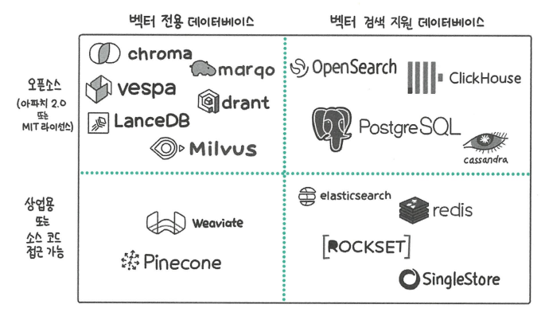
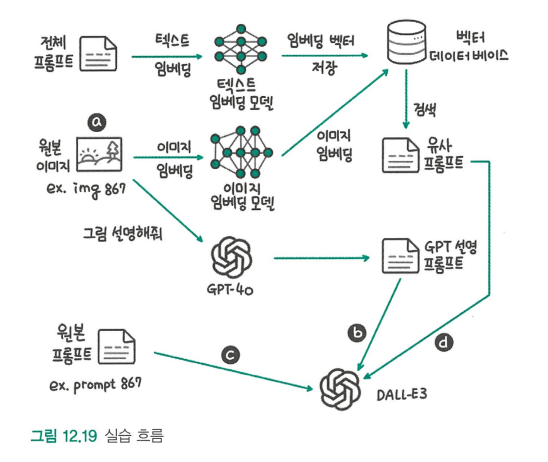

# LLM을 활용한 실전 AI 애플리케이션 개발

# 3부 | LLM을 활용한 실전 애플리케이션 개발
# 12. 벡터 데이터베이스로 확장하기: RAG 구현하기
## 12.1 벡터 데이터베이스란
### 12.1.1 딥러닝과 벡터 데이터베이스
> 딥러닝 기술이 폭넓게 활용됨녀서 데이터의 특징을 추출한 임베딩을 활용하는 경우가 많아졌고, 임베딩을 저장하고 관리하는 기능에 특화된 벡터 데이터베이스의 필요성이 커졌다.

- **벡터 데이터베이스**: 벡터 임베딩을 키로 사용하는 데이터베이스
### 12.1.2 벡터 데이터베이스 지형 파악하기

- 벡터 전용 데이터베이스: 고급 벡터 검색이 필요하고 워크로드가 큰 경우
- 벡터 검색 지원 데이터베이스: 벡터 이외의 데이터 형태를 처리하는 경우

## 12.2 벡터 데이터베이스 작동 원리
### 12.2.1 KNN 검색과 그 한계
- **KNN 검색**: 검색하려는 벡터와 가장 가까운 K개의 이웃 벡터를 찾는 검색 방식
    - 모든 데이터를 조사하므로 정확하다.
    - 연산량이 데이터 수에 비례하게 늘어나 속도가 느려지고 확장성이 떨어진다.
### 12.2.2 ANN 검색이란
- ANN 검색: 근사 최근접 이웃 검색이라는 뜻으로, 임베딩 벡터를 빠르게 탐색할 수 있는 구조로 저장해서 검색 시 탐색할 범위를 좁힌다.
1. IVF
    - 검색 공간을 제안하기 위해 데이터셋 벡터들을 클러스터로 그룹화한다.
2. HNSW
    - 효율적인 ANN 검색을 위한 그래프 기반 인덱싱 구조로, 상위 계층에는 연결이 적고 하위 계층에는 연결이 밀집된 다층 그래프를 구축한다.
### 12.2.3 탐색 가능한 작은 세계(NSW)
> HNSW는 그래프 기반으로, 노드와 간선으로 구성된다.
- 탐색 가능한 작은 세계: 적당히 랜덤하게 연결된 그래프 상태
    > 규칙적인 연결으로 정확한 탐색이 가능하면서도 랜덤한 성질으로 빠른 탐색이 가능해진다.
    > 랜덤으로 저장하다 보니 검색 벡터와 가장 가까운 점이 아닌 곳에서 탐색을 멈추는 지역 최솟값 문제가 발생한다.
### 12.2.4 계층 구조
- HNSW는 계층구조를 NSW에 접목해 여러 계층에 그래프를 배치하는 방식으로 벡터를 저장한다.
- 계층구조는 레벨 0에는 모든 데이터가 있도록, 레벨이 높아질수록 데이터를 듬성듬성 배치하는 방식으로 구성된다.
- 높은 레벨에 벡터를 저장할 때는 확률을 이용한다.

## 12.3 실습: HNSW 인덱스의 핵심 파라미터 이해하기
### 12.3.1 파라미터 m 이해하기
- 추가하는 임베딩 벡터에 연결하는 간선의 수
> 해당 파라미터가 커짐에 따라 어떻게 변화할지 알아보자
- 검색의 품질(재현율) 상승
- 메모리 사용량 증가
- 색인 시간 증가
- 검색 시간 증가
### 12.3.2 파라미터 ef_construction 이해하기
- 가장 가까운 벡터를 선택할 후보군의 크기
> 해당 파라미터가 커짐에 따라 어떻게 변화할지 알아보자
- 검색의 품질(재현율) 상승
- 색인 시간 증가
### 12.3.3 파라미터 ef_search 이해하기
- 검색 단계에서 후보군의 크기
> 해당 파라미터가 커짐에 따라 어떻게 변화할지 알아보자
- 검색의 품질(재현율) 상승
- 검색 시간 증가

## 12.4 실습: 파인콘으로 벡터 검색 구현하기
> 파인콘: 대표적인 벡터 데이터베이스
### 12.4.1 파인콘 클라이언트 사용법
> 파인콘 계정 연결/인덱스 생성 -> 임베딩 생성 -> 파인콘 입력을 위한 데이터 형태 변경 -> 임베딩 데이터를 인덱스에 저장 -> **인덱스 검색 가능**
- 파인콘 클라이언트 라이브러리로 벡터 데이터베이스의 CRUD(생성, 조회, 수정, 삭제)를 수행할 수 있다.
### 12.4.2 라마인덱스에서 벡터 데이터베이스 변경하기
> 라마 인덱스로 RAG 구현 시, 다양한 벡터 데이터베이스와 쉽게 통합할 수 있는 기능을 제공한다.

## 12.5 실습: 파인콘을 활용해 멀티 모달 검색 구현하기
> 이미지와 텍스트를 동일한 벡터 공간에 임베딩으로 변환할 수 있는 CLIP 모델을 사용한다.
### 12.5.1 데이터셋
> 프롬프트와 스테이블 디퓨젼 이미지 쌍으로 구성된 데이터셋을 사용한다.
### 12.5.2 실습 흐름
> 원본 이미지와 세가지 프롬프트로 생성한 이미지를 비교한다.
- GPT 설명 프롬프트
- 원본 프롬프트
- 유사 프롬프트

### 12.5.3 GPT-4o로 이미지 설명 생성하기
> GPT-4o에 원본 이미지를 입력하고 이미지에 대해 설명하도록 지시해 프롬프트를 생성한다.
### 12.5.4 프롬프트 저장
> 클라이언트 준비 -> 인덱스 생성 -> 프롬프트 텍스트를 임베딩 벡터로 변환 -> 텍스트 임베딩 벡터를 파인콘 인덱스에 저장
### 12.5.5 이미지 임베딩 검색
> 원본 이미지를 이미지 임베딩으로 변환하고 해당 임베딩 벡터로 파인콘에서 유사한 프롬프트를 검색한다.
### 12.5.6 DALLE-3로 이미지 생성
> GPT-4o의 설명을 프롬프트로 생성한 이미지가 원본과 가장 유사하고, 원본 프롬프트와 유사 프롬프트로 생성한 이미지가 비슷하다는 결과를 얻는다.

# 13. LLM 운영하기
## 13.1 MLOps
## 13.2 LLMOps는 무엇이 다를까?
## 13.3 LLM 평가하기

# 4부 | 멀티 모달, 에이전트 그리고 LLM의 미래
# 14. 멀티 모달 LLM
# 15. LLM 에이전트
# 16. 새로운 아키텍처