# LLM을 활용한 실전 AI 애플리케이션 개발
## 01 LLM 지도
2022년말 Chat GPT가 등장했고 사용자와 대화가 된다고 느껴질 정도로 놀라운 성능을 보였다. 

하지만 그런 놀라운 성능에도 불구하고 GPT는 굉장히 단순한 과정으로 동작하는데 1장에서는 LLM의 기반이 되는 딥러닝과 언어 모델링에 대해 알아본다.

### 1.1 딥러닝과 언어 모델링
LLM은 **딥러닝** 기반의 **언어 모델**이다.

* 딥러닝 : 데이터의 패턴을 학습한느 머신러닝의 한 분야, 표 형태의 정형 데이터 뿐만 아니라 텍스트와 이미지 같은 비정형 데이터에서도 뛰어난 패턴 인식 성능을 보임.
* 언어 모델 : 다음에 올 단어를 예측하는 모델

이러한 LLM이 지금처럼 자리 잡기까지 중요했던 세 가지 사건이 있다. 
1. 2013년 구글에서 **워드투벡** 발표.
2. 2017년 구글에서 **트랜스포머 아키텍쳐** 공개
3. 2018년 OpenAI의 **GPT-1 모델** 공개 

이 세 가지 주요 사건들이 어떠한 영향들을 미쳐왔는지 알아보자.

---
### 1.1.1 데이터의 특징을 스스로 추출하는 딥러닝

딥러닝의 단순하면서도 범용적으로 문제를 해결하는 3단계 접근 방식
+ 문제의 유형(예: 자연어 처리, 이미지 처리)에 따라 일반적으로 사용되는 모델을 준비
+ 풀고자 하는 문제에 대한 학습 데이터를 준비
+ 학습 데이터를 반복적으로 모델에 입력

딥러닝은 기존 머신러닝과 다르게 연구자 또는 개발자가 데이터의 특징을 뽑지않고 모델이 **스스로** 데이터의 특징을 찾고 분류하는 모든 과정을 학습한다.

---

### 1.1.2 임베딩: 딥러닝 모델이 데이터를 표현하는 방식

딥러닝 모델은 데이터의 의미를 숫자의 집합으로 표현한다. 

이때 데이터의 의미와 특징을 포착해 그 의미를 담고 여러 개의 숫자 집합으로 표현하는 것을 **임베딩(Embedding)** 이라고 부른다.    
데이터를 임베딩으로 표현하면 데이터 사이의 거리를 계산하고 거리를 바탕으로 관련 있는 데이터와 관련이 없는 데이터를 구분할 수 있다.   
#### 이때 2013년 구글에서 워드투벡(word2vec)이라는 모델을 통해 단어를 임베딩(여러개의 숫자 집합)으로 변환하는 방법을 소개했다.   
단어를 임베딩으로 변환한 것을 단어 임베딩(word embedding)이라고 한다.   
(단어를 임베딩으로 변환하다 = 데이터(단어)들을 의미와 특징을 담아 여러개의 숫자 집합으로 표현하다)   

* 다음은 요즘 유행하는 MBTI를 임베딩 모델에 비교해 표로 나타낸 것이다.   

---

### 1.1.3 언어 모델링: 딥러닝 모델의 언어 학습법

* 언어 모델링 : 모델이 입력받은 텍스트의 다음 단어를 예측해 텍스트를 생성하는 방식.   대량의 데이터에서 언어의 특성을 학습하는 사전 학습(pre-training)과제로도 많이 사용된다.

기존의 머신러닝 모델 학습은 지도 학습(supervised-learning) 방식으로 각각의 데이터 셋으로 별도의 모델을 학습 시켰다.    
이에 발전해 지금의 딥러닝 분야에서는 총 **두 단계** 로 나눠 학습을 진행한다. 그리고 이 과정을 전이 학습(transfer-learning)이라고 부른다.

* 사전 학습(pre-training) : 대량의 데이터로 모델을 학습 시킴. 이때 대량의 데이터는 꼭 문제를 해결하기 위한 데이터와 관련이 있는 것은 아니다.
* 미세 조정(fine-tunning) : 특정한 문제를 해결하기 위한 데이터로 추가 학습하는 것. (사전 학습모델을 미세 조정해 풀고자 하는 과제를 다운스트림(downtream) 과제라고 부른다.)

이때 재밌는 것은 학습시키려는 데이터와 다른 대량의 데이터들로 사전 학습을 시킨 것이 결국 점이나 선같은 특징을 파악하는데 도움을 주기 때문에 일반적으로 성능이 더 좋아졌다.

--- 

## 1.2 (딥러닝)언어 모델이 CHAT GPT가 되기 까지

--- 

### 1.2.1 RNN에서 트랜스포머 아키텍처(구조)로

RNN(순환 신경망, Recurrent Neural Network): 트랜스포머 아키텍처를 사용하기 전 텍스트를 생성하기 위해 사용되었던 아키텍처
 

- 입력하는 텍스트를 **순차적** 으로 처리해서 다음 단어를 예측 -> 먼저 입력한 단어의 의미가 점차 희석되며, 입력이 길어지는 경우 성능 저하
- 모델이 '하나의 잠재 상태(hidden state)'에 지금까지의 입력 텍스트의 맥락을 압축 -> 메모리를 적게 사용, 다음 단어를 빠르게 생성
  
트랜스 포머 아키텍처: RNN의 **순차적인** 방식을 버리고, 맥락을 모두 참조하는 **어텐션(atttention)** 연산을 사용 -> RNN의 문제를 대부분 해결

- 맥락을 압축하지 않고 그대로 활용하기 때문에 성능을 높일 수 있지만, 입력 텍스트가 길어지면 맥락 데이터를 모두 저장하고 있어야 하기 때문에 메모리 사용량이 증가
- 매번 단어를 예측할 때마다 맥락 데이터를 모두 확인해야 하기 때문에 입력이 길어지면 예측에 걸리는 시간도 증가
- **but 성능이 좋고 병렬 처리를 통해 학습 속도를 높일 수 있어 현재는 대부분 LLM이 트랜스포머 아키텍처를 기반으로 한다.**
  
### 1.2.2 GPT 시리즈로 보는 모델 크기와 성능의 관계 

언어 모델이 학습하는 과정 = 언어 모델이 학습 데이터를 압축하는 과정   
이때 압축은 공통되고 중요한 패턴을 남기는 손실 압축이다.    
중요한 점은 모델이 계속해서 커진다고 성능이 높아지지 않고 학습 데이터의 크기가 최대 모델 크기의 상한이라고 볼 수 있다.

---

### 1.2.3 Chat GPT의 등장

GPT-3를 CHAT CPT로 바꾼것은 OpenAI가 논문의 연구 결과 발표와 함께 공개한 **지도 미세 조정(supervised-fine-tunning)** 과 **RLHF(Reinforcement Learning from Human Feedback)** 라는 기술 덕분이었다.   
이 기술들을 통해 챗GPT는 그저 사용자가 한 말 다음에 이어질 말을 생성하는 것이 아니라 사용자의 요청을 해결할 수 있는 텍스트를 생성하게 되었다.   

* 지도 미세 조정: 정렬(LLM이 생성하는 답변을 사용자의 요청 의도에 맞추는 것)을 위한 가장 핵심적인 학습 과정으로서, 언어 모델링으로 사전 학습한 언어 모델을 지시 데이터셋으로 추가 학습하는 것.
이때 지시 데이터셋은 사용자가 요청 또는 지시한 사항과 그에 대한 적절한 응답을 정리한 데이터 셋.
* RLHF: OpenAI에서는 두 가지 답변 중 사용자가 더 선호하는 답변을 선택한 데이터셋을 구축, 이를 선호 데이터셋이라고 한다. 이 선호 데이터셋으로 LLM의 답변을 평가하는 리워드 모델을 만들고 LLM이 점점 더 높은 점수를 받을 수 있도록 추가 학습하는 것.

--- 

## 1.3 LLM 애플리케이션의 시대가 열린다

---

### 1.3.1 지식 사용법을 획기적으로 바꾼 LLM 

기존의 자연어 처리 접근 방식에서는 언어 이해 모델과 언어 생성 모델을 각각 개발해 연결했다. 때문에 시스템 복잡도가 높았고 관리가 어려웠다.    
하지만 LLM의 경우 언어 이해와 생성 능력이 모두 뛰어나 **다재다능** 하다. 

LLM은 우리가 기존에 지식을 습득하고 활용하던 모든 측면에 영향을 줄 수 있기 때문에 이전의 AI 모델보다 사회에 미치는 영향이 크다.

---

### 1.3.2 sLLM: 더 작고 효율적인 모델 만들기 

* LLM을 활용하는 두 가지 방법
1. OpenAI의 GPT-4나 구글의 제미나이처럼 **상업용 API**를 사용하는 방법 -> 모델이 크고 범용 텍스트 생성 능력이 뛰어남
2. 오픈소스 LLM을 활용해 **직접 LLM API**를 생성해 사용하는 방법 -> 작업을 위한 데이터를 자유롭게 추가 학습 가능 

* 오픈소스 LLM을 활용해 추가 학습을 하는 경우 모델 크기가 작으면서도 특정 도메인 데이터나 작업에서 높은 성능을 보이는 모델을 만들 수 있는데, 이를 **sLLM**이라고 한다.

--- 

### 1.3.3 더 효율적인 학습과 추론을 위한 기술

LLM의 기반이 되는 트랜스포머 아키텍처 연산은 LLM의 학습과 추론에 필요한 연산량이 크게 증가했다. 이 많은 연산량을 빠르게 처리하기 위해 많은 연산을 병렬로 처리하는데 특화된 처리 장치인 GPU를 사용한다.    
하지만 요즘 비용도 비용이지만 챗GPT 수요가 급증하며 돈을 주고도 GPU을 구하지 못하는 품귀 현상도 나타나고 있다.   
때문에 적은 GPU자원으로도 LLM을 활용할 수 있또록 돕는 연구가 진행중이며 대표적으로 모델 파라미터를 더 적은 비트로 표현하는 양자화와 모델전체를 학습하는 것이 아니라 모델의 일부만 학습하는 LoRA방식이 있다.

--- 

### 1.3.4 LLM의 환각 현상을 대처하는 검색 증각 생성(RAG) 기술

* 환각 현상 : LLM의 한 가지 큰 문제, LLM이 잘못된 정보나 실제로 존재하지 않는 정보를 만들어 내는 현상.
> 이유는 정확히 알기 어렵지만 사실 LLM이 특정 정보가 사실인지 판단할 능력이 없다. 또한 학습 데이터를 압축하는 과정에서 비교적 드물게 등장하는 정보는 소실되는데, 그런 정보의 소실이 부정확한 정보를 생성하는 원인이 될 수도 있다.

* RAG(검색 증강 생성, Retrival Augmented Generation) : 환각 현상을 줄이기 위한 기술, 프롬프트에 LLM이 답변할 때 필요한 정보를 미리 추가함으로써 잘못된 정보를 생성하는 문제를 줄인다.

--- 

## 1.4 LLM의 미래 : 인식과 행동의 확장 

   

앞으로의 LLM이 어떤 방향으로 발전할까에 대한 세 가지 큰 흐름이다. 

먼저, LLM이 더 다양한 형식의 데이터를 입력으로 받을 수 있고 출력으로도 여러 형태의 데이터를 생성할 수 있도록 발전시킨 멀티 모달 LLM이 있다. 또 LLM이 텍스트 생성 능력을 사용해 계획을 세우거나 의사결정을 내리고 필요한 행동까지 수행하는 에이전트 연구도 활발히 진행되고 있다. LLM이 사용하는 트랜스포머 아키텍처를 새로운 아키텍처로 변경해 더 긴 입력을 효율적으로 처리하려는 연구도 주목받고 있다. 

> 멀티 모달 모델이란 다양한 형태의 입력을 받을 수 있는 LLM을 말한다.

--- 

## 02 LLM의 중추, 트랜스포머 아키텍처 살펴보기

**이번 장에서의 목표는 트랜스포머 아키텍처를 코드 레벨에서 직접 구현해 보면서 세부적인 동작을 이해해 보는 것이다.**

---

## 2.1 트랜스포머 아키텍처란

기존 RNN은 1장에서 배웠다싶이 텍스트를 순차적으로 하나씩 입력하는 형태였다.    
   

위 그림에서 x는 텍스트 토큰(token)이고 이는 거의 모든 자연어 처리 연산의 기본 단위이자, 보통 단어보다 짧은 텍스트 단위다. (단어와 같다고 생각하자)   
h는 입력 토큰을 RNN 모델에 입력했을 때의 출력인데, 그림에서 확인할 수 있듯이 이전 토큰의 출력을 다시 모델에 입력으로 사용하기 때문에 입력을 병렬적으로 처리하지 못하는 구조다.    
이런 구조 때문에 학습 속도가 느리고, 입력이 길어졌을때 먼저 입력한 토큰의 정보가 희석되면서 성능이 떨어진다는 문제가 있는 것이다. 성능을 높이기 위해 층을 깊이 쌓으면 그레디언트 소실(gradient vanishing)이나 그레디언트 증폭(gradient exploding)이 발생해 학습이 불안정했다.

반면 트랜스포머는 이런 RNN의 문제를 해결하고자 셀프 어텐션(self-attention)이라는 개념을 도입한다.    
> 셀프 어텐션(self-attention) : 입력된 문장 내의 각 단어가 서로 어떤 관련이 있는지 계산해서 각 단어의 표현을 조정하는 역할. 이로인해 트랜스포머는 다음과 같은 장점을 보임

다음으로 가장 중요한 전체 트랜스포머 아키텍처를 살펴보자.   

트랜스포머 아키텍처는 크게 인코더와 디코더로 나뉜다. 인코더는 언어를 이해하는 역할, 디코더는 언어를 생성하는 역할을 한다. 공통적으로 입력을 임베딩층을 통해 숫자 집합인 임베딩으로 변환하고 위치 인코딩(positional encoding)층에서 문장의 위치 정보를 더한다.   
인코더에서는 층 정규화(layer normalization), 멀티 헤드 어텐션(multi-head-attention), 피드 포워드(feed forward)층을 거치며 영어 문장을 이해하고 디코더로 전달한다.   
디코더에서는 인코더와 유사하게 층 정규화, 멀티 헤드 어텐션 연산을 수행하면서 크로스 어텐션 연산을 통해 인코더가 전달한 데이터를 출력과 함께 종합해서 피드 포워드 층을 거쳐 한국어 번역 결과를 생성한다.

---

## 2.2 텍스트를 임베딩으로 변환하기

컴퓨터는 텍스트를 그대로 계산에 사용할 수 없어 숫자 형식의 데이터로 변경해야한다.   

먼저 텍스트를 적절한 단위로 잘라 숫자형 ID를 부여하는 토큰화(tokenization)을 수행하고 토큰 임베딩 층, 위치 인코딩 층을 통해 여러 숫자의 집합인 토큰임베딩, 토큰의 위치 정보를 담고 있는 위치 임베딩을 추가해 최종적으로 모델에 입력할 임베딩을 만들게 된다. 

이 세가지 과정에 대해 자세히 알아보자.

---

### 2.2.1 토큰화 

토큰화란 텍스트를 적절한 단위로 나누고 숫자 ID를 부여하는 것을 말한다. 단위의 기준은 작게는 자모, 크게는 단어 단위로 나눌 수 있고 어떤 토큰이 어떤 숫자 ID로 연결 됐는지 기록한 사전을 만들어야 한다. 

> OOV(Out Of Vocabulary) : 사전에 없는 단어

위와 같이 작은 단위, 큰 단위 모두 각각 장단점이 뚜렷해 최근에는 데이터에 등장하는 빈도에 따라 토큰화 단위를 결정하는 **서브워드(subword) 토큰화** 방식을 사용한다. 

서브워드 토큰화 방식에서는 자주 나오는 단어는 단어 단위 그대로 유지하고 가끔 나오는 단어는 더 작은 단위로 나눠 텍스트의 의미를 최대한 유지하면서 사전의 크기는 작고 효율적으로 유지할 수 있다.

---

### 2.2.2 토큰 임베딩으로 변환하기

딥러닝 모델이 텍스트 데이터를 처리하기 위해서는 입력으로 들어오는 토큰과 토큰사이의 관계를 계산할 수 있어야 한다. 그러기 위해서 토큰의 의미를 **최소 2개 이상의 숫자 집합인 벡터**로 나타낼 수 있어야 한다.   
이것을 **토큰 임베딩**이라하는데 PyTorch가 제공하는 nn.Embedding 클래스를 사용하면 트큰 아이디를 토큰 임베딩으로 변환할 수 있다.    

*******<여기 예제 2.2 이미지>*******

위 과정을 거친다고 해서 토큰의 의미가 담겨 벡터로 변환되는 것은 아니다.   
임베딩 층이 단어의 의미를 담기 위해서는 딥러닝 모델이 학습 데이터로 훈련되어야 한다.   
기존 머신러닝과 다르게 딥러닝에서는 모델이 특정 작업을 잘 수행하도록 학습하는 과정에서 데이터의 의미를 잘 담은 임베딩을 만드는 법도 학습한다. 

* 맛보기 예시

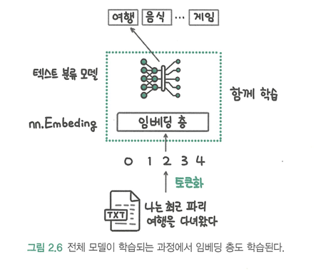

---

### 2.2.3 위치 인코딩 

* RNN: 입력을 순차적으로 처리 -> 자연스럽게 입력 데이터의 순서 정보가 고려됨

* 트랜스포머: 순차적을 버리고 모든 입력을 병렬(동시에)처리 -> 그 과정에서 순서 정보가 사라짐 -> 그래도 순서 정보는 중요하기에 추가해줘야 하고 그 역할을 **위치 인코딩**이 담당

> 처음 사인, 코사인을 활용한 수식을 통해 위치에 대한 정보를 입력했으나 이후 위치 인코딩도 **위치에 따른 임베딩 층**을 추가해 학습 데이터를 통해 학습하는 방식을 많이 활용하고 있다. 

> 쨋든 두 가지 방법 모두 모델로 추론을 수행하는 시점에는 입력 토큰의 위치에 따라 고정된 임베딩을 더해주기 때문에 이를 **절대적 위치 인코딩(absolute position encoding)**이라고 부른다. 

> but..이 또한 상대적인 위치 정보는 활용 못하고, 학습 데이터에서 보기 어려웟던 긴 텍스트를 추론하는 경우에 성능이 떨어지는 문제가 있어 최근에는 **상대적 위치 인코딩 방식**도 많이 활용된다. 

#### 그냥 트랜스포머가 입력으로 위치 정보를 함께 더해준다는 사실만 기억하면 됨.

* 텍스트를 모델 입력 임베딩으로 변환하는 전체적인 과정을 보며 총 정리 해보자

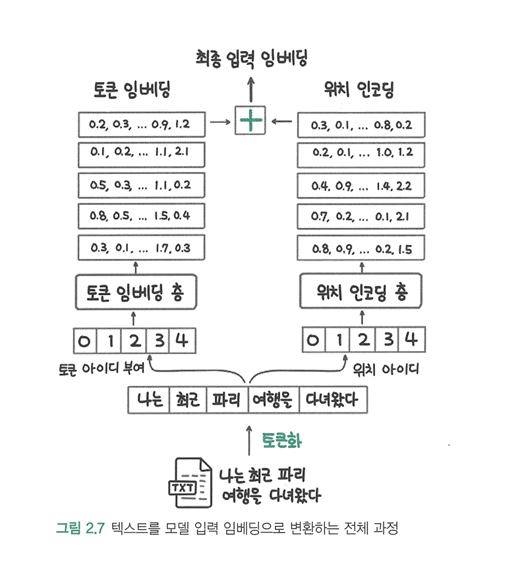

1. 우선 "나는 최근 파리 여행을 다녀왔다" 라는 문장을 단어 단위로 **토큰화**를 수행한다.

2. 각 토큰에 **토큰 ID**와 **위치 ID**를 부여한다.(이때 각 ID는 숫자임)

3. 이 숫자로된 ID가 데이터의 의미를 담을 수는 없으니까 각각의 층(토큰 임베딩 층, 위치 인코딩 층)을 통해 의미를 담을 수 있게 **토큰 임베딩**, **위치 임베딩**으로 변환한다.

4. 이제 그 토큰 임베딩과 위치 인코딩을 **더한 것**이 최종 입력 임베딩인 것이다.

---

## 2.3 어텐션 이해하기

어텐션 : 텍스트를 처리하는 관점에서 입력한 텍스트에서 어떤 단어가 서로 관련되는지 **'주의를 기울여'** 파악한다는 의미

이번 절에서는 어떻게 딥러닝 모델이 관련있는 단어를 찾도록 만들어지는 것인지에 대해 알아보자.

---

### 2.3.1 사람이 글을 읽는 방법과 어텐션

보통 사람이 글을 읽을 때 왼쪽에서 오른쪽으로 흐르듯이 글을 읽지만 어려운 글일 경우 단어 또는 문장 간의 연결을 고민하며 찾아본다. 

어텐션은 이렇게 사람이 관계에 대해 고민하는 과정을 딥러닝 모델이 수행하도록 모방하는 연산이다.

그렇다면 어떻게 어텐션 연산을 만들까???

1. 먼저 단어와 단어 사이의 관계를 계산해서 그 값에 따라 관련이 깊은 단어와 그렇지 않은 단어를 구분할 수 있어야함.
2. 관련이 깊은 단어는 더 많이, 관련이 적은 단어는 더 적게 맥락을 반영해야 함.

---

### 2.3.2 쿼리, 키, 값 이해하기

트랜스포머 아키텍처를 개발한 연구진은 어텐션 연산 과정을 처리하기 위해 쿼리(query), 키(key), 값(value)이라는 개념을 도입한다. 

> 쿼리: 우리가 입력하는 검색어. 쿼리를 입력하고 엔터 키를 치면 검색 엔진이 수많은 자료 중에 쿼리와 관련있는 문서를 찾음.
키: 쿼리와 관련이 있는지 계산하기 위해서 문서가 가진 특징. (문서의 제목, 본문, 저자 이름 등...) 
값: 검색 엔진이 쿼리와 관련이 깊은 키를 가진 문서를 찾아 관련도 순으로 정렬해서 문서를 제공할 때 문서

결국 우리가 검색하면서 원하는 것은 **값**이다.

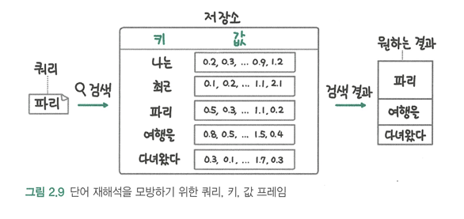

위 그림처럼 결과를 만들어 내기 위한 방법들이 있다.   

1. 단어를 모두 동등하게 반영하는 "평균"방법   
> 이 방법은 단어를 재해석한다는 목표는 달성하지만, 관련이 깊은 단어를 더 많이 반영한다는 목표는 달성하지 못한다. 

2. "가까이 있는 단어가 더 관련이 깊을 것"이라는 가정을 세우고 자기 자신에게 가장 높은 가중치를 주고 멀어질수록 가중치를 낮추는 방식   
> 이 방법은 평균 방식보다는 더 나은 결과를 기대할 수 있지만 원하는 형태의 결과는 얻을 수 없다.

이 두 가지 방식 모두 쿼리와 키의 관련도를 계산하지 않고 모두 동등하게 반영한다거나 거리에 따라 차등을 둔다는 적당한 가정을 세워 맥락을 반영해 원하는 결과를 얻지 못하고 유연성이 떨어진다.

따라서 입력 데이터에 따라 다른 결과를 얻기 위해서는 관련도를 규칙이 아니라 **데이터 자체에서 계산**할 수 있어야 한다.   
그러나 문자열은 그 자체로 계산할 수 없기에 쿼리와 키 토큰을 **토큰 임베딩**으로 변환해 계산을 진행한다.   
벡터와 벡터를 곱해 관계를 계산하면 그 관련도에 따라 주변 맥락을 반영할 수 있고, 문자열이 일치하지 않더라도 유사한 의미의 키로 저장된 정보를 검색할 수 있다.

but 여기서 다시 문제점 2개

1. 같은 단어끼리는 임베딩이 동일하므로 관련도가 크게 계산되면서 주변 맥락을 충분히 반영하지 못하는 경우가 발생   

2. 토큰의 의미가 유사하거나 반대되는 경우처럼 직접적인 관련성을 띨때는 잘 작동하지만 문법에 의거해 토큰이 이어지는 경우처럼 간접적인 관련성을 반영되기 힘듦

그래서! 이와 같은 문제를 피하기 위해 토큰 임베딩을 변환하는 가중치를 도입한다. 

딥러닝에서는 어떤 기능을 잘하게 하고 싶을 때 가중치를 도입하고 **학습 단계**에서 업데이트되게 한다.   
밑의 이미지에서 가중치를 통해 토큰 임베딩을 변환한 쿼리와 키는 각각 q,k이다. 

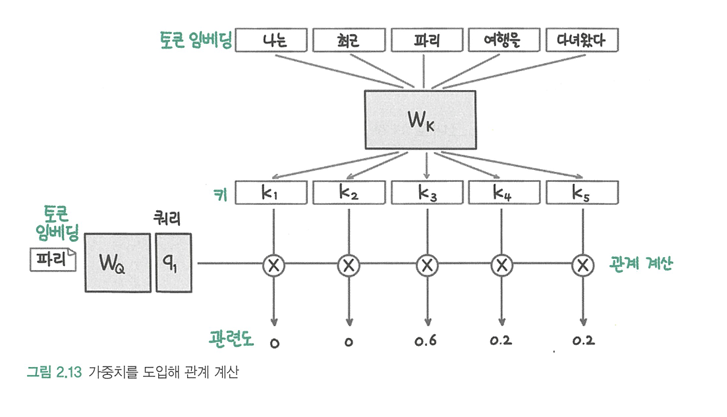

--- 

### 2.3.4 멀티 헤드 어텐션 

멀티 헤드 어텐션: 여러 어텐션 연산을 동시에 적용해 성능을 높이는 것.

위 이미지에서 볼 수 있뜻이 멀티 헤드 어텐션은 동시에(병렬로) 헤드의 수(h)만큼의 연산을 수행한다. 

--- 

## 2.4 정규화와 피드 포워드 층 

이번 절에서는 **층 정규화**와 **피드 포워드 층**에 대해 알아볼 것이다.

> **정규화**란 딥러닝 모델에서 입력이 일정한 분포를 갖도록 만들어 학습이 안정적이고 빨라질 수 있도록 하는 기법   
과거에는 배치 정규화를 사용한데 반해, 트랜스포머 아키텍처에서는 특정 차원에서 정규화를 수행하는 층 정규화를 사용한다. 

> 어텐션 연산이 입력 단어 사이의 관계를 계산해 토큰 임베딩을 조정하는 역할을 했다면 전체 입력 문장을 이해하는 연산이 필요한데, 트랜스포머에서는 이를 위해 완전 연결 층인 피드 포워드 층을 사용한다. 

---

### 2.4.1 층 정규화 이해하기 (배치 정규와 & 층 정규화)

딥 러닝 모델에 데이터를 입력할 때 정확한 예측을 위해 데이터를 정규화 하여 입력하는 것은 상당히 중요하다. 

> 모든 입력 변수가 비슷한 범위와 분포를 갖도록 조정해야함. (정규화)   
이를 통해 모델이 각 입력 변수의 중요성을 적절히 반영해 더 정확한 예측이 가능

정규화는 여러 데이터의 평균과 표준편차를 구해서 다음과 같은 식으로 계산한다.

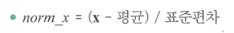
> 평균이 0이고 표준편차가 1인 분포 

이때, 딥러닝에서는 평균과 표준편차를 구할 데이터를 어떻게 묶는지에 따라 크게 **배치 정규화**와 **층 정규화**로 구분한다.   
일반적으로 이미지 처리에서는 배치 정규화, 자연어 처리에서는 층 정규화를 사용

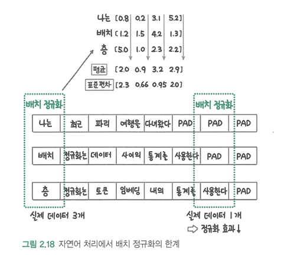
>위 이미지에서 볼 수 있듯이 자연어를 배치 정규화로 처리하는데 있어서 서로 다른 문장의 데이터를 묶어 정규화를 수행하는데 각 정규화에 포함되는 데이터 개수가 제각각이다. 따라서 정규화 효과를 보장하기 어렵다. 

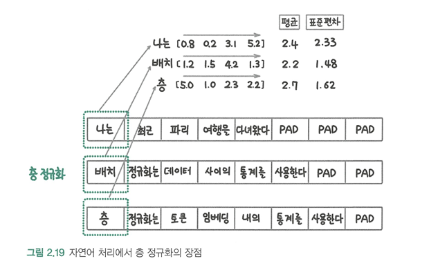
> 층 정규화는 각 토큰 임베딩의 **평균**과 **표준편차**를 구해 정규화를 수행해 이런 단점을 보완한다. 때문에 서로 다른 문자의 실제 데이터 수(단어 수)가 다르더라도 각각의 토큰 임베딩별로(단어 하나마다의) 정규화를 수행하기 때문에 정규화 효과에 차이가 없다.

층 정규화는 적용하는 순서에 따라 크게 두 가지 방식이 있다. 

> 사후 정규화: 어텐션과 피드 포워드 층 이후에 층 정규화를 적용   
사전 정규화: 층 정규화를 적용하고 어텐션과 피드 포워드 층을 통과 

결국 사전 정규화를 활용하는게 학습이 **더 안정적**이라는 사실이 확인되어 **주로 사전 정규화가 활용된다.** 

---

### 2.4.2 피드 포워드 층 

피드 포워드 층은 **데이터의 특징을 학습**하는 완전 연결 층을 말한다.

멀티 헤드 어텐션이 단어 사이의 관계를 파악하는 역할이라면   
피드 포워드 층은 입력 텍스트 전체를 이해하는 역할을 담당한다.    
> 피드 포워드 층 = 선형 층 + 드롭아웃 층 + 층 정규화 + 활성 함수

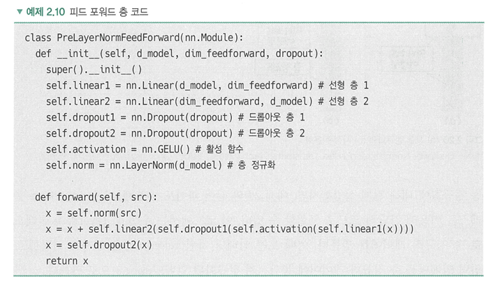
> 피드 포워드 층 코드를 통해 피드 포워드 층에서 진행되는 과정을 살펴보자.   
정확히는 forward 메소드 부분을 보면 된다.    
1. **층 정규화**: 입력 데이터 src에 대해 층 정규화를 수행한다. 이로써 입력 벡터의 분포가 일정하게 유진된다. 
2. **첫 번째 선형 변환**: 정규화된 입력을 첫 번째 선형 층을 통해 변환하여, 중간 차원의 벡터를 생성한다. 
3. **활성화 함수 적용**: 선형 변환된 데이터에 GELU 활성화 함수를 적용하여, 비선형 변환을 수행한다.
4. **첫 번째 드롭아웃**: 비선형 변환된 데이터에 대해 드롭아웃을 적용하여, 일부 뉴런을 무작위로 비활성화 한다.
5. **두 번째 선형 변환**: 드롭아웃 이후의 데이터를 두 번째 선형 층을 통해 변환하여, 원래의 출력 차원으로 되돌린다.
6. **잔차 연결**: 원본 입력 src와 두 번째 선형 변환 후의 출력을 더한다. 이는 학습 과정에서 원본 정보를 보존하면서, 추가적인 변환을 통해 더 나은 표현을 학습할 수 있도록 돕는다.
7. **두 번째 드롭아웃**: 최종적으로 출력 벡터에 드롭아웃을 한 번 더 적용하여, 과적합을 방지한다.  

이렇게 **피드 포워드 층**을 거치면 입력 데이터를 변환해 더 높은 수준의 표현을 학습하게 된다.

--- 

## 2.5 인코더 

인코더는 멀티 헤드 어텐션, 층 정규화, 피드 포워드 층이 반복되는 형태다.   
멀티 헤드 어텐션을 거쳐서 나온 결과(입력 데이터 간의 상호작용 정보가 반영된 새로운 벡터)와 피드 포워드 층을 거쳐서 나온 결과(더 깊은 수준에서 복잡한 패턴을 반영하는 새로운 벡터)를 더하고(잔차 연결하고) 이 블록들을 여러번 쌓아서 만든것이 **트랜스포머 인코더**이다.

### 2.6 디코더 

* 디코더: 생성을 담당하는 부분으로, 트랜스포머 모델도 앞에서 생성한 토큰을 기반으로 다음 토큰을 생성한다. 이렇게 순차적으로 생성해야 하는 특징을 인과적(casual)또는 자기 회귀적(auto-regressive)라고 한다. 

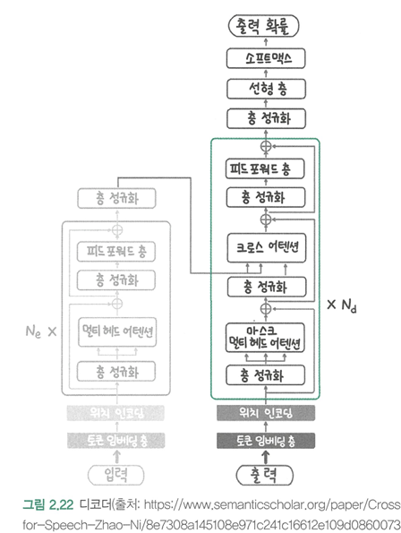

* 인코더와의 첫 번째 차이점
디코더는 인코더와 달리 **마스크 멀티 헤드 어텐션**을 사용한다. 
만약 디코더와 인코더와 마찬가지로 **멀티 헤드 어텐션**을 사용하면 학습 시에 전체 텍스트를 보게 되어 이전에 생성한 단어들만 보고 다음 단어를 예측하며 생성해야하는 기조에 어긋나게 된다. 그리하여 실제 텍스트 생성 시 성능이 떨어질 수 있다.   
마스크드 멀티 헤드 어텐션은 **마스크(Mask)**를 사용해 디코더가 미래 단어를 보지 못하게 제한한다. 

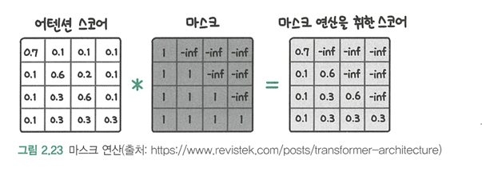

이런 식으로 음의 무한대로 마스크를 만들고 행렬 곱을 진행하면 마스크가 된 곳은 음의 무한대로 가중치가 0이 된다. 

* 인코더와의 두 번째 차이점 
디코더에는 **크로스 어텐션**이 있다. 바로 인코더의 결과를 디코더가 활용할 수 있게 해주는 선이다. 이때 쿼리는 디코더의 잠재 상태를 사용하고 키와 값은 인코더의 결과를 사용한다. 

디코더 또한 인코더와 마찬가지로 디코더 층을 여러번 쌓아 만든다. 

---
 
## 2.7 BERT, GPT, T5등 트랜스포머를 활용한 아키텍처

**트랜스포머 아키텍처 = 인코더 + 디코더** 인것을 지금까지 확인했다. 

+ 인코더: 입력 텍스트를 이해하고, 이를 내부적으로 벡터 표현으로 변환
+ 디코더: 이 벡터 표현을 바탕으로 새로운 텍스트를 생성 

이 트랜스포머 아키텍처를 활용한 모델을 크게 세 가지 그룹으로 나눌 수 있다. 

1. 인코더만 활용해 자연어 이해 작업에 집중한 그룹 (BERT)
2. 디코더만 활용해 자연어 생성 작업에 집중한 그룹 (GPT)
3. 인코더와 디코더를 모두 활용해 더 넓은 범위의 작업을 수행할 수 있도록 한 그룹 (BART,T5)

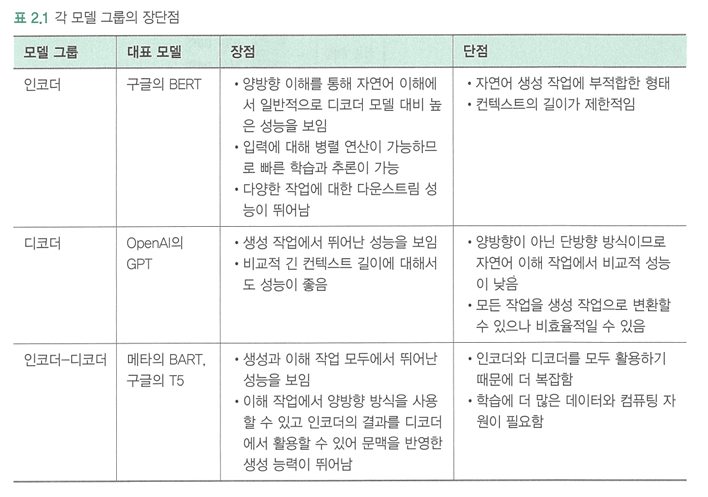

---

### 2.7.1 인코더를 활용한 BERT 

BERT(Bidirectional Encoder Representations from Transformers) : 

+ 인코더만을 활용 (텍스트를 이해하고 표현하는 데 중점을 둔 모델이라는 것임/ 텍스트 생성이 목적이 아님)
+ 그렇게 인코딩 된 벡터는 다양한 NLP 작업(예: 분류, 예측, 번역 등)에 활용
+ 양방향 문맥을 모두 활용해 텍스트를 이해
+ 입력 토큰의 일부를 마스크 토큰으로 대체하고 그 마스크 토큰ㅇ르 맞추는 **마스크 언어 모델링**과제를 통해 사전 학습
+ 사전 학습한 모델은 이후에 필요한 다운스트림(downtream) 과제에 따라 미세 조정(fine-tunning)해 사용한다.

### 정리 
BERT는 두 가지 주요 작업을 통해 사전 학습을 한다.

1. 마스크 언어 모델링(Masked Language Modeling) :
    + 입력 텍스트에서 일부 단어를 마스크 토큰으로 대체
    + 모델은 이 마스크된 단어가 무엇인지 예측하는 과제를 수행
    + 예를 들어, "The cat sat on the [Mask]." 라는 문장에서 [Mask]가 "mat"인지를 예측하는것.

2. 다음 문장 예측 (Next Sentence Prediction) : 
    + 두 문장이 주어졌을 때, 두 번째 문장이 첫 번째 문장에 이어지는지 아닌지를 예측
    + 예를 들어, "The cat sat on the mat." 다음에 "It was a sunny day."가 이어질지, "The dog barked loudly."가 이어질지를 예측한다.

---

### 2.7.2 디코더를 활용한 GPT 

GPT(Generative Pre-trained Transformer) :
+ 이름에서도 알 수 있듯이 생성 작업을 위해 만든 모델
+ 생성 작업의 경우 입력 토큰이나 이전까지 생성한 토크만을 문맥으로 활용하는 인과적 언어 모델링(Causal Language Modeling, CLM)을 사용
+ 그렇기 때문에 단방향 방식 

---

### 2.7.3 인코더와 디코더를 모두 사용하는 BART, T5 

BART(Bidirectional and Auto-Regressive Transformers) :  
+ 자연어 처리 분야에서 인코더-디코더 트랜스포머 아키텍처를 대표 
+ BERT와 GPT의 장점을 결합한 모델
+ 인코더-디코더 모델을 사전 학습하기 위해 입력 테스트에 노이즈를 추가하고 노이즈가 제거된 결과를 생성하는 과제를 수행 
+ 인코더 부분 양항향 추론 가능 

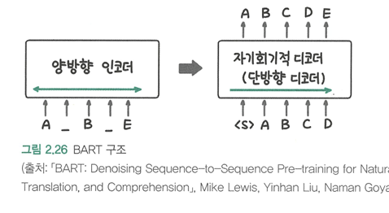

T5(Text-to-Text Transfer Transformer) : 
+ 텍스트에서 텍스트로의 변환
+ 입력의 시작(prefix)에 과제 종류를 지정해서 하나의 모델에서 지정한 작업 종류에 따라 다양한 동작을 하도록 학습시킴. 

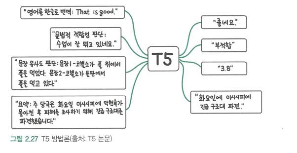

---

## 2.8 주요 사전 학습 메커니즘 

디코더 모델을 학습시키는 인과적 언어 모델링과 인코더 모델을 학습시키는 마스크 언어 모델링을 알아보자 

---

### 2.8.1 인과적 언어 모델링 

문장의 시작부터 끝까지 순차적으로 단어를 예측하는 방식이다. 이전 등장한 단어를 바탕으로 다음에 등장할 단어를 예측한다. 

---

### 2.8.3 마스크 언어 모델링 

입력 단어의 일부를 마스크 처리하고 그 단어를 맞추는 작업으로 모델을 학습 시키는 것. 
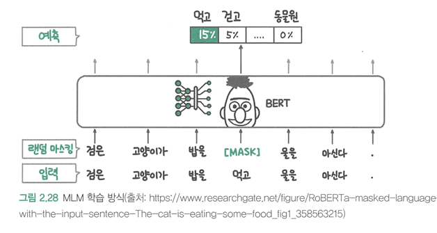

---

# 03 트랜스포머 모델을 다루기 위한 허깅페이스 트랜스포머 라이브러리

허깅페이스(Huggingface)팀이 개발한 트랜스포머 라이브러리가 트랜스포머 모델을 활용할 수 있도록 지원함으로써 현재 딥러닝 분야의 핵심 라이브러리가 됐다. 

---

## 3.1 허깅페이스 트랜스포머란

* 허깅페이스 트랜스포머 : 다양한 트랜스포머 모델을 통일된 인터페이스로 사용할 수 있도록 지원하는 오픈소스 라이브러리 

* 주요 라이브러리:
    - transformers 라이브러리 : 트랜스포머 모델과 토크나이저를 활용할 때 사용
    - datasets 라이브러리 : 데이터 셋을 공개하고 쉽게 가져다 쓸수 있도록 지원 

* 대표적으로 BERT와 GPT-2 모델을 거의 동일한 인터페이스로 활용 가능 
    1. 모델 불러오기
    2. 토크나이저 불러오기
    3. 입력 토큰화
    4. 모델에 입력

--- 

## 3.2 허깅페이스 허브 탐색하기 

허깅페이스의 허브는 다양한 사전 학습 모델과 데이터셋을 탐색하고 쉽게 불러와 사용 할 수 있도록 제공하는 온라인 플랫폼이다. 

---

### 3.2.1 모델 허브

모델 허브에는 다양한 기준으로 모델이 분류되어 있고 다야한 작업 분야의 모델을 제공받을 수 있다. 

---

### 3.2.2 데이터셋 허브

데이터셋 허브 화면은 모델 허브와 거의 동일한 형태이다. 

모델 허브와의 차이점은 분류 기준에 데이터셋 크기, 데이터 유형 등이 추가로 있고 선택한 기준에 맞는 데이터셋을 보여준다는 점이다. 

대표적인 한국어 데이터셋 중 하나인 KLUF는 텍스트 분류, 기계 독해, 문장 유산도 판단 등 다양한 작업에서 모델의 성능을 평가하기 위해 개발된 벤치마크 데이터셋이다.

---

### 3.2.3 모델 데모를 공개하고 사용할 수 있는 스페이스 

스페이스는 사용자가 자신의 모델 데모를 간편하게 공개할 수 잇는 기능이다. 

모델을 개발할 때 모델 데모를 보여줘야하는 경우 스페이스를 활용하면 복잡한 웹 페이지 개발 없이 모델 데모를 공유할 수 있다. 

허깅페이스는 다양한 오픈소스 LLM과 그 성능 정보를 게시하는 리더보드를 운영하고 있다.   
리더보드는 모델 데모는 아니지만, 모델의 성능을 비교하는 웹 페이지 형태이기 때문에 스페이스를 활용해 제공하고 있다. 

---

## 3.3 허깅페이스 라이브러리 사용법 익히기

모델을 학습시키거나 추론하기 위해서는 모델, 토크나이저, 데이터셋이 필요하다.

---

### 3.3.1 모델 활용하기

* 허깅페이스에서는 모델을 **바디**와 **헤드**로 구분한다. 
> 같은 바디를 사용하면서 다른 작업에 사용할 수 있도록 만들기 위해서.

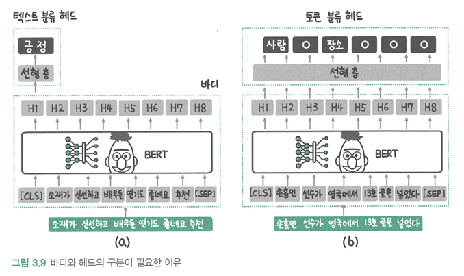

>위 이미지에서 (a)는 문장 전체가 긍정인지 부정인지를 분류하는 모델인데, 이때는 바디가 반환하는 여러 잠재 상태중 가장 앞에 있는 [CLS]토큰의 데이터만 받아 예측에 사용한다. 
(b)는 각 토큰이 사람이나 장소에 해당하는지 판단하는 개체명 인식 모델인데, 각 토큰에 대해 판단해야 하기 때문에 모든 토큰의 데이터를 받아 각각 사람인지 장소인지를 예측한다. 그림에서 O로 표기된 것은 사람이나 장소에 해당하지 않는다는 예측 결과를 나타낸 것.

---

### 3.3.2 토크나이저 활용하기 

토크나이저는 텍스트를 토큰 단위로 나구고 각 토큰을 대응하는 토큰 아이디로 변환한다. 

[CLS]: 문장의 시작을 나타내며, 주로 분류 작업에 사용된다.
[SEP]: 문장의 끝을 나타내며, 두 문장을 구분하는 역할도 한다.
##: 서브워드 토큰화에서 단어의 첫 번째 토큰을 제외한 나머지 서브워드 앞에 붙어, 원래 단어의 일부임을 표시한다.
서브워드(Subword): 단어를 작은 조각으로 나누어 처리하는 방법으로, 어휘 크기를 줄이고 새로운 단어를 효과적으로 처리할 수 있다.

* 서브워드를 활용하는 기준
어휘에 포함된 단어는 그대로 사용되고, 서브워드로 나누어지지 않는다.
어휘에 포함되지 않은 단어는 서브워드로 분리된다.

토큰화 결과 중 token_type_ids는 문장을 구분하는 역할을 한다. BERT는 학습할 때 2개의 문정이 서로 이어지는지 맞추는 NSP작업을 활용하는데 이를 위해 만든 것이 토큰 타입 아이디이다.
BERT 모델의 토크나이저를 사용하는 경우 첫 번째 문장의 토큰 타입 아이디는 0, 두 번째 문장의 토큰 타입 아이디는 1이다. 하지만 RoBERTa 계열 모델의 경우 NSP 과정을 학습 과정에서 제거했기 때문에 문장 토큰 구분이 필요 없다. 

attention_mask는 해당 토큰이 패딩 토큰인지 실제 데이터인지에 대한 정보를 담는다. 
패딩은 모델에 입력하는 토큰 아이디의 길이를 맞추기 위해 추가하는 **특수 토큰**이다.
> 토크나이저의 padding 인자에 'longest'를 입력하면 입력한 문장 중 가장  긴 문장에 맞춰 패딩 토큰을 추가한다. 

---

### 3.3.3 데이터 셋 활용하기 

datasets 라이브러리를 사용하면 앞서 허깅페이스 허브에서 살펴봤떤 데이ㅓ셋을 코드로 불러올 수 있다.

파이썬 딕셔너리를 데이터셋으로 변환하고 싶은 경우 Dataset 클래스의 **from_dict** 메서드를, 데이터 처리에서 많이사용하는 판다스 데이터 프레임을 데이터셋으로 변환하고 싶은 경우 Dataset 클래스의 **from_pandas** 메서드를 사용하면 된다.

---

## 3.4 모델 학습시키기

<한국어 기사 제목을 바탕으로 기사의 카테고리를 분류하는 텍스트 분류 모델을 학습하는 실습>

### 3.4.1 데이터 준비
### 3.4.2 트레이너 API를 사용해 학습하기
### 3.4.3 트레이너 API를 사용하지 않고 학습하기
### 3.4.4 학습한 모델 업로드하기

---

## 3.5 모델 추론하기 

추론을 할 때 모델을 활용하기 쉽도록 추상화한 파이프라인을 활용하는 방법이 있고 직접 모델과 토크나이저를 불러와 활용하는 방법이 있다. 

### 3.5.1 파이프라인을 활용한 추론
### 3.5.2 직접 추론하기 

--- 

# 04 말 잘 듣는 모델 만들기 
알아볼 것   
+ 지도 미세 조정
+ RLHF (Reinforcement Learning from Human Feedback)
+ PPO (Proximal Policy Optimization)
+ 기각 샘플링 (rejective sampling)
+ 직접 선호 최적화 (DPO, Direct Preference Optimization)
## 4.1 코딩 테스트 통과하기: 사전 학습과 미세 조정
### 4.1.1 코딩 개념 익히기: LLM의 사전 학습 

+ LLM : 딥러닝 기반의 언어 모델이며, 다음 단어를 예측하는 언어 모델링을 통해 텍스트를 이해하는 방법을 학습한다. 
LLM은 보통 인터넷 상에 있는 다양한 텍스트 데이터를 수집한 대용량의 텍스트로 사전 학습한다. 

+ 언어모델 : 다음에 올 단어의 확률을 예측하는 모델   
언어 모델을 학습시킬 때는 학습 데이터의 일부를 입력으로 넣고 바로 다음에 나오는 정답 토큰을 맞추도록 학습한다. 

### 4.1.2 연습문제 풀어보기: 지도 미세 조정

+ 지도 미세 조정(supervised fine-tuning) : 요청의 형식을 적절히 해석하고, 응답의 형태를 적절히 작성하며, 요청과 응답이 잘 연결되도록 추가로 학습하는 것.
> 여기서 지도(supervised)란 학습 데이터에 정답이 포함되어 있다는 의미이다.

+ 정렬(alignment) : 지도 미세 조정을 통해 LLM이 사용자의 요청에 맞춰 응답하도록 학습하는 것. 
> 사람의 요청과 LLM의 응답이 정렬되도록 한다는 의미이다.

+ 지시 데이터셋 : 지도 미세 조정에 사용하는 데이터셋, 사용자의 지시에 맞춰 응답한 데이터셋이다. 즉, 사용자의 요청을 형식에 맞춰 작성하고, 그에 대해 적절한 형식의 응답을(정답을) 하는 형태이다.

> 딥러닝 모델은 기본적으로 학습 데이터에 있는 행동을 배우기 때문에 학습 데이터에 요청에 응답하는 데이터가 적다면 그 행동은 잘 배우지 못한다. 

> 이런 문제를 보완하기 위해 사용자의 요구사항과 그에 대한 응답(정답)을 구조화한 데이터를 구축하고 언어 모델의 학습에 활용한다. 

출력 = 지시사항 + 응답   
텍스트 = 지시사항 + 응답 + 출력 

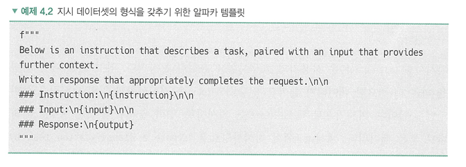

지금까지 어떤 데이터가 어떤 형식으로 만들어지는지를 봤다.   
그렇다면 이 데이터셋을 어떻게 학습??
* 인과적 언어 모델링(causal language modeling) 

---

### 4.1.3 좋은 지시 데이터셋이 갖춰야 할 조건 

* 지시 데이터셋에서 지시사항이 다양한 형태로 되어 있고 응답 데이터의 품질이 높을수록 정렬한 모델의 답변 품질이 높아진다. 
> 아직 확실하진 않지만 지도 미세 조정을 통해 LLM을 정렬하고자 할 때 기초 모델(foundation model)을 잘 선택한다면 작은 지시 데이터셋으로도 정렬이 가능하다는 힌트는 얻을 수 있다. ex) 메타의 리마

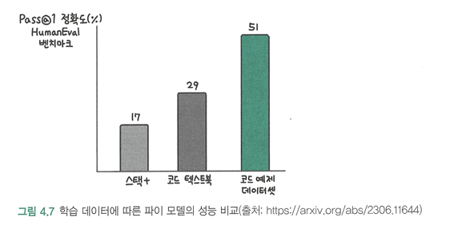

> 학습 데이터의 품질이 높다면 더 많은 양의 데이터로 학습할 때보다도 더 높은 성능을 달성할 수 있다는 사실을 확인할 수 있다.

* 좋은 지시 데이터셋이 갖춰야 하는 조건
> 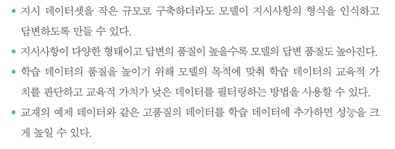

---

## 4.2 채점 모델로 코드 가독성 높이기
### 4.2.1 선호 데이터셋을 사용한 채점 모델 만들기

+ 선호 데이터셋: 두 데이터 중 사람이 더 선호하는 데이터를 선택한 데이터셋. 
> 반대는 비선호 데이터셋, 정해진 것은 아니고 비교하는 대상에 따라 달라질 수 있다. 

여러 코드를 바탕으로 어떤 코드가 더 가독성이 높은지를 선택해 **선호 데이터셋을 구축**
-> 채점 모델이 선호 데이터에 비선호 데이터보다 높은 점수를 주도록 **채점 모델을 학습**시킴.

이런식으로 코드 가독성을 평가하는 채점 모델을 만들 수 있음.

+ 리워드 모델: 생성된 답변의 점수를 평가하는 모델 
> 사용자에게 결과적으로 해가 될 수 있는 정보를 줄이기 위함.

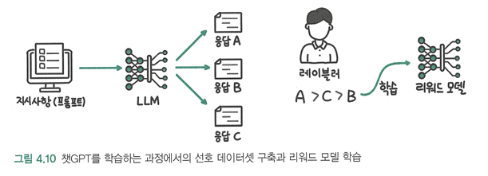
1. 지도 미세 조정을 마친 LLM에 지시사항을 입력해 여러 응답(A,B,C)를 생성
2. 레이블러가 응답을 비교해 더 좋다고 판단하는 순서를 정해 선호 데이터셋을 구축
3. 이 선호 데이터셋을 사용해 리워드 모델이 학습

---

### 4.2.2 강화 학습: 높은 코드 가독성 점수를 향해 

* RLHF(Reinforcement Learning form Human Feedback): 사람의 피드백을 활용한 강화 학습

* LLM에 강화 학습이 접목되는 방법 : 
1. 에이전트가 환경에서 행동을 한다. 
2. 행동에 따라 환경의 상태가 바뀌고 행동에 대한 보상이 생긴다.
3. 에이전트는 이 변화된 상태를 인식하고 보상을 받는다. 
4. 더 많은 보상을 받을 수 있도록 행동을 수정하면서 학습한다.   
-> 에이전트가 연속적으로 수행하는 행동의 모음을 **에피소드**라고 한다.

* 언어 모델은 행동을 취할 때마다(토큰 생성시 마다)보상을 받지 않고 전체 생성 결과에 대해 리워드 모델의 점수를 받는다. 
> 생성한 문장의 점수가 높아지는 방향으로 학습한다. 

그러나 이때 보상을 높게 받는 데에만 집중하는 보상 해킹이 발생할 수 있다. 

---

### 4.2.3 PPO: 보상 해킹 피하기 

* 보상 해킹: 평가 모델의 높은 점수를 받는 과정에서 다른 능력이 감소하거나 평가 점수만 높게 받을 수 있는 우회로를 찾는 현상 

* PPO(근접 정책 최적화,Proximal Preference Optimization) : 지도 미세 조정 모델을 기준으로 학습하는 모델이 너무 멀지 않게 가까운 범위에서 리워드 모델의 높은 점수를 찾도록 한다는 의미.
이때 지도 미세 조정 모델을 기준으로 거리를 측정하기 때문에 참고 모델이라고 한다. 

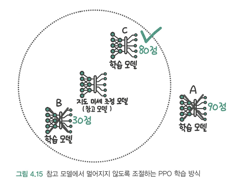

--- 

### 4.2.4 RLHF: 멋지지만 피할 수 있다면...

RLHF는 멋진 결과물만큼이나 사용하기 어렵기로 악명이 높다. 
때문에 강화 학습이나 리워드 모델을 사용하지 않고도 사람의 선호를 학습할 수 있는 기술이 개발 됨.

---

## 4.3 강화 학습이 꼭 필요할까?
### 4.3.1 기각 샘플링: 단순히 가장 점수가 높은 데이터를 사용한다면?

+ 기각 샘플링(rejection sampling): 여러 생성 결과 중 리워드 모델이 가장 높은 점수를 준 결과를 LLM의 지도 미세 조정에 사용하는 것 

> 지도 미세 조정을 마친 LLM을 통해 여러 응답을 생성하고 그중에서 리워드 모델이 가장 높은 점수를 준 응답을 모아 다시 지도 미세 조정을 수행 

-> 강화 학습을 사용하지 않기 때문에 학습이 비교적 안정적이고 간단하고 직관적임에도 효과가 좋음.